# 30-Day Architect Interview Preparation Roadmap

> **Target Roles**: Software Architect · Principal Engineer · Staff Engineer · Lead Software Engineer
> **Prerequisite**: 10+ years experience · Java/Spring/Cloud-Native stack
> **Time Commitment**: 2-3 hours/day weekdays · 4-6 hours/day weekends

---

## Overview

```mermaid
gantt
    title 30-Day Preparation Timeline
    dateFormat  X
    axisFormat  Day %s
    section Week 1 — Foundations
    Java & Spring Deep Dive         :w1a, 1, 5d
    Architecture Patterns           :w1b, 6, 7d
    section Week 2 — System Design
    System Design Framework         :w2a, 8, 5d
    System Design Practice          :w2b, 13, 14d
    section Week 3 — Infrastructure & Data
    Cloud/K8s/Security              :w3a, 15, 5d
    Databases & Messaging           :w3b, 20, 21d
    section Week 4 — Polish & Mock
    Leadership & AI                 :w4a, 22, 5d
    Mock Interviews & Revision      :w4b, 27, 30d
```



---

## Week 1: Core Foundations (Days 1–7)

### Weekly Goals
- [ ] Master Java 21/25 architect-level concepts
- [ ] Refresh Spring Boot 3/4, Security, Cloud internals
- [ ] Solidify architecture patterns (Clean, Hexagonal, DDD)
- [ ] Complete 25 core interview questions

---

### Day 1 (Monday) — Java Internals & Modern Features
| Time | Activity | Resource |
|------|----------|----------|
| 1h | Java 21: Virtual Threads, Pattern Matching, Sealed Classes, Records | [Java Questions](../03-core-questions/java-questions.md) Q1-Q5 |
| 45m | JVM Internals: Memory model, GC (ZGC, Shenandoah), Class Loading | [Java Cheatsheet](../15-cheatsheets/java-cheatsheet.md) |
| 30m | Practice: Write answers to 5 Java questions aloud | Timer yourself |

**Key Deliverable**: Can explain virtual threads vs platform threads with performance implications.

---

### Day 2 (Tuesday) — Java Concurrency & Performance
| Time | Activity | Resource |
|------|----------|----------|
| 1h | Concurrency: CompletableFuture, Structured Concurrency, ForkJoinPool | [Java Questions](../03-core-questions/java-questions.md) Q6-Q10 |
| 45m | Performance: Profiling (JFR, async-profiler), JVM tuning flags | [Java Cheatsheet](../15-cheatsheets/java-cheatsheet.md) |
| 30m | Practice: Design a concurrent data pipeline with back-pressure | Whiteboard exercise |

**Key Deliverable**: Can design thread-safe systems using modern Java concurrency primitives.

---

### Day 3 (Wednesday) — Spring Boot 3/4 & Spring Security
| Time | Activity | Resource |
|------|----------|----------|
| 1h | Spring Boot: Auto-configuration, Actuator, Bean Lifecycle, AOT | [Spring Questions](../03-core-questions/spring-questions.md) Q1-Q8 |
| 45m | Spring Security: Filter chain, OAuth2 resource server, method security | [Security Deep Dive](../06-security/security-deep-dive.md) |
| 30m | Practice: Draw Spring Security filter chain from memory | Whiteboard exercise |

**Key Deliverable**: Can explain Spring Boot auto-configuration mechanism and customize security filter chains.

---

### Day 4 (Thursday) — Spring Cloud & Data
| Time | Activity | Resource |
|------|----------|----------|
| 1h | Spring Cloud: Config, Discovery, Gateway, Circuit Breaker | [Spring Questions](../03-core-questions/spring-questions.md) Q9-Q15 |
| 45m | Spring Data JPA: N+1, Lazy Loading, 2nd Level Cache, Projections | [Spring Cheatsheet](../15-cheatsheets/spring-cheatsheet.md) |
| 30m | Practice: Answer 5 Spring questions with code examples | Record yourself |

**Key Deliverable**: Can design a Spring Cloud microservices stack with resilience patterns.

---

### Day 5 (Friday) — Architecture Patterns
| Time | Activity | Resource |
|------|----------|----------|
| 1h | Clean Architecture, Hexagonal Architecture, Onion Architecture | [Architecture Questions](../03-core-questions/architecture-questions.md) Q1-Q5 |
| 45m | SOLID at Scale, DDD: Bounded Contexts, Aggregates, Domain Events | [Architecture Questions](../03-core-questions/architecture-questions.md) Q6-Q10 |
| 30m | Practice: Refactor a monolithic module using Hexagonal Architecture | Coding exercise |

**Key Deliverable**: Can draw and explain hexagonal architecture with ports and adapters.

---

### Day 6 (Saturday) — Microservices Deep Dive
| Time | Activity | Resource |
|------|----------|----------|
| 2h | Service decomposition, inter-service communication, API Gateway | [Microservices Questions](../03-core-questions/microservices-questions.md) |
| 1.5h | Distributed tracing, service mesh, testing strategies | [Distributed Systems](../05-distributed-systems/deep-dive.md) |
| 1h | Practice: Design a microservices decomposition for an e-commerce app | Whiteboard exercise |
| 30m | Review Day 1-5 notes (spaced repetition) | Self-review |

**Key Deliverable**: Can decompose a monolith into microservices with clear bounded contexts.

---

### Day 7 (Sunday) — Security Fundamentals + Week 1 Review
| Time | Activity | Resource |
|------|----------|----------|
| 2h | OAuth2, OIDC, JWT, CSRF, XSS, RBAC/ABAC | [Security Questions](../03-core-questions/security-questions.md) |
| 1.5h | API Security, Zero Trust Architecture | [Security Deep Dive](../06-security/security-deep-dive.md) |
| 1h | Week 1 Comprehensive Review: Flashcard all key concepts | All Week 1 resources |
| 30m | 🎯 **Mock Interview #1**: Java + Spring + Architecture (self-recorded) | [Architect Mocks](../14-mock-interviews/architect-mocks.md) Mock 1 |

---

## Week 2: System Design Mastery (Days 8–14)

### Weekly Goals
- [ ] Master the 11-step system design framework
- [ ] Complete 8 full system design practice sessions
- [ ] Learn capacity estimation by heart
- [ ] Practice drawing architecture diagrams under time pressure

---

### Day 8 (Monday) — System Design Framework
| Time | Activity | Resource |
|------|----------|----------|
| 1.5h | 11-step framework: Requirements → Capacity → HLD → Database → Caching | [System Design Framework](../04-system-design/framework.md) |
| 45m | Capacity estimation formulas and back-of-envelope math | [System Design Cheatsheet](../15-cheatsheets/system-design-cheatsheet.md) |
| 30m | Practice: Estimate capacity for a URL shortener (1B URLs, 100:1 read/write) | Calculation exercise |

---

### Day 9 (Tuesday) — Payment Gateway Design
| Time | Activity | Resource |
|------|----------|----------|
| 1.5h | Full walkthrough: Payment Gateway (idempotency, PCI-DSS, reconciliation) | [Payment Gateway](../04-system-design/payment-gateway.md) |
| 45m | Practice: Design a simplified payment system in 45 minutes | Timer + whiteboard |
| 30m | Review and identify gaps | Self-assessment |

---

### Day 10 (Wednesday) — Authentication Platform + API Gateway
| Time | Activity | Resource |
|------|----------|----------|
| 1h | Authentication Platform: OAuth2 flows, SSO, MFA, token lifecycle | [Auth Platform](../04-system-design/auth-platform.md) |
| 1h | API Gateway: Routing, rate limiting, circuit breaking | [API Gateway](../04-system-design/api-gateway.md) |
| 30m | Practice: Design an auth system in 30 minutes | Speed drill |

---

### Day 11 (Thursday) — E-commerce + Notification System
| Time | Activity | Resource |
|------|----------|----------|
| 1h | E-commerce: Saga pattern for orders, inventory locking, search | [E-commerce](../04-system-design/ecommerce.md) |
| 1h | Notification System: Multi-channel delivery, templates, DLQ | [Notification System](../04-system-design/notification-system.md) |
| 30m | Practice: Design notification delivery pipeline | Whiteboard exercise |

---

### Day 12 (Friday) — Chat System + Social Media Feed
| Time | Activity | Resource |
|------|----------|----------|
| 1h | Chat System: WebSocket, message ordering, presence, E2E encryption | [Chat System](../04-system-design/chat-system.md) |
| 1h | Social Media Feed: Fan-out strategies, timeline ranking | [Social Media Feed](../04-system-design/social-media-feed.md) |
| 30m | Practice: Compare fan-out-on-write vs fan-out-on-read with trade-offs | Written exercise |

---

### Day 13 (Saturday) — FinTech Designs
| Time | Activity | Resource |
|------|----------|----------|
| 1.5h | Banking Platform: ACID transactions, KYC/AML, audit trail | [Banking Platform](../04-system-design/banking-platform.md) |
| 1.5h | Fraud Detection: Real-time scoring, ML serving, rule engine | [Fraud Detection](../04-system-design/fraud-detection.md) |
| 1h | SaaS Billing: Multi-tenant billing, usage tracking, dunning | [SaaS Billing](../04-system-design/saas-billing-platform.md) |
| 30m | Review Days 8-12 (spaced repetition) | Review notes |
| 30m | 🎯 **Mock Interview #2**: System Design — Design a Payment Gateway | [Architect Mocks](../14-mock-interviews/architect-mocks.md) Mock 2 |

---

### Day 14 (Sunday) — Remaining System Designs + Week 2 Review
| Time | Activity | Resource |
|------|----------|----------|
| 1h | URL Shortener + Ride Sharing | [URL Shortener](../04-system-design/url-shortener.md), [Ride Sharing](../04-system-design/ride-sharing.md) |
| 1h | Video Streaming + File Storage | [Video Streaming](../04-system-design/video-streaming.md), [File Storage](../04-system-design/file-storage.md) |
| 1h | Loan Processing + Event Ticketing | [Loan Processing](../04-system-design/loan-processing.md), [Event Ticketing](../04-system-design/event-ticketing.md) |
| 1h | AI Platforms: AI Agent + Enterprise RAG | [AI Agent](../04-system-design/ai-agent-platform.md), [Enterprise RAG](../04-system-design/enterprise-rag.md) |
| 1h | Week 2 Review: Draw 3 system designs from memory | Self-test |

---

## Week 3: Infrastructure, Data & Deep Dives (Days 15–21)

### Weekly Goals
- [ ] Master distributed systems patterns (Saga, CQRS, Outbox, Event Sourcing)
- [ ] Deep dive into PostgreSQL, Kafka, RabbitMQ
- [ ] Solidify AWS and Kubernetes architect-level knowledge
- [ ] Complete 2 mock interviews

---

### Day 15 (Monday) — Distributed Systems Core
| Time | Activity | Resource |
|------|----------|----------|
| 1.5h | CAP, BASE, Eventual Consistency, Consensus (Raft/Paxos) | [Distributed Systems](../05-distributed-systems/deep-dive.md) §1-3 |
| 45m | Distributed Systems Questions Q1-Q4 | [DS Questions](../03-core-questions/distributed-systems-questions.md) |
| 30m | Practice: Explain CAP theorem with 3 real-world system examples | Verbal exercise |

---

### Day 16 (Tuesday) — Saga, Outbox, Inbox Patterns
| Time | Activity | Resource |
|------|----------|----------|
| 1.5h | Saga (choreography vs orchestration), Outbox (CDC/Debezium), Inbox | [Distributed Systems](../05-distributed-systems/deep-dive.md) §4-6 |
| 45m | Distributed Systems Questions Q5-Q8 | [DS Questions](../03-core-questions/distributed-systems-questions.md) |
| 30m | Practice: Design a Saga for order processing with compensation | Diagram exercise |

---

### Day 17 (Wednesday) — CQRS, Event Sourcing, Distributed Locking
| Time | Activity | Resource |
|------|----------|----------|
| 1.5h | CQRS, Event Sourcing, Distributed Locking, Idempotency | [Distributed Systems](../05-distributed-systems/deep-dive.md) §7-13 |
| 45m | Practice: Design event-sourced account balance system | Whiteboard exercise |
| 30m | Review distributed systems cheatsheet | [DS Cheatsheet](../15-cheatsheets/distributed-systems-cheatsheet.md) |

---

### Day 18 (Thursday) — PostgreSQL Masterclass
| Time | Activity | Resource |
|------|----------|----------|
| 1.5h | MVCC, Isolation Levels, Locking, Indexing, Query Optimization | [Database Masterclass](../07-databases/database-masterclass.md) |
| 45m | Database interview questions Q1-Q8 | [DB Questions](../03-core-questions/database-questions.md) |
| 30m | Practice: Optimize a slow query using EXPLAIN ANALYZE | Hands-on exercise |

---

### Day 19 (Friday) — Kafka & RabbitMQ
| Time | Activity | Resource |
|------|----------|----------|
| 1.5h | Kafka internals, exactly-once, consumer groups, Schema Registry | [Messaging Deep Dive](../08-kafka-rabbitmq/messaging-deep-dive.md) |
| 45m | RabbitMQ: Exchanges, quorum queues, clustering | [Messaging Deep Dive](../08-kafka-rabbitmq/messaging-deep-dive.md) |
| 30m | Practice: Kafka vs RabbitMQ decision matrix for 3 scenarios | Written exercise |

---

### Day 20 (Saturday) — AWS Architecture
| Time | Activity | Resource |
|------|----------|----------|
| 2h | VPC, ALB/NLB, ECS vs EKS, CloudFront, Route53, IAM | [Cloud Infrastructure](../09-aws-kubernetes/cloud-infrastructure.md) AWS section |
| 1.5h | Cloud interview questions Q1-Q10 | [Cloud Questions](../03-core-questions/cloud-questions.md) |
| 1h | Practice: Design a multi-region AWS architecture for FinTech | Diagram exercise |
| 30m | 🎯 **Mock Interview #3**: Distributed Systems + Databases | [Architect Mocks](../14-mock-interviews/architect-mocks.md) Mock 3 |

---

### Day 21 (Sunday) — Kubernetes + Week 3 Review
| Time | Activity | Resource |
|------|----------|----------|
| 2h | K8s architecture, workloads, networking, RBAC, HPA, Istio | [Cloud Infrastructure](../09-aws-kubernetes/cloud-infrastructure.md) K8s section |
| 1.5h | Practice: Deploy a microservices app on EKS from memory | Architecture exercise |
| 1h | Week 3 Review: All distributed systems & infrastructure concepts | Flashcards |
| 30m | 🎯 **Mock Interview #4**: AWS + Kubernetes scenario | [Architect Mocks](../14-mock-interviews/architect-mocks.md) Mock 4 |

---

## Week 4: Leadership, AI & Final Prep (Days 22–30)

### Weekly Goals
- [ ] Master behavioral/leadership interview answers (STAR format)
- [ ] Complete AI Engineering preparation
- [ ] Pass 4 full mock interviews
- [ ] Comprehensive revision of all topics

---

### Day 22 (Monday) — Leadership & Behavioral
| Time | Activity | Resource |
|------|----------|----------|
| 1.5h | Conflict Resolution, Mentoring, Team Leadership (16 STAR answers) | [Behavioral Questions](../11-leadership/behavioral-questions.md) §1-3 |
| 45m | Practice: Record 5 STAR answers (2 minutes each) | Self-recording |
| 30m | Review and improve delivery | Playback review |

---

### Day 23 (Tuesday) — Leadership Continued
| Time | Activity | Resource |
|------|----------|----------|
| 1.5h | Architecture Decisions, Production Incidents, Stakeholder Mgmt | [Behavioral Questions](../11-leadership/behavioral-questions.md) §4-6 |
| 45m | Project Failures, Technical Vision (11 STAR answers) | [Behavioral Questions](../11-leadership/behavioral-questions.md) §7-8 |
| 30m | Practice: Record 5 more STAR answers | Self-recording |

---

### Day 24 (Wednesday) — AI Engineering
| Time | Activity | Resource |
|------|----------|----------|
| 1.5h | MCP, RAG pipeline, Vector Databases, LangChain4j | [AI Engineering](../10-ai-engineering/ai-engineering.md) §1-4 |
| 45m | AI Agents, Tool Calling, Hallucination Prevention | [AI Engineering](../10-ai-engineering/ai-engineering.md) §5-7 |
| 30m | AI Engineering interview questions | [AI Questions](../03-core-questions/ai-engineering-questions.md) |

---

### Day 25 (Thursday) — AI Engineering + ADRs
| Time | Activity | Resource |
|------|----------|----------|
| 1h | AI Security, Observability, Enterprise AI Architecture | [AI Engineering](../10-ai-engineering/ai-engineering.md) §8-10 |
| 1h | Architecture Decision Records: Review 15 key ADRs | [ADRs](../12-architecture-decisions/adrs.md) ADR 1-15 |
| 30m | Practice: Write an ADR for a real decision you've made | Writing exercise |

---

### Day 26 (Friday) — Whiteboard Playbook + ADRs
| Time | Activity | Resource |
|------|----------|----------|
| 1h | Whiteboard interview techniques: Think aloud, drive discussion | [Whiteboard Guide](../13-whiteboard-playbook/whiteboard-guide.md) |
| 1h | Architecture Decision Records: Review ADRs 16-30 | [ADRs](../12-architecture-decisions/adrs.md) ADR 16-30 |
| 30m | Practice: Solve a mini whiteboard exercise | [Whiteboard Guide](../13-whiteboard-playbook/whiteboard-guide.md) exercises |

---

### Day 27 (Saturday) — Full Mock Interview Day
| Time | Activity | Resource |
|------|----------|----------|
| 1.5h | 🎯 **Mock Interview #5**: Full Architect Interview (system design + theory) | [Architect Mocks](../14-mock-interviews/architect-mocks.md) Mock 5 |
| 1.5h | 🎯 **Mock Interview #6**: Principal Engineer Mock (depth + strategy) | [PE Mocks](../14-mock-interviews/principal-engineer-mocks.md) Mock 1 |
| 1.5h | 🎯 **Mock Interview #7**: Leadership Mock (behavioral STAR) | [Leadership Mocks](../14-mock-interviews/leadership-mocks.md) Mock 1 |
| 30m | Self-evaluation and gap identification | Score yourself |

---

### Day 28 (Sunday) — Comprehensive Revision Day 1
| Time | Activity | Resource |
|------|----------|----------|
| 1.5h | Revise: Java, Spring, Security (cheatsheets + weak areas) | [Cheatsheets](../15-cheatsheets/) |
| 1.5h | Revise: System Design — redraw 5 architectures from memory | [System Designs](../04-system-design/) |
| 1.5h | Revise: Distributed Systems, Databases, Kafka | [Cheatsheets](../15-cheatsheets/) |
| 30m | Self-introduction practice (60s, 2min, 5min versions) | [Introductions](../02-self-introduction/introductions.md) |

---

### Day 29 (Monday) — Comprehensive Revision Day 2
| Time | Activity | Resource |
|------|----------|----------|
| 1h | Revise: AWS, Kubernetes, AI Engineering cheatsheets | [Cheatsheets](../15-cheatsheets/) |
| 1h | Revise: 20 weakest questions from all categories | All question files |
| 30m | 🎯 **Mock Interview #8**: Speed round — answer 10 questions in 30 minutes | Mixed questions |
| 30m | Final self-introduction polish | [Introductions](../02-self-introduction/introductions.md) |

---

### Day 30 (Tuesday) — Final Day
| Time | Activity | Resource |
|------|----------|----------|
| 45m | Light review: Cheatsheets only (no new material) | [Cheatsheets](../15-cheatsheets/) |
| 45m | Self-introduction run-through (3 versions) | [Introductions](../02-self-introduction/introductions.md) |
| 30m | Visualization and confidence building | Mental preparation |
| 30m | Logistics: Prepare questions to ask the interviewer | Prepared questions list |

---

## Spaced Repetition Strategy

```
Day 1-7:   Learn → Review same day
Day 8:     Review Week 1 highlights (30 min)
Day 14:    Review Week 1+2 highlights (45 min)
Day 21:    Review Week 1+2+3 highlights (1 hour)
Day 28-30: Comprehensive review (cheatsheets only)
```

| Review Interval | What to Review | Method |
|----------------|----------------|--------|
| Same day | New concepts learned today | Write summary notes |
| +3 days | Previous week's concepts | Flashcard quiz |
| +7 days | 2 weeks ago concepts | Teach-back exercise |
| +14 days | Month-old concepts | Cheatsheet scan |

---

## Mock Interview Schedule Summary

| # | Day | Type | Duration | Focus |
|---|-----|------|----------|-------|
| 1 | Day 7 | Self-recorded | 45 min | Java + Spring + Architecture |
| 2 | Day 13 | Self-recorded | 45 min | System Design (Payment Gateway) |
| 3 | Day 20 | Peer/recorded | 60 min | Distributed Systems + Databases |
| 4 | Day 21 | Peer/recorded | 45 min | AWS + Kubernetes Scenario |
| 5 | Day 27 | Full simulation | 60 min | Architect Interview (Full) |
| 6 | Day 27 | Full simulation | 60 min | Principal Engineer (Depth) |
| 7 | Day 27 | Full simulation | 45 min | Leadership (Behavioral) |
| 8 | Day 29 | Speed round | 30 min | Mixed rapid-fire |

---

## Daily Routine Template

```
┌─────────────────────────────────────────┐
│  WEEKDAY (2.5 hours)                    │
├─────────────────────────────────────────┤
│  📖 Study Block 1:  1h 15m (theory)    │
│  ☕ Break:           10m                │
│  ✍️  Practice Block: 45m (exercises)    │
│  📝 Review Block:   30m (revision)      │
└─────────────────────────────────────────┘

┌─────────────────────────────────────────┐
│  WEEKEND (5 hours)                      │
├─────────────────────────────────────────┤
│  📖 Study Block 1:  1h 30m (deep dive) │
│  ☕ Break:           15m                │
│  📖 Study Block 2:  1h 30m (practice)  │
│  🍕 Break:           30m                │
│  🎯 Mock/Practice:  1h 00m             │
│  📝 Review Block:   30m (revision)      │
└─────────────────────────────────────────┘
```

---

## Progress Tracking Checklist

### Core Knowledge
- [ ] Java 21/25 features & internals
- [ ] Spring Boot 3/4 & Security
- [ ] Architecture patterns (Hexagonal, Clean, DDD)
- [ ] Microservices decomposition & patterns
- [ ] OAuth2/OIDC/JWT/Zero Trust
- [ ] Distributed systems (CAP, Saga, CQRS, Event Sourcing)
- [ ] PostgreSQL (MVCC, indexing, optimization)
- [ ] Kafka & RabbitMQ (internals, trade-offs)
- [ ] AWS (VPC, ECS/EKS, ALB, Route53)
- [ ] Kubernetes (architecture, workloads, networking)
- [ ] AI Engineering (MCP, RAG, Vector DBs)

### System Designs Completed
- [ ] Payment Gateway
- [ ] Authentication Platform
- [ ] API Gateway
- [ ] E-commerce Platform
- [ ] Notification System
- [ ] Chat System
- [ ] Banking Platform
- [ ] Fraud Detection
- [ ] (12 more in repository)

### Interview Readiness
- [ ] Self-introduction polished (3 versions)
- [ ] 100 core questions reviewed
- [ ] 20 system designs studied
- [ ] 50 behavioral STAR answers prepared
- [ ] 30 ADRs reviewed
- [ ] Whiteboard technique practiced
- [ ] 8+ mock interviews completed
- [ ] All cheatsheets reviewed on final day
