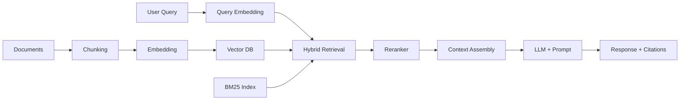
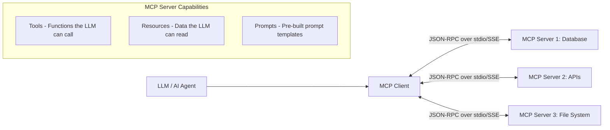
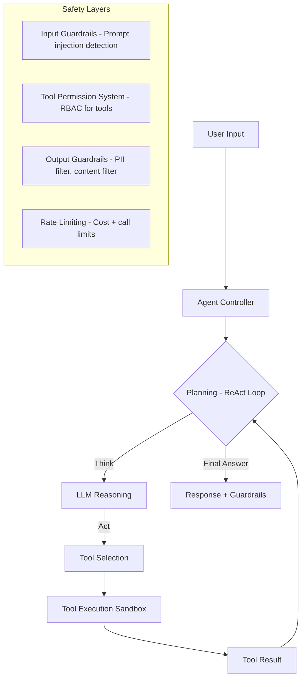

# AI Engineering Interview Questions

> 5 architect-level questions on RAG, MCP, Vector Databases, AI Agents, and Hallucination Prevention.
> Cross-references: [AI Engineering Deep Dive](../10-ai-engineering/ai-engineering.md) · [AI Cheatsheet](../15-cheatsheets/ai-engineering-cheatsheet.md)

---

## Q1: Design an enterprise RAG pipeline. How do you optimize retrieval quality?

### Interviewer's Expectation
End-to-end architecture, chunking strategies, embedding selection, hybrid retrieval, reranking, and evaluation metrics.

### Excellent Answer



**Chunking strategies** (most impactful on quality):
- **Fixed-size**: 512 tokens with 50-token overlap. Simple, consistent.
- **Semantic**: Split on topic boundaries using embedding similarity. Better coherence.
- **Recursive character**: LangChain4j default — splits by paragraphs, then sentences, then words.
- **Document-structure-aware**: Respect headings, tables, code blocks.

**Hybrid retrieval** (best results):
```java
// Dense retrieval (semantic similarity)
List<EmbeddingMatch<TextSegment>> denseResults =
    embeddingStore.findRelevant(queryEmbedding, maxResults: 20, minScore: 0.7);

// Sparse retrieval (keyword matching via BM25)
List<TextSegment> sparseResults = bm25Index.search(query, maxResults: 20);

// Reciprocal Rank Fusion
List<TextSegment> merged = reciprocalRankFusion(denseResults, sparseResults, k: 60);

// Reranking (cross-encoder for precision)
List<TextSegment> reranked = reranker.rerank(query, merged, topN: 5);
```

**Evaluation metrics**: Faithfulness (is the answer grounded?), Relevance (are retrieved chunks relevant?), Answer correctness (compared to ground truth). Use RAGAS framework.

### Common Mistakes
- Chunking too large (irrelevant noise) or too small (missing context), not using hybrid retrieval (dense-only misses keyword matches), skipping reranking (bi-encoders are fast but imprecise), not evaluating quality systematically

---

## Q2: Explain the MCP (Model Context Protocol). How do you architect an MCP-based system?

### Excellent Answer

MCP provides a **standardized protocol** for LLMs to interact with external tools and data sources. It defines a client-server architecture:



**Key concepts**: **Tools** (callable functions with JSON schema), **Resources** (readable data with URIs), **Prompts** (reusable templates). Transport: stdio (local), SSE (remote HTTP).

**Enterprise architecture**: MCP Gateway that manages server lifecycle, enforces security policies, rate limits tool calls, and provides observability. Each server is a microservice exposing domain capabilities.

---

## Q3: How do you select and implement a Vector Database? Compare options.

### Excellent Answer

| Database | Type | Scaling | Best For |
|----------|------|---------|----------|
| **pgvector** | PostgreSQL extension | Vertical (single node) | Small-medium, existing PG infrastructure |
| **Pinecone** | Managed cloud | Horizontal (serverless) | Production SaaS, no ops |
| **Weaviate** | Open-source, self-hosted | Horizontal (k8s) | Multimodal, hybrid search built-in |
| **Milvus** | Open-source, distributed | Horizontal | High-scale, billion+ vectors |
| **Qdrant** | Open-source, Rust | Horizontal | Performance-critical, filtering |

**Decision criteria**: Data volume (< 10M vectors → pgvector, 10M-1B → Pinecone/Weaviate, > 1B → Milvus), existing infrastructure (already have PostgreSQL → pgvector), hybrid search needs (Weaviate has built-in), cost sensitivity (pgvector = free, Pinecone = pay-per-use).

**Indexing algorithms**: HNSW (fast, memory-heavy, best for < 100M vectors), IVF (slower build, better for large datasets), Product Quantization (reduces memory by compressing vectors).

---

## Q4: How do you prevent hallucinations in production AI systems?

### Excellent Answer

**Layered hallucination prevention**:

1. **Retrieval grounding**: Only answer from retrieved documents. "Based on the provided context..."
2. **Prompt engineering**: "If the information is not in the context, say 'I don't know'"
3. **Citation verification**: Require the model to cite source chunks. Verify citations exist.
4. **Confidence scoring**: Use model logprobs to detect uncertainty. Low confidence → escalate to human.
5. **Output validation**: Check factual claims against structured data (dates, numbers, names)
6. **Guardrails**: NeMo Guardrails or custom filters for topic adherence, factual consistency
7. **Human-in-the-loop**: Flag uncertain responses for human review before delivery

```java
// LangChain4j with grounding
AiServices.builder(Assistant.class)
    .chatLanguageModel(model)
    .contentRetriever(retriever)
    .build();

// System prompt with grounding instructions
String systemPrompt = """
    You are a helpful assistant. Answer ONLY based on the provided context.
    If the context doesn't contain the answer, say "I don't have enough information."
    Always cite the source document for each claim.
    Never make up information.
    """;
```

---

## Q5: Design an AI Agent architecture with tool calling. How do you handle safety?

### Excellent Answer



**Safety architecture**:
1. **Tool permissions**: Each agent has an allowlist of tools. Sensitive tools (database write, email send) require elevated permissions.
2. **Sandboxed execution**: Tool calls run in isolated containers with resource limits.
3. **Prompt injection defense**: Input classification model detects injection attempts before LLM processing.
4. **Output filtering**: PII detection (regex + NER model), content policy enforcement.
5. **Human-in-the-loop**: High-impact actions (financial, destructive) require human approval.
6. **Cost guardrails**: Per-user and per-session token limits, model cost tracking.
