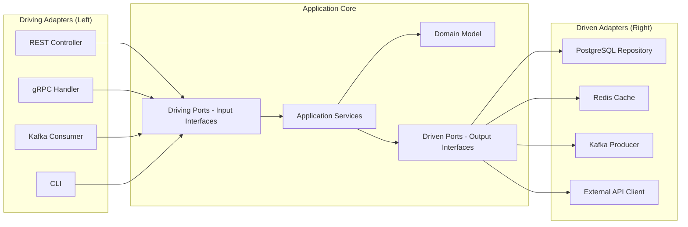
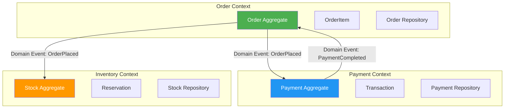
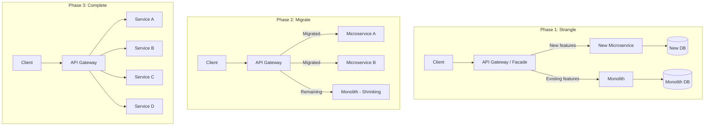
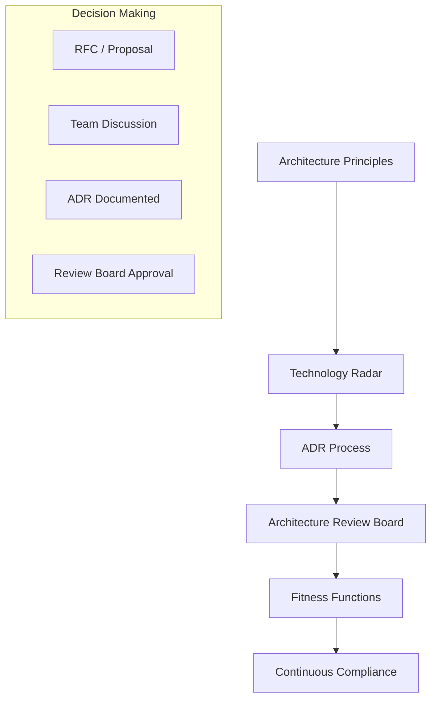

# Architecture Interview Questions

> 10 architect-level questions on Clean Architecture, Hexagonal Architecture, DDD, SOLID at scale, and architecture governance.
> Cross-references: [Distributed Systems](../05-distributed-systems/deep-dive.md) · [ADRs](../12-architecture-decisions/adrs.md)

---

## Q1: Explain Hexagonal Architecture. How does it differ from Clean Architecture and Layered Architecture?

### Interviewer's Expectation
Clear understanding of ports & adapters, dependency inversion at the architecture level, and practical experience applying it to microservices.

### Excellent Answer



**Hexagonal Architecture (Ports & Adapters)** isolates business logic from infrastructure through interfaces:

- **Ports**: Interfaces defined by the domain. *Driving ports* (use cases the application offers) and *Driven ports* (services the application needs).
- **Adapters**: Implementations of ports for specific technologies.

```java
// PORT (Driven) — Domain defines what it needs
public interface OrderRepository {
    Order save(Order order);
    Optional<Order> findById(OrderId id);
}

// PORT (Driving) — Use case the application offers
public interface CreateOrderUseCase {
    OrderConfirmation createOrder(CreateOrderCommand command);
}

// APPLICATION SERVICE — Orchestrates domain logic
@Service
public class CreateOrderService implements CreateOrderUseCase {
    private final OrderRepository orderRepo;       // Driven port
    private final PaymentGateway paymentGateway;    // Driven port
    private final EventPublisher eventPublisher;    // Driven port

    @Override
    public OrderConfirmation createOrder(CreateOrderCommand command) {
        Order order = Order.create(command);        // Domain logic
        order = orderRepo.save(order);
        eventPublisher.publish(new OrderCreated(order.getId()));
        return OrderConfirmation.from(order);
    }
}

// ADAPTER — Infrastructure implements the port
@Repository
public class JpaOrderRepository implements OrderRepository {
    private final SpringDataOrderRepo springRepo;
    // Maps between domain entities and JPA entities
}
```

**Comparison**:

| Aspect | Layered | Clean | Hexagonal |
|--------|---------|-------|-----------|
| **Dependency direction** | Top → Bottom | Inward only | Inward only |
| **Domain isolation** | Weak (depends on infra) | Strong | Strong |
| **Testability** | Requires mocks for DB | Domain tested in isolation | Domain tested in isolation |
| **Flexibility** | Hard to swap DB/framework | Easy | Easy |
| **Complexity** | Low | Medium-High | Medium |
| **Best for** | Simple CRUD | Complex domain logic | Complex domain + many integrations |

### Common Mistakes
- Making the domain depend on framework annotations (`@Entity`, `@Table`)
- Not separating driving from driven ports (mixing input and output concerns)
- Over-engineering simple CRUD services with hexagonal architecture
- Confusing ports with repositories (ports are broader — event publishers, notification gateways, etc.)

### Follow-up Questions
- "How would you handle cross-cutting concerns (logging, transactions) in Hexagonal Architecture?"
- "How does Hexagonal Architecture map to a Maven/Gradle module structure?"
- "When would you NOT use Hexagonal Architecture?"

---

## Q2: How do you apply Domain-Driven Design (DDD) in microservices? Explain Bounded Contexts and Context Mapping.

### Interviewer's Expectation
Practical DDD — not just theory. How to discover bounded contexts, define aggregate boundaries, and map relationships between contexts in a microservice architecture.

### Excellent Answer



**Bounded Context discovery through Event Storming**:
1. Gather domain experts and developers
2. Identify **domain events** (past tense: "Order Placed", "Payment Collected")
3. Group events into **clusters** → these become bounded contexts
4. Identify **commands** that trigger events and **aggregates** that handle them
5. Define **context boundaries** and **integration patterns**

**Context mapping patterns**:

| Pattern | Relationship | Example |
|---------|-------------|---------|
| **Shared Kernel** | Two contexts share a subset of the model | Common `Money` value object |
| **Customer-Supplier** | Upstream provides API, downstream consumes | Order → Payment |
| **Conformist** | Downstream conforms to upstream model | Integrating with 3rd-party API |
| **Anti-Corruption Layer (ACL)** | Translate between models at boundary | Legacy system integration |
| **Open Host Service** | Published API for multiple consumers | Public REST API |
| **Published Language** | Standard interchange format | Protobuf events on Kafka |

**Aggregate design rules**:
1. **Small aggregates** — Prefer single-entity aggregates; reference other aggregates by ID
2. **Consistency boundary** — Aggregate is the transaction boundary
3. **Invariant enforcement** — Aggregate root enforces business rules
4. **Cross-aggregate consistency** — Use domain events (eventual consistency)

```java
// GOOD: Small aggregate, references by ID
public class Order {
    private OrderId id;
    private CustomerId customerId;  // Reference by ID, not Customer entity
    private List<OrderLine> lines;  // Owned by this aggregate
    private OrderStatus status;

    public void confirm() {
        if (lines.isEmpty()) throw new EmptyOrderException();
        this.status = OrderStatus.CONFIRMED;
        registerEvent(new OrderConfirmed(this.id));
    }
}
```

### Common Mistakes
- Making aggregates too large (entire Order + Customer + Product in one aggregate)
- Using lazy loading to cross aggregate boundaries (tight coupling)
- Not using domain events for cross-aggregate communication
- Equating one bounded context = one microservice (a context can have multiple services)

### Follow-up Questions
- "How do you handle the situation where a business concept exists in multiple bounded contexts?"
- "Explain the difference between an entity, value object, and aggregate root."
- "How do you perform Event Storming remotely? What tools do you use?"

---

## Q3: How do you manage technical debt at the architecture level? What frameworks do you use?

### Interviewer's Expectation
Strategic approach — not just "we should refactor." Wants to see how the candidate tracks, prioritizes, and systematically addresses technical debt.

### Excellent Answer

**Technical debt taxonomy**:

| Type | Example | Risk | Strategy |
|------|---------|------|----------|
| **Deliberate-Prudent** | "We'll ship with manual scaling, automate later" | Controlled | Planned payoff with timeline |
| **Deliberate-Reckless** | "We don't have time for tests" | High | Immediate attention |
| **Inadvertent-Prudent** | "Now we know a better way to do this" | Medium | Refactor when touched |
| **Inadvertent-Reckless** | "We didn't know about the N+1 problem" | Variable | Training + fix |

**My framework for managing tech debt**:

1. **Track**: Tech Debt Register (Architectural Decision Records for intentional debt)
```markdown
## ADR-047: Accept synchronous calls between Order and Inventory
**Status**: Accepted (with debt timeline)
**Debt**: Tight coupling, sync failure cascade
**Payoff Plan**: Migrate to Kafka events by Q3 2025
**Impact if not paid**: P1 incidents during inventory service outages
```

2. **Measure**: Architecture fitness functions
```java
// ArchUnit test — prevent dependency violations
@ArchTest
static final ArchRule domainShouldNotDependOnInfra =
    noClasses().that().resideInAPackage("..domain..")
        .should().dependOnClassesThat().resideInAPackage("..infrastructure..");

// Track coupling metrics over time
// Monitor: Circular dependencies, package cohesion, afferent/efferent coupling
```

3. **Prioritize**: Cost of Delay framework
```
Priority = (Impact × Urgency) / Effort
- Impact: How much does this debt slow us down?
- Urgency: Is it getting worse over time?
- Effort: How much work to fix?
```

4. **Budget**: 20% rule — allocate 20% of sprint capacity to debt reduction
```
Sprint Planning:
- 80% feature work
- 15% tech debt reduction (from prioritized backlog)
- 5% exploratory/learning
```

5. **Communicate**: Translate debt to business impact
```
❌ "We need to refactor the payment module"
✅ "The payment module causes 2 outages/month, each costing $50K in lost revenue.
    A 3-week investment will reduce outages to near-zero."
```

### Common Mistakes
- Treating all tech debt equally (not prioritizing by business impact)
- Asking for "refactoring sprints" (never approved; integrate debt work into features)
- Not tracking debt formally (invisible debt never gets addressed)
- Over-engineering to avoid any debt (some deliberate debt is strategically correct)

### Follow-up Questions
- "How do you convince stakeholders to invest in technical debt reduction?"
- "What is an Architecture Fitness Function? Give examples."
- "How do you prevent technical debt from accumulating in the first place?"

---

## Q4: Explain the Strangler Fig pattern. How do you migrate a monolith to microservices?

### Interviewer's Expectation
Practical migration strategy — not just theory. Timeline, risk management, team organization, and data migration approach.

### Excellent Answer



**Step-by-step migration**:

1. **Identify seams** using DDD bounded contexts
2. **Build the proxy** — API Gateway routes traffic to monolith or new service
3. **Extract easiest service first** — Build confidence, learn patterns
4. **Data migration strategy**: 
   - Dual-write initially (monolith + new service)
   - CDC (Change Data Capture) with Debezium for sync
   - Once verified, cut over reads, then writes
5. **Feature flag the migration** — Roll back instantly if issues
6. **Delete from monolith** — Only after new service is stable (30+ days)

**Data decomposition** (hardest part):
```
Phase 1: New service reads from monolith DB (shared, read-only)
Phase 2: New service has own DB, synced via CDC
Phase 3: Cut over — new service is source of truth
Phase 4: Remove sync, clean up monolith tables
```

### Common Mistakes
- Big bang rewrite (highest risk strategy — fails most often)
- Not having the API Gateway/facade in place before starting
- Extracting services that are tightly coupled in the database
- Not measuring success (define "done" for each migration phase)

### Follow-up Questions
- "How do you handle shared database tables that multiple services need?"
- "What's the role of CDC (Change Data Capture) in migration?"
- "How do you manage team organization during migration?"

---

## Q5: How do you make architecture decisions in a large organization? What governance model do you use?

### Interviewer's Expectation
Leadership and influence — how to build consensus, document decisions, and maintain architectural coherence across teams.

### Excellent Answer

**Architecture governance model**:



**1. Architecture Decision Records (ADRs)** — Every significant decision is documented:
- Lightweight, stored alongside code
- Template: Context → Decision → Rationale → Consequences
- Anyone can propose, team discusses, architect facilitates

**2. Technology Radar** — Categorize technologies into:
- **Adopt**: Recommended, supported, training available
- **Trial**: Promising, approved for non-critical services
- **Assess**: Investigating, not in production
- **Hold**: Deprecated, migrate away

**3. Architecture Review Board (ARB)** — NOT a gate, but a support function:
- Weekly 30-minute sessions
- Teams present design proposals
- ARB provides feedback, connects teams solving similar problems
- Decisions are advisory, not mandates (except for security/compliance)

**4. Golden Path** — Paved road for common patterns:
- Spring Boot starter with observability, security, CI/CD pre-configured
- Template repositories for new microservices
- Documented patterns for data access, messaging, authentication

**5. Fitness Functions** — Automated architecture compliance:
```java
@ArchTest
ArchRule enforceHexagonal = noClasses()
    .that().resideInAPackage("..domain..")
    .should().dependOnClassesThat().resideInAnyPackage("..infrastructure..", "..adapter..");
```

### Common Mistakes
- Making architecture decisions in isolation (ivory tower architect)
- Too much governance (slows teams down) or too little (chaos)
- Not revisiting decisions (context changes, decisions should be reviewed)
- Mandating tools/frameworks without explaining the "why"

### Follow-up Questions
- "How do you handle disagreements in architecture decisions?"
- "What's the difference between an architect and a tech lead in decision making?"
- "How do you balance team autonomy with architectural consistency?"

---

## Q6-Q10: Additional Architecture Questions

### Q6: What are Architecture Fitness Functions and how do you implement them?
**Expectation**: Automated tests that verify architecture properties (coupling, layering, performance SLAs) as the system evolves.
**Key Answer**: Use ArchUnit for structural tests, contract tests for integration boundaries, and performance benchmarks as fitness functions. Run in CI/CD pipeline. Example: "No package should have cyclic dependencies" → ArchUnit test.

### Q7: How do you design APIs for long-term evolution? Explain API versioning strategies.
**Expectation**: URI versioning vs header versioning vs content negotiation, backward compatibility, deprecation lifecycle.
**Key Answer**: Prefer additive-only changes (add fields, never remove). Use API versioning (URI `/v2/`) for breaking changes. Implement consumer-driven contract tests. Maintain N-1 version support minimum. Document deprecation timeline.

### Q8: Explain SOLID principles at the architecture level (not class level).
**Expectation**: SRP → single-purpose microservices, OCP → extension via configuration/plugins, LSP → contract compatibility, ISP → small focused APIs, DIP → infrastructure abstraction.
**Key Answer**: SRP becomes "each service has one reason to change." ISP becomes "don't expose API endpoints your consumers don't need." DIP becomes hexagonal architecture ports.

### Q9: How do you evaluate "build vs buy" for platform components?
**Expectation**: Decision framework considering TCO, time-to-market, strategic differentiation, maintenance burden, and vendor lock-in.
**Key Answer**: Build if it's core differentiator. Buy if it's commodity (auth, email, monitoring). Evaluate: development cost, maintenance cost, opportunity cost, vendor risk, compliance requirements. Use ADR to document the decision.

### Q10: How do you design for multi-region deployment?
**Expectation**: Data sovereignty, latency optimization, conflict resolution, active-active vs active-passive, DNS-based routing.
**Key Answer**: Active-passive for simplicity, active-active for latency. Use CRDTs or last-writer-wins for conflict resolution. Route53 latency-based routing. Database: per-region primary with cross-region replication. Consider data residency regulations (GDPR).
