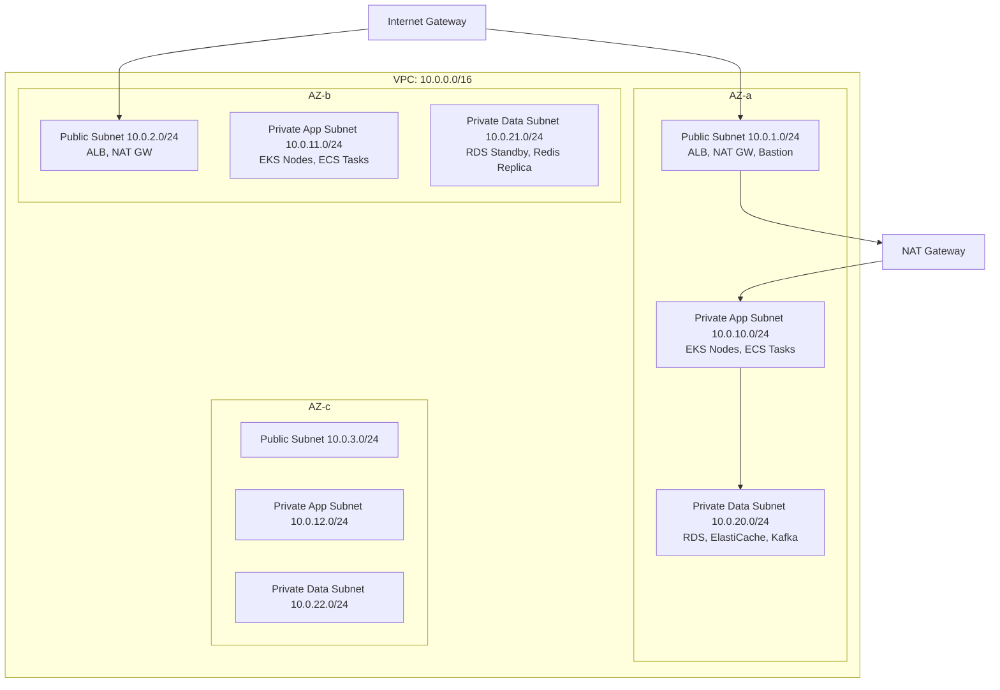

# Cloud & AWS Interview Questions

> 10 architect-level questions on AWS VPC, ECS/EKS, load balancing, multi-region, IAM, and cost optimization.
> Cross-references: [Cloud Infrastructure](../09-aws-kubernetes/cloud-infrastructure.md) · [AWS Cheatsheet](../15-cheatsheets/aws-cheatsheet.md)

---

## Q1: Design a production VPC architecture for a FinTech microservices platform.

### Interviewer's Expectation
Multi-AZ design with proper subnet strategy, security groups, NACLs, and network segmentation.

### Excellent Answer

**Three-tier subnet strategy**: Public (ALB, NAT) → Private App (compute) → Private Data (databases). App subnets have no direct internet access; outbound traffic goes through NAT Gateway. Data subnets have no outbound internet at all.

**Security layers**: Security Groups (stateful, instance-level) + NACLs (stateless, subnet-level) + VPC Flow Logs (auditing).

### Common Mistakes
- Putting databases in public subnets, single-AZ design, /16 without CIDR planning for peering, single NAT Gateway (SPOF)

### Follow-up Questions
- "How do you optimize NAT Gateway costs for high-traffic services?"
- "How do you implement VPC peering vs Transit Gateway?"
- "How do you handle inter-region communication?"

---

## Q2: Compare ECS (Fargate) vs EKS. When would you choose each?

### Interviewer's Expectation
Trade-off analysis based on team capabilities, workload requirements, and operational overhead.

### Excellent Answer

| Aspect | ECS Fargate | EKS |
|--------|-----------|-----|
| **Operational overhead** | Low (serverless) | High (cluster management) |
| **Learning curve** | Low | High (Kubernetes expertise) |
| **Portability** | AWS-only | Multi-cloud (K8s standard) |
| **Cost (small scale)** | Higher (Fargate premium) | Lower (EC2 instances) |
| **Cost (large scale)** | Predictable | Lower with Spot + Karpenter |
| **Ecosystem** | AWS-native integrations | Rich K8s ecosystem (Helm, Istio) |
| **Auto-scaling** | Simple (target tracking) | Complex (HPA, VPA, Karpenter) |
| **Service mesh** | App Mesh (limited) | Istio, Linkerd (mature) |
| **Best for** | Small teams, simple architectures | Large teams, complex architectures, multi-cloud |

**My recommendation**: Start with ECS Fargate for speed and simplicity. Migrate to EKS when you need: service mesh, advanced scheduling, multi-cloud portability, or the K8s ecosystem.

---

## Q3: Explain ALB vs NLB. When do you use each?

### Excellent Answer

| Feature | ALB (Application) | NLB (Network) |
|---------|-------------------|----------------|
| **Layer** | Layer 7 (HTTP/HTTPS) | Layer 4 (TCP/UDP) |
| **Routing** | Path, host, header, query string | Port-based only |
| **TLS** | Terminates TLS | TLS passthrough or termination |
| **WebSocket** | Supported | Supported |
| **Static IP** | No (use Global Accelerator) | Yes |
| **Performance** | Higher latency (~ms) | Ultra-low latency (~μs) |
| **WAF** | Supported | Not supported |
| **gRPC** | Supported | Supported (TCP) |
| **Best for** | HTTP APIs, web apps | gRPC, IoT, ultra-low latency, static IPs |

**Production pattern**: CloudFront → ALB (WAF + path routing) → Services. Use NLB only for non-HTTP protocols or when static IPs are required.

---

## Q4-Q10: Additional Cloud Questions (Condensed)

**Q4: Design a multi-region DR strategy for a banking application.** Active-passive with Route53 failover. RDS cross-region read replica promoted on failover. RPO < 1 minute, RTO < 15 minutes. S3 cross-region replication. DynamoDB global tables for active-active metadata.

**Q5: How do you implement IAM best practices for a microservices platform?** Least privilege per service (IRSA for EKS). No long-lived credentials. Cross-account access via STS AssumeRole. Permission boundaries for developer roles. Service control policies at org level.

**Q6: Design a CloudFront + S3 architecture for a global SaaS platform.** Origin Access Control (OAC) for S3. Cache behaviors by path (static vs API). Lambda@Edge for dynamic headers, geo-routing, A/B testing. Custom error pages. Cache invalidation strategy.

**Q7: How do you optimize AWS costs for a microservices platform?** Right-sizing with Compute Optimizer. Spot instances for fault-tolerant workloads. Reserved Instances/Savings Plans for baseline. NAT Gateway cost reduction (S3/DynamoDB gateway endpoints). Graviton instances (20% cheaper).

**Q8: Explain Route53 routing policies and when to use each.** Simple (single resource), Weighted (A/B testing, blue-green), Latency (closest region), Failover (active-passive DR), Geolocation (data sovereignty), Multivalue (simple round-robin).

**Q9: How do you implement infrastructure as code for AWS?** Terraform for multi-cloud, CloudFormation for AWS-native. Terraform modules for reusable VPC, EKS, RDS patterns. State management with S3 + DynamoDB locking. CI/CD pipeline: plan → manual approve → apply.

**Q10: Design auto-scaling for a FinTech platform with variable load.** Target tracking (CPU 60%, request count). Step scaling for burst (scale out fast, scale in slow). Predictive scaling for known patterns (market open/close). Karpenter for K8s node scaling. RDS read replicas scale with load.
