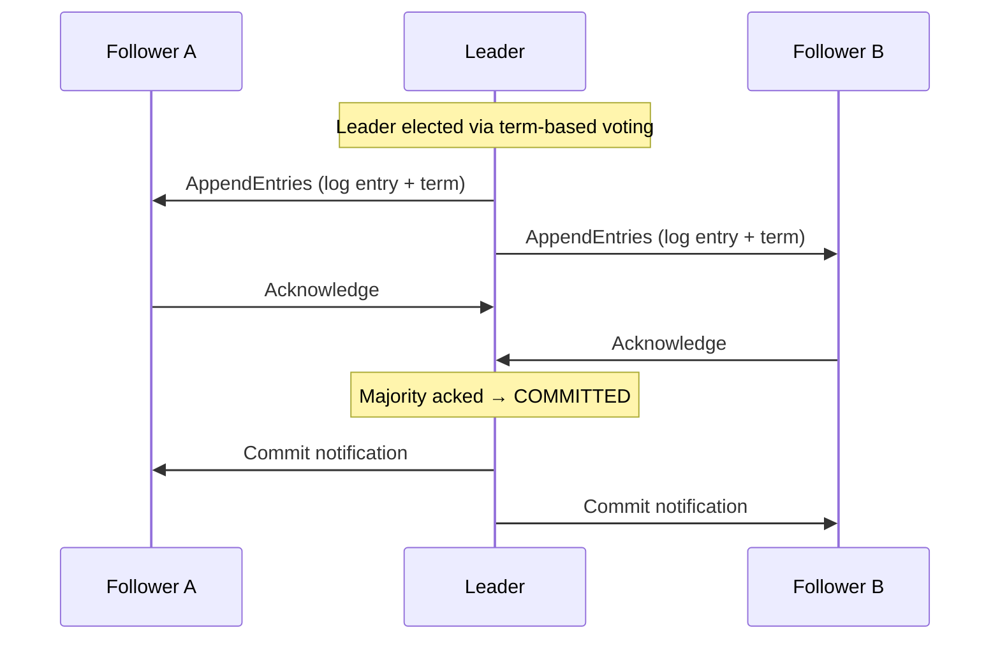
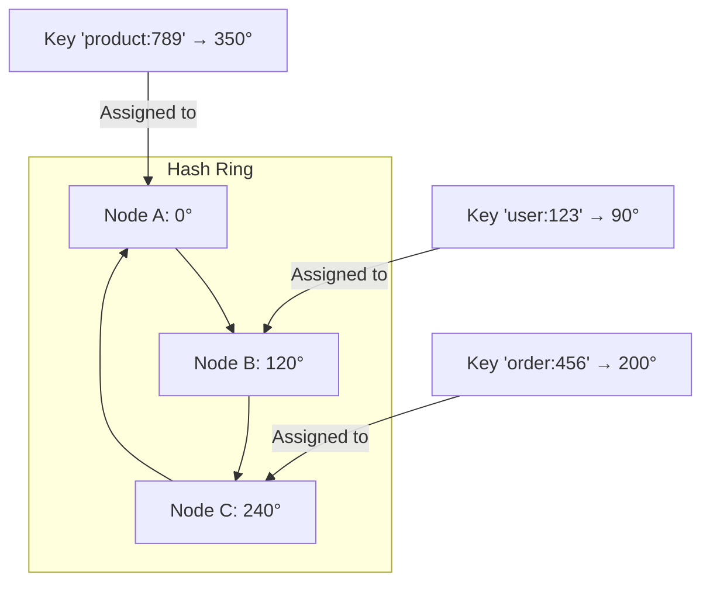
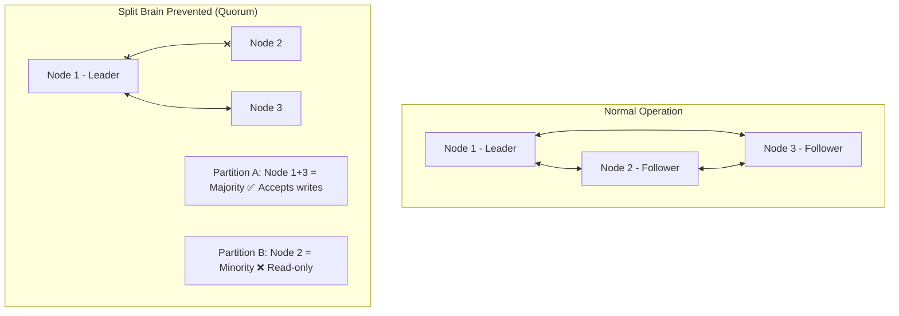

# Distributed Systems Interview Questions

> 8 architect-level questions on CAP theorem, consensus, distributed locking, consistency, and clock synchronization.
> Cross-references: [Distributed Systems Deep Dive](../05-distributed-systems/deep-dive.md) · [DS Cheatsheet](../15-cheatsheets/distributed-systems-cheatsheet.md)

---

## Q1: Explain the CAP theorem with real-world examples. How does it affect your architecture decisions?

### Interviewer's Expectation
Not just the textbook definition. Wants practical application: which real systems are CP vs AP, and how to choose based on business requirements.

### Excellent Answer

CAP states that during a **network partition**, a distributed system must choose between **Consistency** (all nodes see the same data) and **Availability** (every request receives a response).

**Key insight**: CAP is about the trade-off DURING a partition. When there's no partition, you can have both C and A.

| System | Choice | Why | Example |
|--------|--------|-----|---------|
| **PostgreSQL (primary)** | CP | Bank accounts need strong consistency | Balance must be accurate |
| **Cassandra** | AP | Availability > strong consistency | Social media posts, IoT sensor data |
| **ZooKeeper** | CP | Coordination requires consistency | Leader election, distributed locks |
| **DynamoDB** | Tunable | Configure per-query (eventual or strong) | E-commerce: eventual for catalog, strong for orders |
| **Redis Sentinel** | CP | Failover may refuse writes during election | Session store, rate limiting |
| **Kafka** | CP (with min.insync.replicas) | Replication guarantees | Event streaming |

**How I apply this**:
```
Payment Processing:
  → CP: Strong consistency for account balances (PostgreSQL + synchronous replication)
  → AP for non-critical: User notification preferences (eventual consistency OK)

Product Catalog:
  → AP: Show slightly stale prices rather than showing errors
  → CP for inventory: Don't oversell (distributed lock + strong consistency)
```

**PACELC extension**: Even when there is No Partition, there's a trade-off between Latency and Consistency.
- PA/EL: Dynamo — available during partition, low latency otherwise
- PC/EC: PostgreSQL — consistent during partition, consistent otherwise
- PA/EC: Most systems — available during partition, consistent when healthy

### Common Mistakes
- Thinking you must choose C or A permanently (it's per-operation)
- Ignoring PACELC (CAP doesn't address the latency/consistency trade-off during normal operation)
- Not realizing "partition tolerance" isn't optional (networks WILL fail)
- Equating eventual consistency with "no consistency" (it WILL converge)

### Follow-up Questions
- "How does the PACELC theorem extend CAP?"
- "Give an example where you chose AP for one operation and CP for another in the same system."
- "How does Kafka's `acks=all` + `min.insync.replicas` relate to CAP?"

---

## Q2: Explain consensus algorithms (Raft/Paxos). Why are they important for distributed systems?

### Interviewer's Expectation
Conceptual understanding of how distributed systems agree on values, leader election, and log replication. Not expected to implement Raft, but should understand the phases.

### Excellent Answer

**Consensus** allows a cluster of nodes to agree on a single value even if some nodes fail. Critical for: leader election, distributed configuration, log replication.

**Raft** (designed for understandability):



**Three phases**:
1. **Leader Election**: Nodes start as followers. If no heartbeat received → become candidate → request votes → majority wins → become leader
2. **Log Replication**: Leader receives writes, appends to local log, replicates to followers, commits after majority acknowledge
3. **Safety**: A node can only be elected leader if its log is at least as up-to-date as majority

**Where consensus is used in practice**:
- **etcd** (Kubernetes): Raft-based, stores cluster state
- **ZooKeeper**: ZAB protocol (Paxos-derived), used by Kafka for metadata
- **CockroachDB**: Raft per range of keys, distributed SQL
- **Kafka KRaft**: Raft-based metadata management (replacing ZooKeeper)

### Common Mistakes
- Confusing consensus with 2PC (consensus tolerates failures, 2PC blocks on any failure)
- Thinking consensus is fast (multiple round trips, not suitable for high-throughput data)
- Not understanding why odd-numbered clusters are preferred (3 tolerates 1 failure, 4 also tolerates only 1)
- Confusing Raft terms with wall-clock time

### Follow-up Questions
- "Why is Kafka moving from ZooKeeper to KRaft?"
- "What happens during a network partition in a Raft cluster?"
- "How does CockroachDB use Raft differently from etcd?"

---

## Q3: How do you implement distributed locking? Compare Redis, ZooKeeper, and database-based approaches.

### Interviewer's Expectation
Understanding of lock algorithms (Redlock), edge cases (clock skew, GC pauses), and practical production experience.

### Excellent Answer

| Approach | Algorithm | Pros | Cons |
|----------|-----------|------|------|
| **Redis (single)** | `SET key value NX EX 30` | Simple, fast | Single point of failure |
| **Redis (Redlock)** | Lock acquired on N/2+1 nodes | Fault tolerant | Controversial (Martin Kleppmann critique), clock-dependent |
| **ZooKeeper** | Ephemeral sequential nodes | Strong guarantees, session-based | Operational complexity, slower |
| **Database** | `SELECT FOR UPDATE` / advisory locks | No additional infrastructure | Limited scalability, connection-bound |
| **etcd** | Lease-based with TTL | Strong consistency (Raft) | Additional infrastructure |

```java
// Redis distributed lock with Redisson (recommended)
@Component
public class DistributedLockService {
    private final RedissonClient redisson;

    public <T> T executeWithLock(String lockKey, Duration timeout, Supplier<T> task) {
        RLock lock = redisson.getLock(lockKey);
        boolean acquired = false;
        try {
            acquired = lock.tryLock(timeout.toSeconds(), 30, TimeUnit.SECONDS);
            if (!acquired) {
                throw new LockAcquisitionException("Failed to acquire lock: " + lockKey);
            }
            return task.get();
        } catch (InterruptedException e) {
            Thread.currentThread().interrupt();
            throw new LockAcquisitionException("Interrupted while acquiring lock", e);
        } finally {
            if (acquired && lock.isHeldByCurrentThread()) {
                lock.unlock();
            }
        }
    }
}

// Usage
paymentResult = lockService.executeWithLock(
    "payment:" + orderId,
    Duration.ofSeconds(5),
    () -> paymentService.processPayment(orderId)
);
```

**The fencing token pattern** (prevents stale lock holders from corrupting data):
```
Client 1 acquires lock → gets fencing token #34
Client 1 has GC pause → lock expires
Client 2 acquires lock → gets fencing token #35
Client 1 resumes → tries to write with token #34
Storage rejects write because #34 < current token #35
```

### Common Mistakes
- Not setting lock TTL (dead client holds lock forever)
- Not using fencing tokens (GC pause → stale lock holder writes stale data)
- Using Redlock without understanding its limitations
- Not handling lock extension for long-running operations (Redisson's watchdog handles this)

### Follow-up Questions
- "Explain Martin Kleppmann's critique of Redlock."
- "How does ZooKeeper's ephemeral node approach handle session failures?"
- "What is the fencing token pattern and why is it critical?"

---

## Q4: What is consistent hashing? How is it used in distributed systems?

### Interviewer's Expectation
Understanding of the algorithm, virtual nodes, and real-world applications (load balancing, caching, database sharding).

### Excellent Answer

**Problem**: In a traditional hash (`hash(key) % N`), adding or removing a node remaps almost ALL keys.

**Consistent hashing**: Maps both keys and nodes onto a ring (0 to 2^32). Each key is assigned to the first node clockwise on the ring. Adding/removing a node only affects keys between that node and its predecessor — minimal disruption.



**Virtual nodes**: Each physical node maps to multiple positions on the ring (e.g., 150 virtual nodes per physical node). This ensures even distribution, especially with heterogeneous node capacities.

**Real-world usage**:
- **Cassandra**: Partitions data across nodes using consistent hashing with vnodes
- **Redis Cluster**: 16,384 hash slots distributed across nodes
- **CDN**: Content routing to edge servers
- **Load balancing**: Sticky session routing (consistent hashing on session ID)
- **Kafka**: Partition assignment (custom partitioner)

### Common Mistakes
- Not using virtual nodes (hot spots with uneven distribution)
- Not understanding replication factor interaction (Cassandra: consistent hash determines primary, replicas are next N nodes)
- Confusing consistent hashing with hash partitioning
- Not handling node addition/removal gracefully (data rebalancing)

### Follow-up Questions
- "How does Cassandra use consistent hashing with vnodes?"
- "What is the 'jump hash' algorithm and when is it better?"
- "How does consistent hashing interact with replication?"

---

## Q5: Explain vector clocks and how they solve ordering in distributed systems.

### Interviewer's Expectation
Understanding of why wall clocks are unreliable, how vector clocks establish causal ordering, and practical alternatives (hybrid logical clocks).

### Excellent Answer

**Problem**: Wall clocks are unreliable in distributed systems. NTP can drift by milliseconds, and clock skew means events can appear out of order.

**Lamport clocks**: Monotonically increasing counter. `send(msg): clock++; receive(msg): clock = max(local, received) + 1`. Establishes **partial ordering** but can't determine concurrency.

**Vector clocks**: Each node maintains a vector of counters, one per node:
```
Node A: [A:1, B:0, C:0]  → writes X=1
Node B: [A:0, B:1, C:0]  → writes X=2
           ↓
  Conflict detected: Neither dominates the other
  [A:1, B:0] vs [A:0, B:1] → concurrent writes

Node C receives both:
  [A:1, B:1, C:1] → must resolve conflict (LWW, merge, ask user)
```

**Practical systems**:
- **DynamoDB**: Uses vector clocks for conflict detection (returns all conflicting versions)
- **Riak**: Uses dotted version vectors (optimized vector clocks)
- **CockroachDB**: Uses Hybrid Logical Clocks (HLC) — combines physical clock + logical counter

**For interviews, the key insight**: Vector clocks detect conflicts but don't resolve them. Resolution strategies: Last-Writer-Wins (LWW), merge (CRDTs), or application-level resolution.

### Common Mistakes
- Confusing Lamport clocks with vector clocks
- Not understanding that vector clocks detect concurrency, not resolve it
- Thinking wall clocks are "good enough" for ordering in distributed systems
- Not mentioning CRDTs as a conflict-free alternative

### Follow-up Questions
- "What are CRDTs and how do they avoid the need for conflict resolution?"
- "How do Hybrid Logical Clocks improve on vector clocks?"
- "How does Google Spanner use TrueTime for global ordering?"

---

## Q6: How do you handle split-brain scenarios in distributed systems?

### Interviewer's Expectation
Understanding of split-brain causes, detection, and prevention strategies.

### Excellent Answer

**Split-brain** occurs when a network partition causes two subsets of a cluster to independently believe they are the active cluster — both accepting writes, causing data divergence.

**Prevention strategies**:
1. **Quorum-based writes**: Require majority (`W > N/2`) to accept writes. Minority partition rejects writes. Used by: Raft, Paxos, ZooKeeper.
2. **Fencing**: The old leader is fenced (STONITH — Shoot The Other Node In The Head) before the new leader activates. Used by: PostgreSQL with Patroni.
3. **Lease-based leadership**: Leader holds a time-bounded lease. If it can't renew (network partition), it steps down. Minority partition has no leader.
4. **Witness/tie-breaker**: Odd-numbered clusters (3, 5) prevent 50/50 splits. A lightweight witness node breaks ties.



### Common Mistakes
- Using even-numbered clusters (tie in partition → both sides reject)
- Not implementing fencing (old leader continues writing after new leader elected)
- Relying on heartbeat timeouts alone (too aggressive → false positives, too conservative → long outage)
- Not testing partition scenarios (use tools like Chaos Monkey, Toxiproxy)

### Follow-up Questions
- "How does PostgreSQL with Patroni handle split-brain?"
- "What is STONITH and why is it important?"
- "How do you test for split-brain in your systems?"

---

## Q7: What is idempotency and why is it critical in distributed systems? How do you implement it?

### Interviewer's Expectation
Practical implementation patterns, not just the definition. Idempotency keys, database-level guarantees, and Kafka consumer idempotency.

### Excellent Answer

**Idempotency**: Performing an operation multiple times produces the same result as performing it once. Critical because in distributed systems, messages can be delivered more than once (at-least-once delivery).

**Implementation pattern — Idempotency Key**:
```java
@Transactional
public PaymentResult processPayment(String idempotencyKey, PaymentRequest request) {
    // Check if already processed
    Optional<PaymentResult> existing = idempotencyStore.findByKey(idempotencyKey);
    if (existing.isPresent()) {
        return existing.get();  // Return cached result — idempotent!
    }

    // Process payment
    PaymentResult result = paymentGateway.charge(request);

    // Store result with idempotency key
    idempotencyStore.save(idempotencyKey, result, Duration.ofHours(24));

    return result;
}
```

```sql
-- Database-level idempotency with unique constraint
CREATE TABLE processed_events (
    event_id UUID PRIMARY KEY,
    processed_at TIMESTAMP NOT NULL,
    result JSONB
);

-- Consumer: INSERT or ignore if already exists
INSERT INTO processed_events (event_id, processed_at, result)
VALUES ($1, NOW(), $2)
ON CONFLICT (event_id) DO NOTHING;
```

**Naturally idempotent operations**: SET (assign a value), DELETE (delete if exists), GET (read). **NOT idempotent**: INCREMENT, APPEND, TRANSFER.

**Making non-idempotent operations idempotent**:
```java
// ❌ Not idempotent: balance += amount (double credit!)
// ✅ Idempotent: IF NOT processed(txn_id) THEN balance += amount; mark_processed(txn_id)
```

### Common Mistakes
- Assuming retries are safe without idempotency
- Not including idempotency key in the API contract (`Idempotency-Key` header)
- TTL too short on idempotency store (retries after TTL create duplicates)
- Not handling concurrent requests with the same idempotency key (use database unique constraint)

### Follow-up Questions
- "How does Stripe implement idempotency keys?"
- "How do you make Kafka consumers idempotent?"
- "What's the relationship between idempotency and exactly-once processing?"

---

## Q8: Explain leader election in distributed systems. What algorithms are used?

### Interviewer's Expectation
Understanding of why leader election is needed, algorithms (Raft, Bully, ZooKeeper), and practical usage in microservices (scheduled jobs, cache warming).

### Excellent Answer

**Why leader election?** Single writer avoids conflicts. Coordination tasks (scheduled jobs, cache warming, partition assignment) should run on exactly one instance.

**Approaches**:

| Method | How | Pros | Cons |
|--------|-----|------|------|
| **Raft-based (etcd)** | Consensus algorithm | Strong guarantees | Needs etcd cluster |
| **ZooKeeper** | Ephemeral sequential znodes | Battle-tested | Operational complexity |
| **Redis (Redisson)** | SETNX with TTL | Simple | Redis SPOF, clock-dependent |
| **Database** | `SELECT FOR UPDATE SKIP LOCKED` | No additional infra | Limited scalability |
| **Spring Integration** | `LockRegistry` with JDBC/Redis | Spring-native | Spring-specific |
| **K8s Lease** | Kubernetes Lease API | Cloud-native | K8s-specific |

```java
// Simple leader election with Spring + Redis
@Component
public class LeaderElection {
    private final RedissonClient redisson;
    private final String nodeId = UUID.randomUUID().toString();

    @Scheduled(fixedRate = 10000)
    public void tryBecomeLeader() {
        RLock lock = redisson.getLock("scheduler-leader");
        if (lock.tryLock()) {
            try {
                // I am the leader — execute scheduled tasks
                executeScheduledJobs();
            } finally {
                lock.unlock();
            }
        }
    }
}
```

### Common Mistakes
- Not implementing leader health checks (dead leader holds leadership)
- Not handling leadership transfer during graceful shutdown
- Using leader election for data partitioning (use consistent hashing instead)
- Not testing leader failover scenarios

### Follow-up Questions
- "How do you ensure exactly one instance runs a scheduled job in Kubernetes?"
- "What happens if the leader has a GC pause and loses its lease?"
- "How does Kafka use leader election for partition leaders?"
