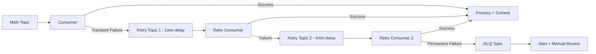

# Messaging Interview Questions

> 5 architect-level questions on Kafka, RabbitMQ, exactly-once semantics, ordering, and DLQ strategies.
> Cross-references: [Messaging Deep Dive](../08-kafka-rabbitmq/messaging-deep-dive.md) · [Kafka Cheatsheet](../15-cheatsheets/kafka-cheatsheet.md)

---

## Q1: Compare Kafka and RabbitMQ. How do you decide which to use?

### Interviewer's Expectation
Beyond superficial comparison — trade-off analysis based on use case, throughput, ordering, replay, and operational complexity.

### Excellent Answer

| Aspect | Apache Kafka | RabbitMQ |
|--------|-------------|----------|
| **Model** | Distributed log (append-only) | Message broker (queue-based) |
| **Throughput** | Very High (millions/sec) | High (tens of thousands/sec) |
| **Message retention** | Configurable (days/weeks/forever) | Until consumed + acknowledged |
| **Ordering** | Per-partition guarantee | Per-queue (single consumer) |
| **Replay** | ✅ Consumer can re-read | ❌ Once consumed, gone |
| **Consumer model** | Pull (consumer controls pace) | Push (broker delivers) |
| **Routing** | Topic + partition key | Exchange types (direct, topic, fanout, headers) |
| **Protocol** | Custom binary (Kafka protocol) | AMQP 0.9.1 |
| **Exactly-once** | ✅ Transactional API | ❌ At-most-once or at-least-once |
| **Best for** | Event streaming, event sourcing, CDC, high-throughput | Task queues, request-reply, complex routing, priority queues |

**Decision framework**:
```
Event Streaming (high volume, replay needed)     → Kafka
Task Queue (work distribution, priority)          → RabbitMQ
Event Sourcing (immutable log)                    → Kafka
Complex Routing (topic-based, headers)            → RabbitMQ
CDC / Data Pipeline                               → Kafka (+ Kafka Connect)
Exactly-Once Processing                           → Kafka
Low Latency per-message                           → RabbitMQ
Hybrid (events + tasks)                           → Both!
```

**Real-world hybrid**: Kafka for domain events (OrderPlaced → Payment, Inventory). RabbitMQ for task queues (send email, generate PDF, process image).

### Common Mistakes
- Using Kafka for simple task queues (overkill), using RabbitMQ for event sourcing (no replay), not considering operational complexity of Kafka, treating them as interchangeable

---

## Q2: How does Kafka achieve exactly-once semantics?

### Excellent Answer

Three components working together:

1. **Idempotent Producer** (`enable.idempotence=true`): Each producer has a unique PID. Broker deduplicates by `(PID, sequence_number)`. Prevents duplicate writes from retries.

2. **Transactional API**: Atomic writes across multiple partitions/topics:
```java
producer.initTransactions();
producer.beginTransaction();
producer.send(new ProducerRecord<>("orders", key, value));
producer.send(new ProducerRecord<>("audit", key, auditValue));
producer.sendOffsetsToTransaction(offsets, consumerGroupMetadata);
producer.commitTransaction();
// Either ALL writes succeed, or NONE do
```

3. **Consumer with `isolation.level=read_committed`**: Only reads messages from committed transactions. Uncommitted/aborted messages are invisible.

**End-to-end exactly-once** = Idempotent Producer + Transactions + Read Committed Consumer + Consume-Transform-Produce in single transaction.

### Common Mistakes
- Thinking idempotent producer alone provides exactly-once (it only prevents duplicate sends), not using `read_committed` on consumers, not handling transaction timeouts, confusing Kafka exactly-once with application-level exactly-once (external systems still need idempotency)

---

## Q3: How do you handle message ordering in Kafka?

### Excellent Answer

**Kafka guarantees ordering within a single partition only.** Messages with the same partition key go to the same partition → ordered.

```java
// Ensure all events for an order go to the same partition
producer.send(new ProducerRecord<>("order-events",
    orderId,    // Partition key — all events for this order are ordered
    event));
```

**Challenges and solutions**:

| Challenge | Solution |
|-----------|----------|
| Need global ordering | Single partition (limits throughput to 1 consumer) |
| Consumer rebalance breaks ordering | Sticky partition assignor, cooperative rebalancing |
| Consumer failure mid-batch | Commit offsets only after processing succeeds |
| Retry changes order | Separate retry topic with delay, or `max.in.flight.requests.per.connection=1` |
| Need ordering across entities | Saga orchestrator processes events from multiple partitions sequentially |

---

## Q4: Design a DLQ (Dead Letter Queue) strategy for Kafka.

### Excellent Answer



**Three-tier retry strategy**:
1. **Inline retry**: 3 immediate retries (network blips)
2. **Delayed retry topics**: Separate topics with increasing delays (1min, 5min, 30min)
3. **DLQ**: Permanent failures → DLQ topic → alerting → manual investigation dashboard

```java
@Configuration
public class KafkaRetryConfig {
    @Bean
    public DefaultErrorHandler errorHandler(KafkaTemplate<String, String> template) {
        DeadLetterPublishingRecoverer recoverer = new DeadLetterPublishingRecoverer(template,
            (record, ex) -> new TopicPartition(record.topic() + ".DLQ", record.partition()));

        return new DefaultErrorHandler(recoverer,
            new FixedBackOff(1000L, 3L));  // 3 retries, 1s interval
    }
}
```

---

## Q5: How do you handle consumer group rebalancing in Kafka?

### Excellent Answer

**Rebalancing** redistributes partitions across consumers when: a consumer joins/leaves, a consumer crashes, partitions are added.

**Problem**: During rebalancing, ALL consumers in the group stop processing (stop-the-world). For large consumer groups, this can cause minutes of downtime.

**Solutions**:
1. **Cooperative Sticky Assignor** (recommended): Incremental rebalancing — only reassigns affected partitions, others continue processing
2. **Static Group Membership** (`group.instance.id`): Consumer restart doesn't trigger rebalance if within `session.timeout.ms`
3. **Tune timeouts**: `session.timeout.ms=45s`, `heartbeat.interval.ms=15s` — avoid unnecessary rebalances from GC pauses

```yaml
spring:
  kafka:
    consumer:
      properties:
        partition.assignment.strategy: org.apache.kafka.clients.consumer.CooperativeStickyAssignor
        group.instance.id: ${HOSTNAME}  # Static membership
        session.timeout.ms: 45000
        heartbeat.interval.ms: 15000
        max.poll.interval.ms: 300000
```

### Common Mistakes
- Using eager rebalancing (default before Kafka 2.4), not monitoring consumer lag during rebalances, max.poll.interval.ms too low (slow processing triggers rebalance), not implementing graceful shutdown (consumer doesn't leave group cleanly)
