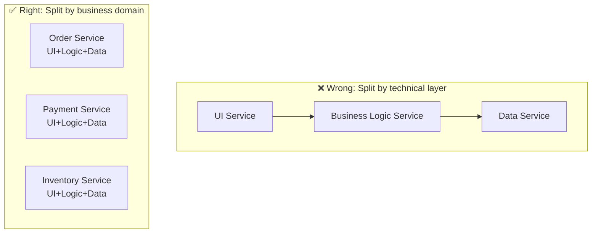
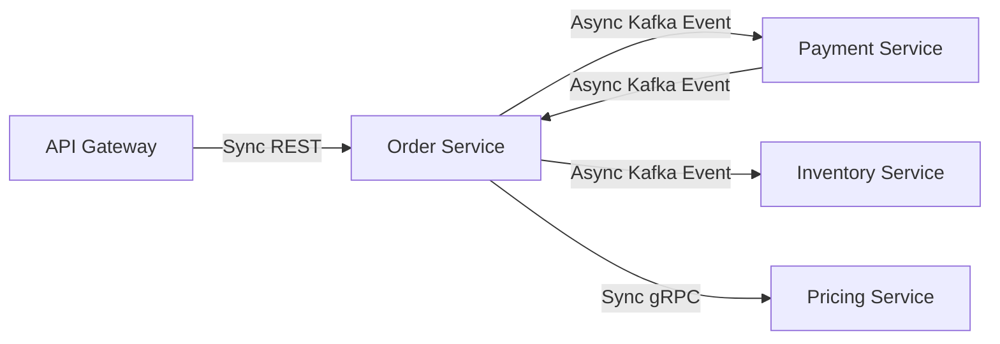
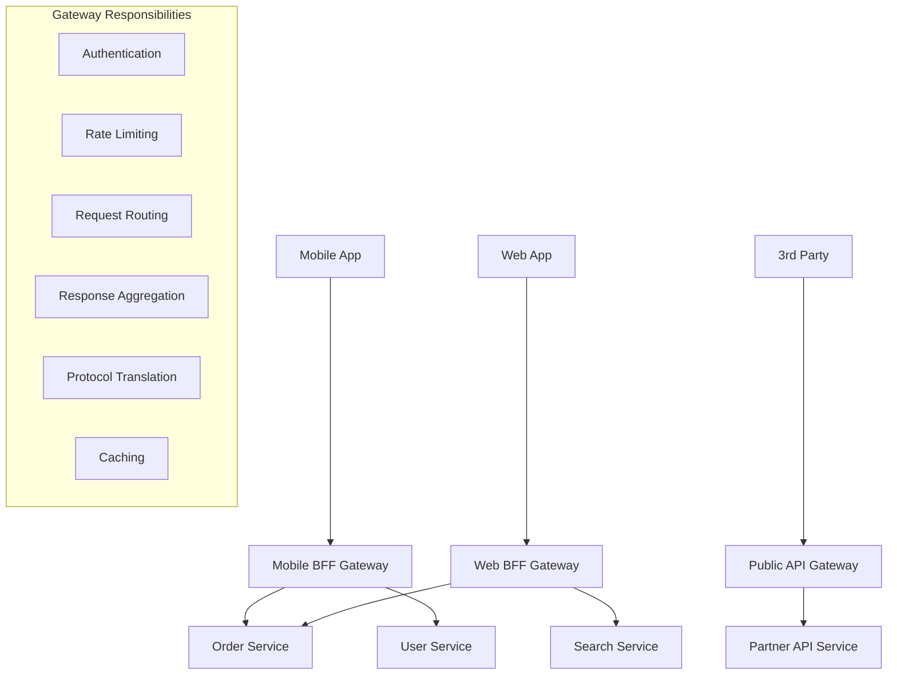
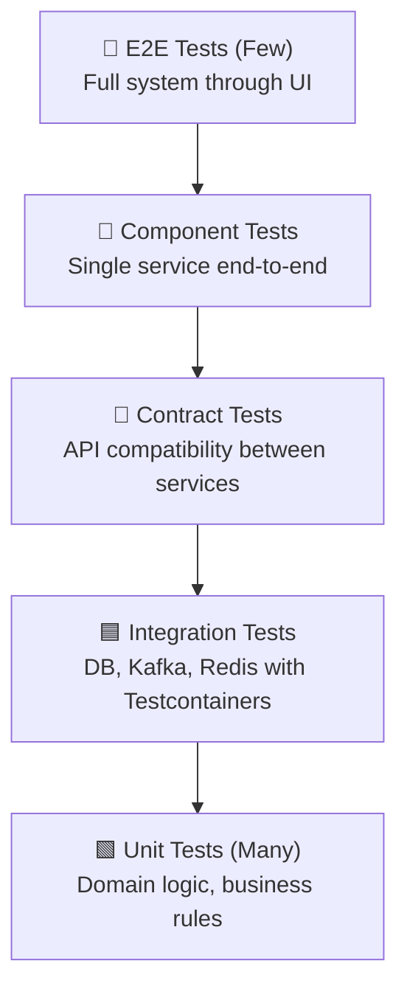

# Microservices Interview Questions

> 10 architect-level questions on service decomposition, communication, API Gateway, service mesh, data consistency, and testing.
> Cross-references: [Distributed Systems](../05-distributed-systems/deep-dive.md) · [Architecture Questions](./architecture-questions.md)

---

## Q1: How do you decompose a monolith into microservices? What strategies do you use to identify service boundaries?

### Interviewer's Expectation
Systematic approach using DDD, not arbitrary splitting. Understanding of bounded contexts, data ownership, and team alignment.

### Excellent Answer

**Three decomposition strategies**:

1. **By Business Capability**: Align services with what the business does (Order Management, Payment Processing, Inventory)
2. **By Subdomain (DDD)**: Use Event Storming to discover bounded contexts — each context is a candidate service
3. **By Data Ownership**: Each service owns its data; if two functions share the same data lifecycle, they belong together

**Event Storming process**:
```
Step 1: Domain Events → "OrderPlaced", "PaymentReceived", "ItemShipped"
Step 2: Commands → "PlaceOrder", "ProcessPayment", "ShipItem"
Step 3: Aggregates → Order, Payment, Shipment
Step 4: Bounded Contexts → Order Context, Payment Context, Fulfillment Context
Step 5: Context Map → Define relationships (Customer-Supplier, ACL, etc.)
```

**Service boundary validation checklist**:
- [ ] Can this service be deployed independently?
- [ ] Does it own its data (no shared database)?
- [ ] Does it align with a team (Conway's Law)?
- [ ] Are cross-service transactions minimized?
- [ ] Is the API surface small and cohesive?



### Common Mistakes
- Splitting by technical layer (creates distributed monolith)
- Making services too small (nano-services with excessive network overhead)
- Sharing databases between services (tight coupling via data)
- Not considering team structure (Conway's Law)

### Follow-up Questions
- "How do you handle a shared concept like 'User' that exists in multiple domains?"
- "What is the ideal size of a microservice?"
- "How does Conway's Law influence service decomposition?"

---

## Q2: Compare synchronous vs asynchronous inter-service communication. When do you use each?

### Interviewer's Expectation
Trade-off analysis with practical guidelines, not just "async is better."

### Excellent Answer

| Aspect | Synchronous (REST/gRPC) | Asynchronous (Kafka/RabbitMQ) |
|--------|------------------------|-------------------------------|
| **Coupling** | Temporal + spatial | Spatial only |
| **Latency** | Immediate response | Eventually processed |
| **Failure handling** | Cascade risk | Message queued for retry |
| **Consistency** | Request-response guarantees | Eventual consistency |
| **Debugging** | Simple stack trace | Complex event tracing |
| **Backpressure** | Limited (circuit breaker) | Built-in (queue depth) |
| **Use case** | Queries, real-time validation | Commands, events, workflows |

**Decision framework**:
```
Need immediate response? → Synchronous (REST/gRPC)
  → User-facing API calls
  → Real-time validation ("Is this username available?")
  → Read queries

Can tolerate delay? → Asynchronous (Events)
  → State changes ("Order placed" → notify payment, inventory)
  → Long-running processes (report generation, email sending)
  → Cross-domain communication
```

**Hybrid pattern (most common in production)**:


User-facing calls are synchronous; inter-service side effects are asynchronous via events.

### Common Mistakes
- Using synchronous calls for everything (distributed monolith, cascade failures)
- Using async for queries that need immediate response
- Not implementing idempotency for async consumers
- Ignoring the complexity cost of async (debugging, eventual consistency)

### Follow-up Questions
- "How do you handle the case where an async operation fails and the user needs feedback?"
- "Compare REST, gRPC, and GraphQL for inter-service communication."
- "How do you implement request-reply pattern over Kafka?"

---

## Q3: What is a distributed monolith? How do you detect and fix it?

### Interviewer's Expectation
Real-world experience recognizing anti-patterns in microservices that indicate tight coupling despite service separation.

### Excellent Answer

A **distributed monolith** has the deployment complexity of microservices with none of the benefits — services are so tightly coupled that you can't deploy, scale, or change them independently.

**Symptoms**:
1. **Synchronized deployments**: "We need to deploy services A, B, and C together"
2. **Shared database**: Multiple services read/write the same tables
3. **Chatty communication**: Service A makes 20+ synchronous calls to Service B per request
4. **Shared libraries with domain logic**: All services depend on `common-models.jar`
5. **Feature changes require multiple service changes**: Adding a field touches 5 services
6. **Cascade failures**: One service goes down, everything goes down

**Detection**:
```java
// ArchUnit test for dependency violations
@ArchTest
ArchRule noCrossServiceImports = noClasses()
    .that().resideInAPackage("..orderservice..")
    .should().dependOnClassesThat().resideInAPackage("..paymentservice..");
```

Monitor: deployment frequency per service (should be independent), failure correlation (should be uncorrelated), change coupling (feature changes should affect 1-2 services).

**Fixes**:
1. **Break shared databases** → Each service owns its data, use events for sync
2. **Replace sync chains with events** → Order → Kafka event → Payment (not HTTP chain)
3. **Split shared libraries** → Extract domain-specific contracts (Protobuf/Avro schemas)
4. **Anti-corruption layers** → Translate between service models at boundaries
5. **API Gateway for aggregation** → Don't make clients call 5 services; gateway aggregates

### Common Mistakes
- Thinking "we have microservices" because services are separate Git repos
- Not measuring coupling metrics (deployment coupling, change coupling)
- Fixing symptoms (adding more retries) instead of root cause (tight coupling)
- Resistance to merging services that should be one (two services with shared lifecycle → merge them)

### Follow-up Questions
- "When should you merge microservices back into a monolith?"
- "How does the shared-nothing architecture principle apply?"
- "What's the difference between loose coupling and no coupling?"

---

## Q4: How do you implement the API Gateway pattern? What are the trade-offs of a gateway vs direct service calls?

### Interviewer's Expectation
Architecture-level understanding of gateway responsibilities, BFF pattern, and when gateway adds value vs unnecessary complexity.

### Excellent Answer



**Gateway vs Direct Calls**:

| Aspect | API Gateway | Direct Service Calls |
|--------|-----------|---------------------|
| **Pros** | Single entry point, cross-cutting concerns centralized, client simplification | Lower latency, simpler architecture, no SPOF |
| **Cons** | Single point of failure, potential bottleneck, additional hop | Cross-cutting concerns duplicated, client complexity |
| **Best for** | Public APIs, mobile apps, multi-client scenarios | Service-to-service internal calls, simple architectures |

**BFF (Backend for Frontend)** — Separate gateway per client type:
- Mobile BFF: Optimized payloads, aggregated responses, offline-friendly
- Web BFF: Full data, real-time features, SSE/WebSocket
- Public API: Versioned, rate-limited, API key authenticated

### Common Mistakes
- Putting business logic in the gateway (should be thin routing + cross-cutting)
- Single gateway for all clients (different clients have different needs → BFF)
- Not implementing circuit breakers in the gateway
- Gateway as a transformation layer (becomes a bottleneck)

### Follow-up Questions
- "Compare Spring Cloud Gateway, Kong, and AWS API Gateway."
- "How does a service mesh (Istio) relate to an API Gateway?"
- "How do you handle API versioning in the gateway?"

---

## Q5: How do you test microservices? Explain the testing pyramid and contract testing.

### Interviewer's Expectation
Comprehensive testing strategy that addresses the unique challenges of distributed systems.

### Excellent Answer



| Level | Scope | Tools | Speed | Confidence |
|-------|-------|-------|-------|------------|
| **Unit** | Single class/function | JUnit 5, Mockito | ~ms | Logic correctness |
| **Integration** | Service + real infra | Testcontainers | ~seconds | Infrastructure compatibility |
| **Contract** | API boundary | Spring Cloud Contract, Pact | ~seconds | Cross-service compatibility |
| **Component** | Single service E2E | SpringBootTest + WireMock | ~seconds | Service behavior |
| **E2E** | Full system | Playwright, k6 | ~minutes | System-wide behavior |

**Contract testing is the key differentiator**:
```java
// Consumer side (Payment Service expects Order Service to return this)
@Pact(consumer = "PaymentService", provider = "OrderService")
RequestResponsePact orderDetailsPact(PactDslWithProvider builder) {
    return builder
        .given("Order 123 exists")
        .uponReceiving("a request for order 123")
        .path("/api/orders/123")
        .method("GET")
        .willRespondWith()
        .status(200)
        .body(newJsonBody(body -> {
            body.stringType("orderId", "123");
            body.decimalType("totalAmount", 99.99);
            body.stringType("status", "CONFIRMED");
        }).build())
        .toPact();
}

// Provider side (Order Service verifies it fulfills the contract)
@Provider("OrderService")
@PactBroker(url = "https://pact-broker.company.com")
class OrderServiceProviderTest {
    @TestTemplate
    @ExtendWith(PactVerificationInvocationContextProvider.class)
    void verifyPact(PactVerificationContext context) {
        context.verifyInteraction();
    }
}
```

### Common Mistakes
- No contract tests (integration breaks discovered in staging/production)
- Testing implementation details instead of behavior
- Not using Testcontainers (H2 doesn't behave like PostgreSQL)
- Too many E2E tests (slow, flaky, expensive)

### Follow-up Questions
- "How do you test Saga patterns across microservices?"
- "What's the difference between Pact and Spring Cloud Contract?"
- "How do you handle test data management across services?"

---

## Q6-Q10: Additional Microservices Questions (Condensed)

### Q6: Explain the Sidecar pattern and Service Mesh architecture.
**Key Answer**: Sidecar proxy (Envoy) handles cross-cutting concerns (mTLS, observability, retries) alongside each service. Service mesh (Istio) manages all sidecars centrally. Trade-off: operational complexity vs uniform infrastructure.

### Q7: How do you handle distributed tracing across microservices?
**Key Answer**: OpenTelemetry SDK auto-instruments Spring Boot. Trace context (W3C TraceContext) propagated via HTTP headers. Collector → Jaeger/Tempo. Sample rate at 10% in production. Correlate logs with trace IDs.

### Q8: What is the Strangler Fig pattern? How do you migrate incrementally?
**Key Answer**: Route traffic through a facade. New features go to new service, old features gradually migrated. API Gateway routes by path prefix. Dual-write for data migration. Feature flags for rollback.

### Q9: How do you handle data consistency across microservices without distributed transactions?
**Key Answer**: Accept eventual consistency. Saga pattern for multi-service workflows. Outbox pattern for reliable event publishing. Idempotent consumers for exactly-once processing. Compensating transactions for rollback.

### Q10: What are microservice anti-patterns you've encountered?
**Key Answer**: Distributed monolith, shared database, chatty services, circular dependencies, too-small services (nano-services), data-driven decomposition (instead of domain-driven), shared domain libraries, no service ownership.
