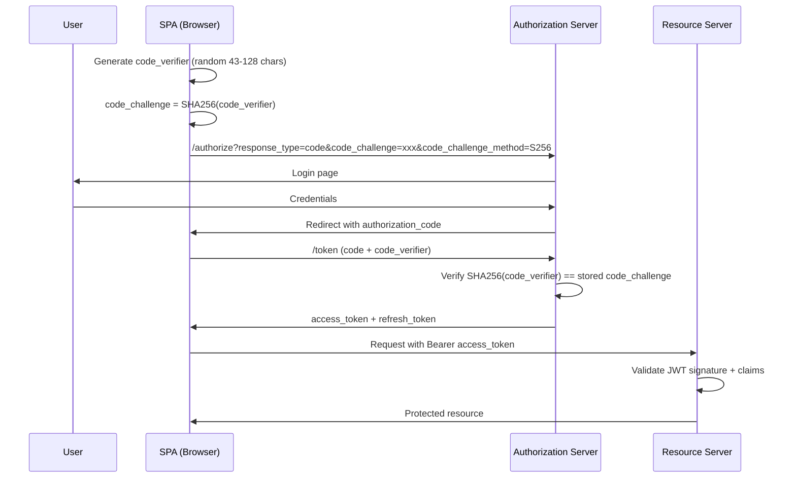
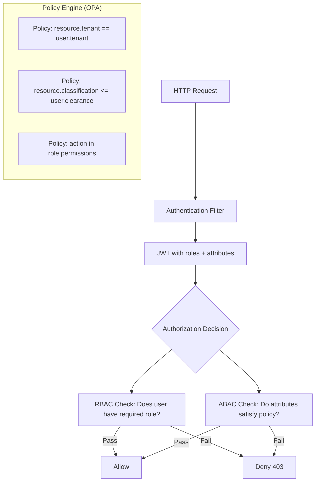
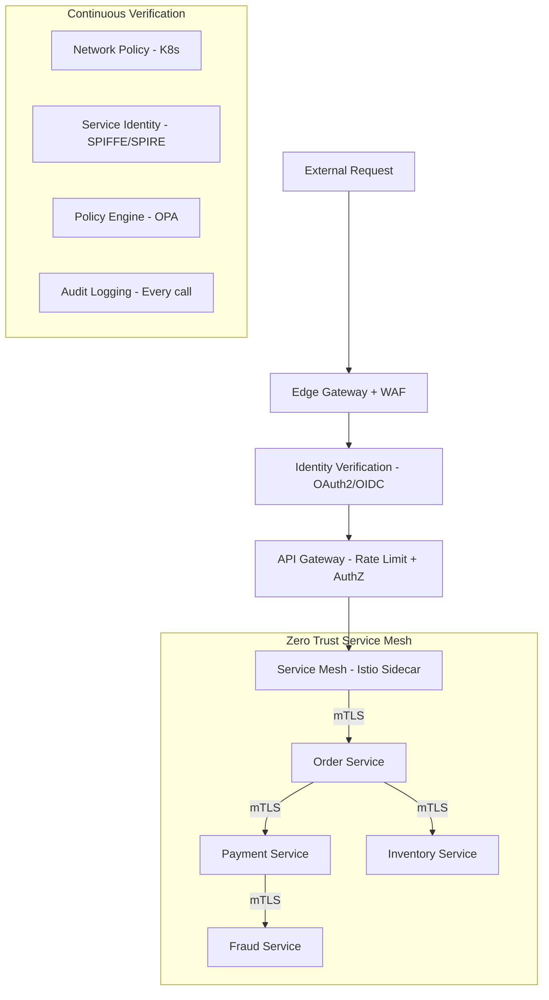
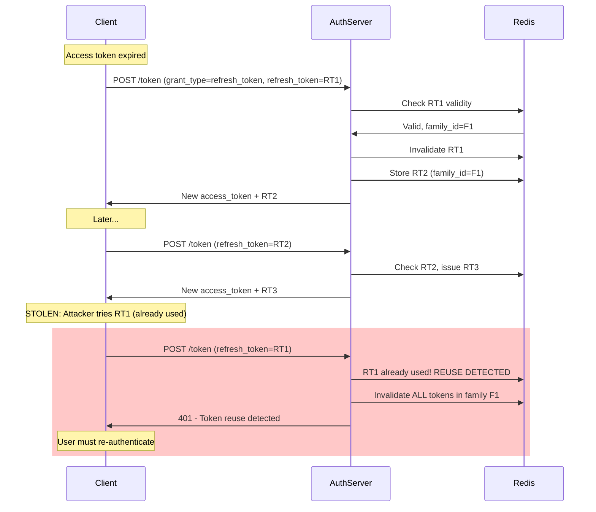

# Security Interview Questions

> 10 architect-level questions on OAuth2, OIDC, JWT, CSRF, XSS, API Security, RBAC/ABAC, and Zero Trust.
> Cross-references: [Security Deep Dive](../06-security/security-deep-dive.md) · [Security Cheatsheet](../15-cheatsheets/security-cheatsheet.md)

---

## Q1: Explain the OAuth2 Authorization Code flow with PKCE. Why is PKCE required for SPAs and mobile apps?

### Interviewer's Expectation
Complete understanding of the flow, why implicit flow was deprecated, and how PKCE prevents authorization code interception attacks.

### Excellent Answer



**Why PKCE?** SPAs and mobile apps can't securely store a `client_secret`. The original Authorization Code flow required a server-side client secret. Without it, if an attacker intercepts the authorization code (via malicious browser extension, custom URL scheme hijacking on mobile), they could exchange it for tokens.

PKCE solves this: the code_verifier is never transmitted until the token exchange, and only the SHA256 hash (code_challenge) is sent in the initial request. The attacker has the code but not the code_verifier, so they can't complete the token exchange.

**Implementation in Spring Security**:
```java
@Bean
public SecurityFilterChain filterChain(HttpSecurity http) throws Exception {
    return http
        .oauth2Login(oauth2 -> oauth2
            .authorizationEndpoint(auth -> auth
                .authorizationRequestResolver(pkceResolver())))
        .build();
}
```

### Common Mistakes
- Using the implicit flow for SPAs (deprecated in OAuth 2.1, tokens exposed in URL fragments)
- Storing tokens in localStorage (vulnerable to XSS — use httpOnly cookies or in-memory)
- Not validating the `state` parameter (CSRF protection for OAuth)
- Using `code_challenge_method=plain` instead of `S256` (no security benefit)

### Follow-up Questions
- "Where should a SPA store access tokens? Compare localStorage, sessionStorage, and httpOnly cookies."
- "How does the Backend-for-Frontend (BFF) pattern improve SPA security?"
- "Explain the difference between OAuth2 access tokens and OIDC ID tokens."

---

## Q2: What is the difference between JWT and opaque tokens? When would you choose each?

### Interviewer's Expectation
Trade-off analysis between self-contained JWTs and reference tokens, covering revocation, performance, and security implications.

### Excellent Answer

| Aspect | JWT (Self-contained) | Opaque Token (Reference) |
|--------|---------------------|-------------------------|
| **Validation** | Local (signature check) | Remote (introspection endpoint) |
| **Performance** | Fast (no network call) | Slower (requires round-trip) |
| **Revocation** | Hard (valid until expiry) | Easy (delete from store) |
| **Size** | Large (~800 bytes with claims) | Small (~32 bytes) |
| **Stateless** | Yes | No (requires token store) |
| **Information** | Contains claims (roles, tenant) | No information (just a reference) |
| **Best for** | Microservice-to-microservice | User-facing APIs needing revocation |

**JWT structure**:
```
Header.Payload.Signature

eyJhbGciOiJSUzI1NiJ9.                    // Header: {"alg":"RS256","typ":"JWT"}
eyJzdWIiOiJ1c2VyMTIzIiwicm9sZXMiOlsiQURNSU4iXSwiZXhwIjoxNzA5MjM0NTY3fQ.  // Payload
SflKxwRJSMeKKF2QT4fwpMeJf36POk6yJV_adQssw5c  // Signature
```

**When I choose JWT**: Inter-service communication in microservices where services need user context (roles, tenant) without calling the auth server. Short-lived (15 minutes).

**When I choose opaque tokens**: User-facing APIs where immediate revocation is critical (banking logout, stolen token scenario). The token is a random string stored in Redis with the session data.

**Hybrid approach** (what I recommend):
```
User ←→ API Gateway: Opaque token (revocable, stored in Redis)
API Gateway ←→ Microservices: JWT (self-contained, short-lived)
```

The gateway exchanges the opaque token for a JWT, adding claims. This gives you revocability at the edge and performance internally.

### Common Mistakes
- Storing sensitive data in JWT payload (it's Base64-encoded, not encrypted!)
- Not validating JWT signature, expiry, issuer, and audience
- Using long-lived JWTs (>1 hour) without refresh token rotation
- Using HS256 (symmetric) in distributed systems (all services share the secret)

### Follow-up Questions
- "How would you implement immediate JWT revocation without making every service call the auth server?"
- "Explain RS256 vs HS256. Which is appropriate for microservices?"
- "How does token refresh work with rotation?"

---

## Q3: How do you prevent CSRF attacks in modern web applications? Is CSRF still relevant with SPAs?

### Interviewer's Expectation
Understanding of CSRF mechanics, the role of `SameSite` cookies, and why CSRF is largely mitigated in API-only architectures with Bearer tokens.

### Excellent Answer

**CSRF requires three conditions**:
1. User is authenticated (has a session cookie)
2. Application uses **cookies** for authentication (auto-attached by browser)
3. Attacker can craft a request that the user's browser sends with the cookie

**Modern mitigation strategies**:

| Strategy | How It Works | Best For |
|----------|-------------|----------|
| `SameSite=Strict` cookie | Browser won't send cookie on cross-origin requests | Strong protection, may break legitimate cross-origin flows |
| `SameSite=Lax` cookie | Cookie sent for top-level navigation GET, not POST | Default in modern browsers, good baseline |
| Synchronizer Token | Server generates a random token, client includes in requests | Traditional server-rendered apps |
| Double Submit Cookie | Token in both cookie and header, server compares | SPAs with cookie-based auth |
| Bearer Token (no cookies) | Token in `Authorization` header, not auto-attached | REST APIs, SPAs using localStorage |

**Key insight for SPAs**: If your API uses `Authorization: Bearer <token>` headers (not cookies), CSRF is **not a concern** because the browser never auto-attaches the token. CSRF is a cookie-specific attack.

**However**, if you use the BFF pattern with httpOnly cookies for token storage (recommended for security), you need CSRF protection:

```java
@Bean
public SecurityFilterChain filterChain(HttpSecurity http) throws Exception {
    return http
        .csrf(csrf -> csrf
            .csrfTokenRepository(CookieCsrfTokenRepository.withHttpOnlyFalse())
            .csrfTokenRequestHandler(new SpaCsrfTokenRequestHandler()))
        .build();
}
```

### Common Mistakes
- Disabling CSRF entirely without understanding why it's safe (only safe for stateless Bearer token APIs)
- Not setting `SameSite` attribute on authentication cookies
- Using GET requests for state-changing operations (CSRF bypasses `SameSite=Lax` for GET)
- Confusing CSRF with XSS (different attack vectors, different mitigations)

### Follow-up Questions
- "How does `SameSite=Lax` interact with OAuth2 redirect flows?"
- "Can CSRF attacks work against JSON APIs? Under what conditions?"
- "How do you protect against login CSRF?"

---

## Q4: Design an RBAC + ABAC hybrid authorization system for a multi-tenant SaaS platform.

### Interviewer's Expectation
Architecture-level design combining role-based and attribute-based access control, policy engines, and implementation with Spring Security.

### Excellent Answer



**RBAC** answers: "Can a user with role X perform action Y?"
**ABAC** answers: "Given the user's attributes, resource attributes, and context, should this be allowed?"

```java
// Spring Security with RBAC + ABAC hybrid
@PreAuthorize("hasRole('MANAGER') and @authzService.canAccessTenant(#tenantId)")
@GetMapping("/api/tenants/{tenantId}/reports")
public List<Report> getReports(@PathVariable String tenantId) { ... }

@Component
public class AuthzService {
    // ABAC: attribute-based check
    public boolean canAccessTenant(String tenantId) {
        Authentication auth = SecurityContextHolder.getContext().getAuthentication();
        String userTenant = ((JwtAuthenticationToken) auth).getToken().getClaimAsString("tenant_id");
        return tenantId.equals(userTenant);
    }

    // ABAC: time-based and context-based
    public boolean canApproveTransaction(BigDecimal amount) {
        Authentication auth = SecurityContextHolder.getContext().getAuthentication();
        BigDecimal limit = getApprovalLimit(auth); // Based on role + seniority + region
        boolean withinBusinessHours = isBusinessHours(ZoneId.of(getUserTimezone(auth)));
        return amount.compareTo(limit) <= 0 && withinBusinessHours;
    }
}
```

**For complex policies, use OPA (Open Policy Agent)**:
```rego
# policy.rego
package authz

default allow = false

allow {
    input.user.tenant_id == input.resource.tenant_id
    input.user.role in data.role_permissions[input.action]
    input.resource.classification <= input.user.clearance_level
}
```

### Common Mistakes
- Implementing authorization in application code scattered everywhere (unmaintainable)
- Not separating authentication from authorization concerns
- Hard-coding role checks (`if role == "ADMIN"`) instead of permission-based (`if hasPermission("approve_loan")`)
- Not considering data-level authorization (user can list orders, but only their own)

### Follow-up Questions
- "How would you implement row-level security for multi-tenant data access?"
- "How does ABAC scale compared to RBAC? What are the performance implications?"
- "How would you audit authorization decisions for compliance?"

---

## Q5: Explain XSS attacks (Stored, Reflected, DOM-based) and how to prevent them at the architecture level.

### Interviewer's Expectation
Beyond basic escaping — understanding CSP headers, trusted types, and defense-in-depth strategies.

### Excellent Answer

| XSS Type | Attack Vector | Example |
|----------|--------------|---------|
| **Stored** | Malicious script saved to DB, served to all users | Comment containing `<script>steal(cookies)</script>` |
| **Reflected** | Script in URL parameter reflected in response | `site.com/search?q=<script>alert(1)</script>` |
| **DOM-based** | Client-side JS modifies DOM with untrusted input | `document.innerHTML = location.hash` |

**Defense-in-depth architecture**:

1. **Content Security Policy (CSP)** — Most powerful defense:
```
Content-Security-Policy: default-src 'self'; script-src 'self' 'nonce-abc123'; style-src 'self'; img-src 'self' data:; connect-src 'self' api.example.com; frame-ancestors 'none'
```

2. **Output encoding** — Context-aware escaping:
```java
// Server-side: Thymeleaf auto-escapes by default
<p th:text="${userInput}">Safe</p>

// API responses: Jackson auto-escapes JSON strings
// But watch for: HTML rendered from API responses on the client
```

3. **Input validation** — Reject, don't sanitize:
```java
@NotBlank
@Pattern(regexp = "^[a-zA-Z0-9\\s]{1,200}$")
private String displayName;
```

4. **HTTP headers**:
```java
@Bean
public SecurityFilterChain filterChain(HttpSecurity http) throws Exception {
    return http
        .headers(headers -> headers
            .contentSecurityPolicy(csp -> csp.policyDirectives(
                "default-src 'self'; script-src 'self'; frame-ancestors 'none'"))
            .contentTypeOptions(Customizer.withDefaults())  // X-Content-Type-Options: nosniff
            .frameOptions(frame -> frame.deny()))           // X-Frame-Options: DENY
        .build();
}
```

5. **HttpOnly + Secure cookies** — Prevents JavaScript access to session cookies:
```java
server.servlet.session.cookie.http-only=true
server.servlet.session.cookie.secure=true
server.servlet.session.cookie.same-site=strict
```

### Common Mistakes
- Relying solely on input sanitization (context-dependent, easy to bypass)
- Not setting CSP headers (single most effective XSS prevention mechanism)
- Using `innerHTML` or `v-html` with user-controlled content
- Not escaping data in different contexts (HTML, JavaScript, URL, CSS require different encoding)

### Follow-up Questions
- "How would you implement CSP in a microservices architecture with an API Gateway?"
- "What are Trusted Types and how do they prevent DOM-based XSS?"
- "How does XSS interact with CSRF? Can XSS bypass CSRF protections?"

---

## Q6: How would you implement Zero Trust Architecture in a microservices environment?

### Interviewer's Expectation
Practical implementation of Zero Trust principles: verify explicitly, least privilege, assume breach — using service mesh, mTLS, and continuous verification.

### Excellent Answer



**Five pillars of Zero Trust for microservices**:

1. **Identity Verification**: Every service has a cryptographic identity (SPIFFE IDs), not just network location
2. **mTLS Everywhere**: All service-to-service communication encrypted and authenticated
3. **Least Privilege**: Network policies restrict which services can talk to which
4. **Continuous Verification**: Every request is authorized, not just the first one
5. **Assume Breach**: Encrypt data at rest, log everything, limit blast radius

**Implementation with Istio**:
```yaml
# PeerAuthentication — enforce mTLS
apiVersion: security.istio.io/v1beta1
kind: PeerAuthentication
metadata:
  name: default
  namespace: production
spec:
  mtls:
    mode: STRICT    # All traffic must be mTLS

# AuthorizationPolicy — service-level authorization
apiVersion: security.istio.io/v1beta1
kind: AuthorizationPolicy
metadata:
  name: payment-service-policy
spec:
  selector:
    matchLabels:
      app: payment-service
  rules:
    - from:
        - source:
            principals: ["cluster.local/ns/production/sa/order-service"]
      to:
        - operation:
            methods: ["POST"]
            paths: ["/api/payments"]
```

### Common Mistakes
- Treating Zero Trust as a product (it's an architecture, not a tool to buy)
- Only implementing mTLS without authorization policies (encrypted ≠ authorized)
- Not rotating service certificates automatically
- Trusting the internal network (the whole point of Zero Trust is you don't)

### Follow-up Questions
- "How do you handle service-to-service authentication without a service mesh?"
- "What is SPIFFE/SPIRE and how does it provide workload identity?"
- "How do you balance Zero Trust security with performance overhead?"

---

## Q7: Explain SSRF (Server-Side Request Forgery). How would you prevent it in a microservices architecture?

### Interviewer's Expectation
Understanding of how SSRF allows attackers to access internal services, metadata APIs, and how to build systemic protections.

### Excellent Answer

**SSRF** occurs when an attacker makes the server send requests to unintended locations — typically internal services or cloud metadata endpoints:

```
Attacker → Application: "Fetch URL: http://169.254.169.254/latest/meta-data/iam/security-credentials/"
Application → AWS Metadata API: Fetches IAM credentials
Application → Attacker: Returns IAM credentials!
```

**Prevention strategies**:

1. **URL allowlisting** — Only permit requests to known-good domains
2. **Block private IP ranges** — `10.0.0.0/8`, `172.16.0.0/12`, `192.168.0.0/16`, `169.254.169.254`
3. **DNS resolution validation** — Resolve hostname BEFORE connecting, check IP isn't private
4. **IMDSv2 on AWS** — Requires a PUT request with hop limit, preventing SSRF:
```bash
# IMDSv2 - requires token
TOKEN=$(curl -X PUT "http://169.254.169.254/latest/api/token" -H "X-aws-ec2-metadata-token-ttl-seconds: 21600")
curl -H "X-aws-ec2-metadata-token: $TOKEN" http://169.254.169.254/latest/meta-data/
```
5. **Network segmentation** — Services that fetch external URLs should be in isolated network segments
6. **Disable HTTP redirects** — Attackers use redirects to bypass URL validation

```java
public URI validateUrl(String userUrl) {
    URI uri = URI.create(userUrl);

    // Block non-HTTP(S) schemes
    if (!Set.of("http", "https").contains(uri.getScheme())) {
        throw new SecurityException("Only HTTP(S) allowed");
    }

    // Resolve DNS and check IP
    InetAddress address = InetAddress.getByName(uri.getHost());
    if (address.isLoopbackAddress() || address.isSiteLocalAddress()
        || address.isLinkLocalAddress()) {
        throw new SecurityException("Internal addresses blocked");
    }

    // Allowlist check
    if (!ALLOWED_DOMAINS.contains(uri.getHost())) {
        throw new SecurityException("Domain not in allowlist");
    }

    return uri;
}
```

### Common Mistakes
- Only validating the URL string (DNS rebinding can bypass string checks)
- Not blocking cloud metadata endpoints (AWS, GCP, Azure all have them)
- Allowing HTTP redirects after URL validation (redirect to internal IP)
- Not considering SSRF via file upload (SVG, XML with external entities)

### Follow-up Questions
- "What is DNS rebinding and how does it bypass SSRF protections?"
- "How does IMDSv2 protect against SSRF in AWS?"
- "How would you implement a safe URL fetching service for user-provided URLs?"

---

## Q8: How do you secure inter-service communication in a microservices architecture?

### Interviewer's Expectation
Multiple layers of security — transport (mTLS), authentication (JWT propagation), authorization (per-service policies), and monitoring.

### Excellent Answer

**Defense in depth for service-to-service communication**:

| Layer | Mechanism | Purpose |
|-------|-----------|---------|
| **Transport** | mTLS (mutual TLS) | Encryption + mutual authentication |
| **Identity** | JWT / SPIFFE | Prove service identity |
| **Authorization** | OPA / Istio AuthZ | Enforce what services can call what |
| **Network** | K8s NetworkPolicy | Restrict network-level access |
| **Data** | Encryption at rest | Protect stored data |
| **Audit** | Distributed tracing | Log every inter-service call |

**JWT propagation pattern**:
```java
// API Gateway extracts user JWT, adds service context, forwards
@Component
public class ServiceContextFilter implements GatewayFilter {
    @Override
    public Mono<Void> filter(ServerWebExchange exchange, GatewayFilterChain chain) {
        String userToken = exchange.getRequest().getHeaders().getFirst("Authorization");
        // Validate user JWT, extract claims
        // Create internal service JWT with: user claims + gateway signature + expiry
        String internalToken = createInternalToken(userToken);
        return chain.filter(exchange.mutate()
            .request(r -> r.header("X-Internal-Token", internalToken))
            .build());
    }
}
```

### Common Mistakes
- Trusting internal network (no encryption between services)
- Passing user JWT directly between all services (services shouldn't see full user tokens)
- Not implementing service-level authorization (any service can call any other service)
- Not rotating mTLS certificates automatically

### Follow-up Questions
- "How do you handle service identity in serverless (Lambda) environments?"
- "What's the difference between mTLS and service mesh-provided identity?"
- "How do you debug mTLS issues in production?"

---

## Q9: Explain the OWASP API Security Top 10. How do you systematically prevent these?

### Interviewer's Expectation
Knowledge of API-specific security threats and architectural patterns to prevent them systematically.

### Excellent Answer

| # | Vulnerability | Prevention |
|---|--------------|------------|
| 1 | **Broken Object Level Authorization** (BOLA) | Verify ownership on every request: `if (order.getUserId() != currentUser.getId()) throw 403` |
| 2 | **Broken Authentication** | MFA, rate-limit login, account lockout, secure token storage |
| 3 | **Broken Object Property Level Authorization** | Use DTOs with explicit field exposure, never return entities directly |
| 4 | **Unrestricted Resource Consumption** | Rate limiting, pagination limits, request size limits |
| 5 | **Broken Function Level Authorization** | Method-level `@PreAuthorize`, centralized authz policies |
| 6 | **Unrestricted Access to Sensitive Business Flows** | CAPTCHA for bots, rate limiting business operations |
| 7 | **Server-Side Request Forgery** | URL allowlisting, block internal IPs, validate DNS |
| 8 | **Security Misconfiguration** | Disable debug endpoints, security headers, remove defaults |
| 9 | **Improper Inventory Management** | API versioning, deprecation policy, API gateway discovery |
| 10 | **Unsafe Consumption of APIs** | Validate all 3rd-party API responses, timeout/circuit-break |

**Systematic prevention architecture**:
```java
@Bean
public SecurityFilterChain apiSecurity(HttpSecurity http) throws Exception {
    return http
        // OWASP #4: Rate limiting
        .addFilterBefore(rateLimitFilter(), UsernamePasswordAuthenticationFilter.class)
        // OWASP #2: Strong authentication
        .oauth2ResourceServer(oauth2 -> oauth2.jwt(Customizer.withDefaults()))
        // OWASP #1, #5: Authorization
        .authorizeHttpRequests(auth -> auth
            .requestMatchers("/api/admin/**").hasRole("ADMIN")
            .anyRequest().authenticated())
        // OWASP #8: Security headers
        .headers(headers -> headers
            .contentSecurityPolicy(csp -> csp.policyDirectives("default-src 'self'")))
        .build();
}
```

### Common Mistakes
- Focusing only on authentication, neglecting authorization (BOLA is #1 for a reason)
- Returning JPA entities directly in API responses (exposes internal fields)
- No rate limiting on business operations (attackers can drain resources)
- Not validating responses from third-party APIs

### Follow-up Questions
- "How would you implement object-level authorization for a multi-tenant API?"
- "What's the difference between rate limiting and throttling?"
- "How do you handle API security for webhooks?"

---

## Q10: How do you implement token refresh and rotation? What happens if a refresh token is stolen?

### Interviewer's Expectation
Understanding of refresh token rotation, token families, and automatic reuse detection to minimize damage from token theft.

### Excellent Answer

**Refresh token rotation** issues a NEW refresh token with every use and invalidates the old one:



**Token family tracking**: Each refresh token belongs to a "family" (chain). If a used token is presented again, it means the token was stolen — invalidate the entire family.

```java
@Service
public class TokenRotationService {
    private final RedisTemplate<String, TokenFamily> redis;

    public TokenPair refreshToken(String refreshToken) {
        TokenFamily family = redis.opsForValue().get("rt:" + refreshToken);

        if (family == null) {
            throw new InvalidTokenException("Unknown refresh token");
        }

        if (family.isUsed(refreshToken)) {
            // REUSE DETECTED — token was stolen!
            invalidateFamily(family.getFamilyId());
            auditService.logSecurityEvent("REFRESH_TOKEN_REUSE", family);
            throw new TokenReuseException("Token reuse detected — all sessions invalidated");
        }

        // Mark current token as used
        family.markUsed(refreshToken);

        // Issue new token pair
        String newRefreshToken = generateSecureToken();
        family.addToken(newRefreshToken);
        redis.opsForValue().set("rt:" + newRefreshToken, family, 30, TimeUnit.DAYS);

        return new TokenPair(generateAccessToken(), newRefreshToken);
    }
}
```

### Common Mistakes
- Not rotating refresh tokens (stolen token valid forever until expiry)
- Not implementing reuse detection (can't detect theft)
- Refresh token expiry too long (30+ days without rotation)
- Storing refresh tokens in localStorage (use httpOnly cookies)

### Follow-up Questions
- "How do you handle refresh token rotation for mobile apps with intermittent connectivity?"
- "What's the difference between absolute and sliding token expiry?"
- "How would you implement 'logout from all devices'?"
