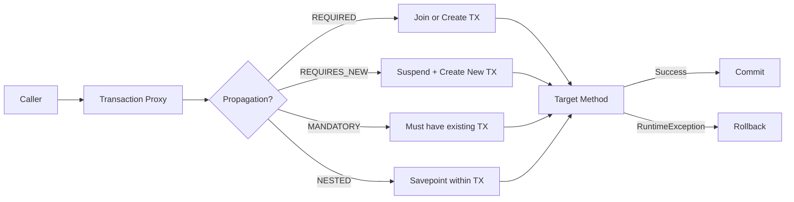
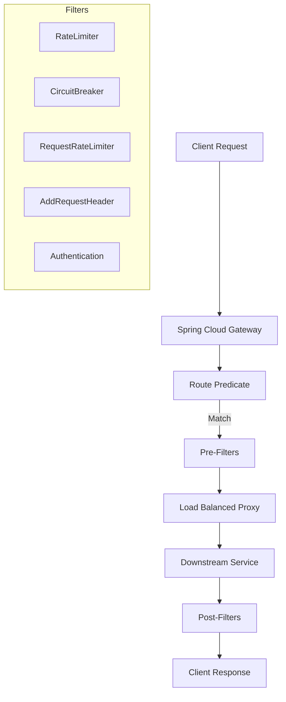
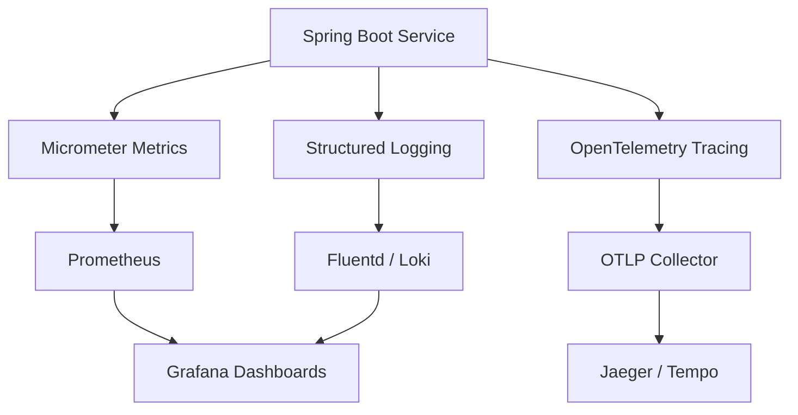
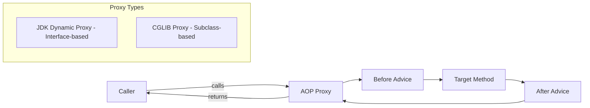
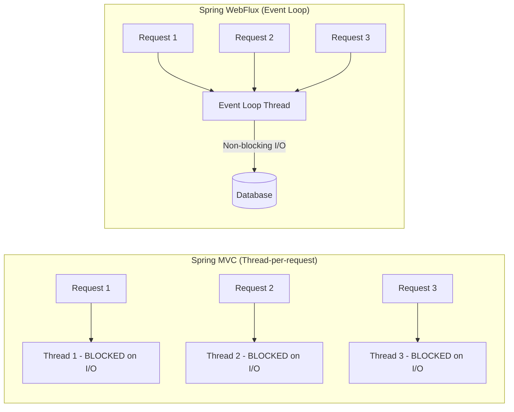
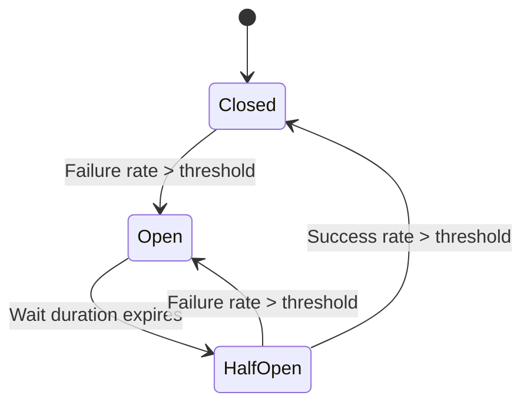

# Spring Architect-Level Interview Questions

> 15 questions covering Spring Boot 3/4, Spring Security, Spring Cloud, Data JPA, WebFlux, Actuator, AOP, and transaction management.
> Cross-references: [Security Deep Dive](../06-security/security-deep-dive.md) · [Spring Cheatsheet](../15-cheatsheets/spring-cheatsheet.md)

---

## Q1: Explain Spring Boot auto-configuration. How does it work internally, and how would you create a custom starter?

### Interviewer's Expectation
Deep understanding of the `@Conditional` annotation family, `META-INF/spring/org.springframework.boot.autoconfigure.AutoConfiguration.imports`, and practical experience creating reusable starters for shared infrastructure.

### Excellent Answer

Spring Boot auto-configuration uses **conditional class loading** to automatically configure beans based on what's on the classpath, what beans already exist, and what properties are set.

**Internal mechanism** (Spring Boot 3+):

1. `@SpringBootApplication` includes `@EnableAutoConfiguration`
2. Spring reads `META-INF/spring/org.springframework.boot.autoconfigure.AutoConfiguration.imports` (replaces `spring.factories` in Boot 3)
3. Each listed class is a `@AutoConfiguration` class with `@Conditional*` annotations
4. Spring evaluates conditions and only creates beans when conditions are met

```java
// How DataSource auto-configuration works (simplified)
@AutoConfiguration
@ConditionalOnClass(DataSource.class)                    // Only if JDBC is on classpath
@ConditionalOnMissingBean(DataSource.class)              // Only if user didn't define one
@EnableConfigurationProperties(DataSourceProperties.class)
public class DataSourceAutoConfiguration {

    @Bean
    @ConditionalOnProperty(prefix = "spring.datasource", name = "url")
    public DataSource dataSource(DataSourceProperties properties) {
        return DataSourceBuilder.create()
            .url(properties.getUrl())
            .username(properties.getUsername())
            .password(properties.getPassword())
            .build();
    }
}
```

**Creating a custom starter** (e.g., company-wide observability):

```
my-observability-starter/
├── my-observability-autoconfigure/
│   ├── src/main/java/.../ObservabilityAutoConfiguration.java
│   └── src/main/resources/META-INF/spring/
│       └── org.springframework.boot.autoconfigure.AutoConfiguration.imports
└── my-observability-starter/
    └── pom.xml (depends on autoconfigure + required dependencies)
```

```java
@AutoConfiguration
@ConditionalOnClass(MeterRegistry.class)
@EnableConfigurationProperties(ObservabilityProperties.class)
public class ObservabilityAutoConfiguration {

    @Bean
    @ConditionalOnMissingBean
    public RequestLoggingFilter requestLoggingFilter(ObservabilityProperties props) {
        return new RequestLoggingFilter(props.getServiceName());
    }

    @Bean
    @ConditionalOnMissingBean
    public CustomMetricsExporter metricsExporter(MeterRegistry registry) {
        return new CustomMetricsExporter(registry);
    }
}
```

**Architectural value**: Custom starters enforce organizational standards (logging format, metrics, tracing, security) across 50+ microservices without copy-pasting configuration.

### Common Mistakes
- Using `spring.factories` in Spring Boot 3 (deprecated, use the new imports file)
- Not using `@ConditionalOnMissingBean` (overrides user-defined beans)
- Creating a single starter with too many responsibilities (violates single responsibility)
- Not ordering auto-configurations properly (`@AutoConfiguration(after = ...)`)

### Follow-up Questions
- "How does `@ConditionalOnClass` work when the class isn't on the classpath?"
- "How would you debug auto-configuration issues? What tools does Spring Boot provide?"
- "Explain the difference between `@Configuration(proxyBeanMethods = true)` and `false`."

---

## Q2: Walk me through the Spring Security filter chain architecture. How would you customize it for a microservices API?

### Interviewer's Expectation
Understanding of the `SecurityFilterChain`, how filters are ordered, OAuth2 resource server configuration, and how to add custom filters for multi-tenant or API-key authentication.

### Excellent Answer

Spring Security is a **servlet filter chain** that intercepts every HTTP request:


**Key filters in order**:
1. `SecurityContextHolderFilter` — Establishes security context
2. `CsrfFilter` — CSRF protection (disabled for stateless APIs)
3. `BearerTokenAuthenticationFilter` — Validates JWT tokens
4. `AuthorizationFilter` — Enforces access rules

**Production microservice configuration**:

```java
@Configuration
@EnableMethodSecurity
public class SecurityConfig {

    @Bean
    @Order(1)
    public SecurityFilterChain apiFilterChain(HttpSecurity http) throws Exception {
        return http
            .securityMatcher("/api/**")
            .csrf(csrf -> csrf.disable())           // Stateless API — no CSRF
            .sessionManagement(session -> session
                .sessionCreationPolicy(SessionCreationPolicy.STATELESS))
            .oauth2ResourceServer(oauth2 -> oauth2
                .jwt(jwt -> jwt
                    .jwtAuthenticationConverter(jwtAuthConverter())))
            .authorizeHttpRequests(auth -> auth
                .requestMatchers("/api/public/**").permitAll()
                .requestMatchers("/api/admin/**").hasRole("ADMIN")
                .anyRequest().authenticated())
            .addFilterBefore(
                new TenantContextFilter(),           // Custom: Extract tenant from JWT
                BearerTokenAuthenticationFilter.class)
            .addFilterAfter(
                new AuditLoggingFilter(),             // Custom: Audit log all API calls
                AuthorizationFilter.class)
            .build();
    }

    @Bean
    @Order(2)
    public SecurityFilterChain actuatorFilterChain(HttpSecurity http) throws Exception {
        return http
            .securityMatcher("/actuator/**")
            .authorizeHttpRequests(auth -> auth
                .requestMatchers("/actuator/health").permitAll()
                .anyRequest().hasRole("OPS"))
            .httpBasic(Customizer.withDefaults())
            .build();
    }

    private JwtAuthenticationConverter jwtAuthConverter() {
        JwtGrantedAuthoritiesConverter converter = new JwtGrantedAuthoritiesConverter();
        converter.setAuthoritiesClaimName("roles");
        converter.setAuthorityPrefix("ROLE_");
        JwtAuthenticationConverter jwtConverter = new JwtAuthenticationConverter();
        jwtConverter.setJwtGrantedAuthoritiesConverter(converter);
        return jwtConverter;
    }
}
```

**Multi-SecurityFilterChain pattern**: Use `@Order` and `securityMatcher` to define separate chains for API endpoints, actuator endpoints, and webhook endpoints — each with different authentication mechanisms.

### Common Mistakes
- Not disabling CSRF for stateless APIs (causes 403 on POST/PUT/DELETE)
- Using a single SecurityFilterChain for everything (mixing concerns)
- Not setting `SessionCreationPolicy.STATELESS` for JWT-based APIs
- Not understanding filter ordering (custom filter in wrong position)

### Follow-up Questions
- "How would you implement API key authentication alongside JWT?"
- "Explain method-level security with `@PreAuthorize` — how does SpEL evaluation work?"
- "How would you implement tenant isolation in a multi-tenant Spring Security setup?"

---

## Q3: How does Spring Data JPA handle the N+1 query problem? What are all the strategies to solve it?

### Interviewer's Expectation
Practical experience with N+1, knowledge of `@EntityGraph`, `JOIN FETCH`, batch size, and the ability to diagnose the problem in production.

### Excellent Answer

The N+1 problem occurs when loading a parent entity triggers N additional queries to load associated entities:

```java
// PROBLEM: Loading 100 orders triggers 100 queries for order items
List<Order> orders = orderRepository.findAll();
orders.forEach(order -> order.getItems().size()); // 100 lazy-loaded queries!
```

**Solutions (ranked by preference)**:

**1. `@EntityGraph` (recommended for read queries)**:
```java
@EntityGraph(attributePaths = {"items", "items.product"})
List<Order> findAllByCustomerId(UUID customerId);
// Generates: SELECT o, i, p FROM Order o LEFT JOIN FETCH o.items i LEFT JOIN FETCH i.product p
```

**2. JPQL `JOIN FETCH`**:
```java
@Query("SELECT DISTINCT o FROM Order o JOIN FETCH o.items WHERE o.status = :status")
List<Order> findByStatusWithItems(@Param("status") OrderStatus status);
```

**3. Batch fetching (`@BatchSize`)**:
```java
@Entity
public class Order {
    @OneToMany(mappedBy = "order")
    @BatchSize(size = 25)  // Loads items in batches of 25 instead of one-by-one
    private List<OrderItem> items;
}
// With 100 orders: 1 query for orders + 4 queries for items (batches of 25)
```

**4. DTO Projections (best for read-heavy APIs)**:
```java
public interface OrderSummary {
    UUID getId();
    String getCustomerName();
    BigDecimal getTotalAmount();
}

List<OrderSummary> findByStatus(OrderStatus status);
// No entity graph needed — flat query, no lazy loading possible
```

**5. Global batch size in `application.yml`**:
```yaml
spring:
  jpa:
    properties:
      hibernate:
        default_batch_fetch_size: 25
```

**Detection in production**: Enable Hibernate statistics and monitor query counts:
```yaml
spring.jpa.properties.hibernate.generate_statistics: true
logging.level.org.hibernate.stat: DEBUG
```
Or use `datasource-proxy` to log query counts per request:
```
[Request /api/orders] Total queries: 101 → N+1 detected!
```

### Common Mistakes
- Using `FetchType.EAGER` globally (solves N+1 but causes over-fetching everywhere)
- Fetching multiple `@OneToMany` collections with `JOIN FETCH` (Cartesian product explosion)
- Not using `DISTINCT` with `JOIN FETCH` (duplicate parent entities)
- Ignoring DTO projections for read-only use cases (entities carry unnecessary overhead)

### Follow-up Questions
- "What's the Cartesian product problem with multiple JOIN FETCHes and how do you solve it?"
- "Explain Hibernate's first-level cache and second-level cache architecture."
- "How would you implement pagination with JOIN FETCH?"

---

## Q4: Explain Spring transaction management. What are the propagation levels and when do you use each?

### Interviewer's Expectation
Deep understanding of `@Transactional` semantics, propagation behaviors, and common pitfalls (self-invocation, checked exceptions, read-only optimization).

### Excellent Answer

Spring transactions use **AOP proxies** to wrap methods with transaction boundaries:



**Propagation levels and real-world usage**:

| Propagation | Behavior | Use Case |
|-------------|----------|----------|
| `REQUIRED` (default) | Join existing or create new | Standard business operations |
| `REQUIRES_NEW` | Always create new, suspend existing | Audit logging that must persist even if parent rolls back |
| `MANDATORY` | Must have existing, else exception | Domain services that should never be called without a TX |
| `NESTED` | Savepoint within existing TX | Partial rollback in batch processing |
| `SUPPORTS` | Join if exists, else non-TX | Read operations that benefit from TX but don't require it |
| `NOT_SUPPORTED` | Suspend existing, run non-TX | Long-running operations that shouldn't hold a TX |
| `NEVER` | Throw if TX exists | Operations that must be non-transactional |

```java
@Service
public class OrderService {

    @Transactional  // REQUIRED — main business transaction
    public Order createOrder(CreateOrderRequest request) {
        Order order = orderRepository.save(mapToEntity(request));
        inventoryService.reserve(order.getItems());   // Part of same TX
        auditService.logOrderCreation(order);          // REQUIRES_NEW — separate TX
        return order;
    }
}

@Service
public class AuditService {

    @Transactional(propagation = Propagation.REQUIRES_NEW)
    public void logOrderCreation(Order order) {
        // Runs in its own transaction
        // If order creation rolls back, audit log still persists
        auditRepository.save(new AuditEntry("ORDER_CREATED", order.getId()));
    }
}
```

**Critical pitfalls**:

**1. Self-invocation bypass**:
```java
@Service
public class UserService {
    public void processUsers() {
        for (User user : users) {
            updateUser(user);  // ❌ Direct call — bypasses proxy, @Transactional ignored!
        }
    }

    @Transactional
    public void updateUser(User user) { ... }
}
// Fix: Inject self, extract to another service, or use TransactionTemplate
```

**2. Checked exceptions don't trigger rollback by default**:
```java
@Transactional(rollbackFor = BusinessException.class) // Must specify!
public void transfer(TransferRequest request) throws BusinessException { ... }
```

**3. Read-only optimization**:
```java
@Transactional(readOnly = true)
public List<Order> findOrders(OrderFilter filter) {
    // Hibernate skips dirty checking — significant performance improvement
    // PostgreSQL may route to read replica
}
```

### Common Mistakes
- Calling `@Transactional` methods from within the same class (self-invocation)
- Not specifying `rollbackFor` for checked exceptions
- Using `@Transactional` on private methods (proxy can't intercept)
- Opening transactions too early / too broadly (holding DB connections)

### Follow-up Questions
- "How does `@Transactional` work with Spring WebFlux/reactive?"
- "Explain the difference between programmatic and declarative transaction management."
- "How would you implement distributed transactions across microservices?"

---

## Q5: How does Spring Cloud Gateway work? Compare it with Netflix Zuul and direct load balancer routing.

### Interviewer's Expectation
Architecture-level understanding of API Gateway patterns, reactive vs. blocking gateway, and when to use Spring Cloud Gateway vs. infrastructure-level routing.

### Excellent Answer

Spring Cloud Gateway is a **reactive, non-blocking** API gateway built on Spring WebFlux and Project Reactor:



```yaml
# application.yml configuration
spring:
  cloud:
    gateway:
      routes:
        - id: order-service
          uri: lb://order-service          # Load-balanced to service discovery
          predicates:
            - Path=/api/orders/**
            - Method=GET,POST
          filters:
            - StripPrefix=1
            - name: CircuitBreaker
              args:
                name: orderCircuitBreaker
                fallbackUri: forward:/fallback/orders
            - name: RequestRateLimiter
              args:
                redis-rate-limiter:
                  replenishRate: 100
                  burstCapacity: 200
```

**Comparison**:

| Feature | Spring Cloud Gateway | Netflix Zuul 1 | AWS ALB/NLB |
|---------|---------------------|----------------|-------------|
| **Model** | Reactive (Netty) | Blocking (Servlet) | Infrastructure |
| **Performance** | High (non-blocking) | Lower (thread-per-request) | Very High |
| **Customization** | Extensive (Java filters) | Moderate | Limited |
| **Service Discovery** | Eureka, Consul, K8s | Eureka | Target Groups |
| **Circuit Breaking** | Built-in (Resilience4j) | Hystrix (deprecated) | None |
| **Rate Limiting** | Built-in (Redis) | Custom | WAF rules |
| **WebSocket** | Supported | Limited | Supported |
| **Deployment** | Application layer | Application layer | AWS managed |
| **Best for** | Custom logic, BFF | Legacy Netflix stack | Simple routing |

**When to use which**:
- **Spring Cloud Gateway**: When you need custom business logic in the gateway (tenant routing, request enrichment, complex auth)
- **AWS ALB**: When simple path-based routing suffices and you want managed infrastructure
- **Both**: ALB at the edge (TLS termination, WAF) + Spring Cloud Gateway behind it for application-level concerns

### Common Mistakes
- Putting business logic in the gateway (should be thin routing + cross-cutting concerns)
- Not using reactive clients for downstream calls (mixing blocking I/O defeats the purpose)
- Not implementing circuit breakers (gateway becomes a single point of failure amplifier)
- Over-coupling gateway configuration to service internals

### Follow-up Questions
- "How would you implement the BFF (Backend for Frontend) pattern with Spring Cloud Gateway?"
- "How does rate limiting work with Redis in Spring Cloud Gateway?"
- "What's the difference between Spring Cloud Gateway and a service mesh like Istio?"

---

## Q6: Explain Spring Boot Actuator and how you design observability for microservices at scale.

### Interviewer's Expectation
Beyond basic `/health` endpoint — production observability strategy with metrics (Micrometer), distributed tracing (OpenTelemetry), and structured logging.

### Excellent Answer

**Actuator provides production-ready operational endpoints**, but real observability requires the three pillars integrated:



**Metrics with Micrometer**:
```java
@Component
public class PaymentMetrics {
    private final Counter paymentCounter;
    private final Timer paymentTimer;
    private final Gauge activePayments;

    public PaymentMetrics(MeterRegistry registry) {
        this.paymentCounter = Counter.builder("payments.processed")
            .tag("gateway", "stripe")
            .description("Total payments processed")
            .register(registry);

        this.paymentTimer = Timer.builder("payments.duration")
            .publishPercentiles(0.5, 0.95, 0.99)
            .publishPercentileHistogram()
            .register(registry);

        this.activePayments = Gauge.builder("payments.active",
            activePaymentsList, List::size)
            .register(registry);
    }

    public void recordPayment(PaymentResult result) {
        paymentCounter.increment();
        paymentTimer.record(() -> processPayment(result));
    }
}
```

**Distributed tracing with OpenTelemetry** (Spring Boot 3+):
```yaml
management:
  tracing:
    sampling:
      probability: 0.1    # Sample 10% of traces in production
  otlp:
    tracing:
      endpoint: http://otel-collector:4318/v1/traces

logging:
  pattern:
    level: "%5p [${spring.application.name},%X{traceId:-},%X{spanId:-}]"
```

**Custom health indicators**:
```java
@Component
public class KafkaHealthIndicator implements HealthIndicator {
    private final KafkaAdmin kafkaAdmin;

    @Override
    public Health health() {
        try {
            kafkaAdmin.describeCluster();
            return Health.up().withDetail("brokers", getBrokerCount()).build();
        } catch (Exception e) {
            return Health.down(e).build();
        }
    }
}
```

**RED method for every service**:
- **R**ate — requests per second (`http.server.requests`)
- **E**rrors — error rate by status code (`http.server.requests` with `status=5xx`)
- **D**uration — latency percentiles (`http.server.requests` timer)

### Common Mistakes
- Exposing all actuator endpoints without security (information leakage)
- Not using structured logging (parsing unstructured logs at scale is painful)
- Setting tracing sample rate to 100% in production (massive storage/performance cost)
- Not adding business-level metrics (only infra metrics — no business visibility)

### Follow-up Questions
- "How would you implement SLOs (Service Level Objectives) using Micrometer?"
- "What's the difference between tracing propagation with W3C TraceContext vs B3?"
- "How do you correlate logs with traces in a Kubernetes environment?"

---

## Q7: How does Spring AOP work internally? When would you use AOP vs. other cross-cutting approaches?

### Interviewer's Expectation
Understanding of proxy-based AOP (JDK dynamic proxies vs CGLIB), AspectJ weaving, and practical judgment about when AOP is appropriate vs. alternatives.

### Excellent Answer

Spring AOP uses **runtime proxies** to intercept method calls:



**Two proxy mechanisms**:
- **JDK Dynamic Proxy**: Creates a proxy implementing the same interfaces. Default when bean implements an interface.
- **CGLIB**: Creates a subclass of the target class. Used when no interface exists. Default in Spring Boot.

```java
// Cross-cutting concern: Distributed lock with AOP
@Aspect
@Component
public class DistributedLockAspect {

    private final RedissonClient redisson;

    @Around("@annotation(distributedLock)")
    public Object aroundLock(ProceedingJoinPoint pjp, DistributedLock distributedLock) throws Throwable {
        String lockKey = resolveLockKey(distributedLock, pjp);
        RLock lock = redisson.getLock(lockKey);

        boolean acquired = lock.tryLock(
            distributedLock.waitTime(),
            distributedLock.leaseTime(),
            TimeUnit.SECONDS
        );

        if (!acquired) {
            throw new LockAcquisitionException("Could not acquire lock: " + lockKey);
        }

        try {
            return pjp.proceed();
        } finally {
            if (lock.isHeldByCurrentThread()) {
                lock.unlock();
            }
        }
    }
}

// Usage
@DistributedLock(key = "'payment:' + #paymentId", leaseTime = 30)
public PaymentResult processPayment(String paymentId) { ... }
```

**When to use AOP vs. alternatives**:

| Approach | Use When | Examples |
|----------|----------|---------|
| **AOP** | Truly cross-cutting, declarative, same pattern everywhere | Logging, metrics, locking, caching, auth |
| **Interceptors/Filters** | HTTP request lifecycle | Request logging, CORS, tenant context |
| **Decorator Pattern** | Behavior varies per implementation | Adding retry to specific service calls |
| **Event Listeners** | Decoupled side effects | Sending notifications after order creation |

### Common Mistakes
- Using AOP for business logic (creates hidden flow that's hard to debug)
- Not understanding self-invocation limitation (same as `@Transactional`)
- Overly broad pointcut expressions (intercepting unintended methods)
- Not considering the performance overhead of method interception in hot paths

### Follow-up Questions
- "What's the difference between Spring AOP and AspectJ? When would you use full AspectJ?"
- "How does `@Cacheable` work internally using AOP?"
- "Can you intercept private methods with Spring AOP? Why or why not?"

---

## Q8: How would you design a Spring Boot application for multi-tenancy?

### Interviewer's Expectation
Architecture-level multi-tenancy strategies (shared DB, schema-per-tenant, DB-per-tenant), tenant resolution, and data isolation concerns.

### Excellent Answer

**Multi-tenancy strategies**:

| Strategy | Isolation | Cost | Complexity | Best For |
|----------|-----------|------|------------|----------|
| **Shared schema + discriminator column** | Low | Low | Low | SaaS with many small tenants |
| **Schema per tenant** | Medium | Medium | Medium | Compliance-sensitive (FinTech) |
| **Database per tenant** | High | High | High | Enterprise clients demanding isolation |

**Implementation with shared schema (most common)**:

```java
// 1. Tenant resolution filter
@Component
public class TenantContextFilter extends OncePerRequestFilter {
    @Override
    protected void doFilterInternal(HttpServletRequest request,
            HttpServletResponse response, FilterChain chain) {
        String tenantId = extractTenantId(request);  // From JWT, header, or subdomain
        TenantContext.setCurrentTenant(tenantId);
        try {
            chain.doFilter(request, response);
        } finally {
            TenantContext.clear();
        }
    }

    private String extractTenantId(HttpServletRequest request) {
        // Strategy 1: JWT claim
        String jwt = request.getHeader("Authorization");
        return jwtDecoder.decode(jwt).getClaim("tenant_id");

        // Strategy 2: Subdomain (acme.platform.com → "acme")
        // Strategy 3: Header (X-Tenant-ID)
    }
}

// 2. Hibernate tenant discriminator
@Entity
@FilterDef(name = "tenantFilter", parameters = @ParamDef(name = "tenantId", type = String.class))
@Filter(name = "tenantFilter", condition = "tenant_id = :tenantId")
public class Order {
    @Column(name = "tenant_id", nullable = false)
    private String tenantId;
}

// 3. Auto-apply filter via EntityManager
@Aspect
@Component
public class TenantFilterAspect {
    @PersistenceContext
    private EntityManager entityManager;

    @Before("execution(* com.example.repository.*.*(..))")
    public void applyTenantFilter() {
        Session session = entityManager.unwrap(Session.class);
        session.enableFilter("tenantFilter")
               .setParameter("tenantId", TenantContext.getCurrentTenant());
    }
}
```

**Schema-per-tenant** uses dynamic DataSource routing:
```java
public class TenantRoutingDataSource extends AbstractRoutingDataSource {
    @Override
    protected Object determineCurrentLookupKey() {
        return TenantContext.getCurrentTenant();
    }
}
```

### Common Mistakes
- Not adding tenant_id to every query (data leak between tenants!)
- Not indexing the tenant_id column (performance degrades with scale)
- Forgetting tenant context in async operations (`@Async`, Kafka consumers)
- Not testing with multiple tenants simultaneously

### Follow-up Questions
- "How do you handle database migrations in a schema-per-tenant model?"
- "How would you propagate tenant context through Kafka events?"
- "What's your approach to tenant-specific customization (feature flags, config)?"

---

## Q9: Explain Spring WebFlux and reactive programming. When would you choose it over Spring MVC?

### Interviewer's Expectation
Understanding of the reactive programming model, backpressure, event loop architecture, and practical judgment about when reactive provides genuine benefit.

### Excellent Answer

Spring WebFlux is a **non-blocking, reactive** web framework using Project Reactor. Instead of thread-per-request, it uses an **event loop** model (like Node.js) with a small number of threads.



```java
// MVC (blocking)
@GetMapping("/users/{id}")
public User getUser(@PathVariable String id) {
    User user = userRepository.findById(id);      // Thread blocks here
    List<Order> orders = orderClient.getOrders(id); // Thread blocks here
    return enrichUser(user, orders);
}

// WebFlux (reactive)
@GetMapping("/users/{id}")
public Mono<User> getUser(@PathVariable String id) {
    return userRepository.findById(id)              // Returns immediately
        .zipWith(orderClient.getOrders(id))         // Concurrent, non-blocking
        .map(tuple -> enrichUser(tuple.getT1(), tuple.getT2()));
}
```

**Decision matrix**:

| Factor | Choose MVC | Choose WebFlux |
|--------|-----------|----------------|
| **I/O profile** | Moderate I/O, JDBC database | Heavy I/O, many downstream calls |
| **Team experience** | Most Java teams | Reactive-trained team |
| **Debugging** | Easy stack traces | Complex, async stack traces |
| **Database** | JPA/Hibernate (blocking) | R2DBC, reactive MongoDB |
| **Throughput** | Good (with virtual threads) | Excellent under high concurrency |
| **Ecosystem** | Mature, most libraries | Growing, some libraries lag |

**Java 21 changes the calculus**: Virtual threads give MVC the scalability of WebFlux while keeping the simple, imperative programming model. For most teams, **Spring MVC + virtual threads** is now the recommended approach.

### Common Mistakes
- Using WebFlux with blocking libraries (JDBC, blocking HTTP clients) — worse than MVC
- Calling `.block()` in reactive code (defeats the purpose, potential deadlock)
- Choosing WebFlux for simplicity (it's more complex, not simpler)
- Not understanding backpressure semantics

### Follow-up Questions
- "With Java 21 virtual threads, is there still a case for WebFlux?"
- "How does backpressure work in Project Reactor?"
- "How do you test reactive code? What's `StepVerifier`?"

---

## Q10: How does Hibernate's second-level cache work? Design a caching strategy for a high-read microservice.

### Interviewer's Expectation
Understanding of L1 cache (session), L2 cache (SessionFactory), query cache, cache invalidation challenges, and when to use application-level caching (Caffeine/Redis) vs Hibernate caching.

### Excellent Answer

**Hibernate Cache Levels**:

| Cache | Scope | Lifetime | Default |
|-------|-------|----------|---------|
| **L1 (Session)** | Per EntityManager/Session | Single transaction | Always on |
| **L2 (SessionFactory)** | Shared across sessions | Application lifetime | Off (must enable) |
| **Query Cache** | Caches query results | Configurable TTL | Off |

```java
// Enable L2 cache for frequently-read, rarely-changed entities
@Entity
@Cache(usage = CacheConcurrencyStrategy.READ_WRITE, region = "products")
public class Product {
    @Id
    private UUID id;
    private String name;
    private BigDecimal price;

    @Cache(usage = CacheConcurrencyStrategy.READ_WRITE)
    @OneToMany(mappedBy = "product")
    private List<ProductVariant> variants;
}
```

```yaml
# application.yml
spring:
  jpa:
    properties:
      hibernate:
        cache:
          use_second_level_cache: true
          use_query_cache: true
          region.factory_class: org.hibernate.cache.jcache.JCacheRegionFactory
      javax:
        cache:
          provider: org.ehcache.jsr107.EhcacheCachingProvider
```

**For high-read microservices, I prefer application-level caching over L2 cache**:

```java
@Service
public class ProductService {

    @Cacheable(value = "products", key = "#id",
               unless = "#result == null")
    public ProductDTO getProduct(UUID id) {
        return productRepository.findById(id)
            .map(this::toDTO)
            .orElse(null);
    }

    @CacheEvict(value = "products", key = "#product.id")
    public void updateProduct(Product product) {
        productRepository.save(product);
    }

    @CacheEvict(value = "products", allEntries = true)
    @Scheduled(fixedRate = 3600000) // Hourly full invalidation as safety net
    public void evictAllProducts() { }
}
```

**Multi-level caching for highest performance**:
```
Request → L1 (Caffeine, in-memory, ~1ms) → L2 (Redis, distributed, ~5ms) → Database (~50ms)
```

```java
@Bean
public CacheManager cacheManager() {
    CaffeineCacheManager caffeine = new CaffeineCacheManager();
    caffeine.setCaffeine(Caffeine.newBuilder()
        .maximumSize(10_000)
        .expireAfterWrite(Duration.ofMinutes(5)));

    RedisCacheManager redis = RedisCacheManager.builder(redisConnectionFactory)
        .cacheDefaults(RedisCacheConfiguration.defaultCacheConfig()
            .entryTtl(Duration.ofMinutes(30)))
        .build();

    return new CompositeCacheManager(caffeine, redis);
}
```

### Common Mistakes
- Caching mutable entities with stale data in multi-instance deployments
- Not considering cache invalidation across service instances (local cache inconsistency)
- Using query cache without understanding its invalidation semantics (invalidated on ANY write to cached tables)
- Over-caching (caching data that changes frequently → cache churn, worse performance)

### Follow-up Questions
- "How do you handle cache invalidation across multiple instances of a service?"
- "Compare Caffeine vs Guava cache. Why is Caffeine preferred?"
- "How would you implement cache warming on service startup?"

---

## Q11: How do you handle database schema migrations in Spring Boot microservices at scale?

### Interviewer's Expectation
Experience with Flyway/Liquibase, migration strategies for zero-downtime deployments, and handling schema changes across microservice databases.

### Excellent Answer

**Flyway is my preferred tool** (simpler, SQL-based):

```
resources/db/migration/
├── V1__create_orders_table.sql
├── V2__add_status_column.sql
├── V3__create_index_on_status.sql
└── V4__add_payment_reference.sql
```

**Zero-downtime migration strategy** (expand-and-contract):

```
Phase 1 (Expand): Add new column (nullable) → Deploy code that writes to BOTH old and new
Phase 2 (Migrate): Backfill existing data
Phase 3 (Contract): Deploy code that reads from new column only
Phase 4 (Cleanup): Drop old column
```

```sql
-- V5 (Phase 1): Expand
ALTER TABLE orders ADD COLUMN payment_id UUID;
-- No NOT NULL yet — backward compatible

-- V6 (Phase 2): Migrate
UPDATE orders SET payment_id = (
    SELECT id FROM payments WHERE payments.order_id = orders.id
);

-- V7 (Phase 3): After new code is fully deployed
ALTER TABLE orders ALTER COLUMN payment_id SET NOT NULL;

-- V8 (Phase 4): Cleanup
ALTER TABLE orders DROP COLUMN old_payment_ref;
```

**Production safeguards**:
```yaml
spring:
  flyway:
    enabled: true
    baseline-on-migrate: true
    locations: classpath:db/migration
    validate-on-migrate: true
    out-of-order: false        # Enforce ordering
    lock-retry-count: 10       # Handle concurrent startup in K8s
```

### Common Mistakes
- Running destructive migrations (DROP COLUMN) without the expand-and-contract pattern
- Not testing migrations against a copy of production data
- Using Hibernate `ddl-auto` in production (never!)
- Not handling concurrent migration execution (multiple pods starting simultaneously)

### Follow-up Questions
- "How do you rollback a failed migration in production?"
- "Compare Flyway vs Liquibase. When would you choose each?"
- "How do you manage migrations in a multi-tenant, schema-per-tenant setup?"

---

## Q12: How does Spring Cloud Circuit Breaker with Resilience4j work? Design a resilience strategy.

### Interviewer's Expectation
Understanding of circuit breaker states, configuration, fallback strategies, and how to combine with retry, bulkhead, and rate limiter for comprehensive resilience.

### Excellent Answer



**Complete resilience stack**:

```java
@Service
public class PaymentGatewayClient {

    @CircuitBreaker(name = "paymentGateway", fallbackMethod = "paymentFallback")
    @Retry(name = "paymentGateway")
    @Bulkhead(name = "paymentGateway", type = Bulkhead.Type.THREADPOOL)
    @RateLimiter(name = "paymentGateway")
    @TimeLimiter(name = "paymentGateway")
    public CompletableFuture<PaymentResult> processPayment(PaymentRequest request) {
        return CompletableFuture.supplyAsync(() ->
            restClient.post()
                .uri("/payments")
                .body(request)
                .retrieve()
                .body(PaymentResult.class)
        );
    }

    private CompletableFuture<PaymentResult> paymentFallback(PaymentRequest request, Throwable t) {
        log.warn("Payment gateway circuit open, queuing for retry: {}", t.getMessage());
        kafkaTemplate.send("payment-retry-queue", request);
        return CompletableFuture.completedFuture(
            PaymentResult.queued("Payment queued for processing"));
    }
}
```

```yaml
resilience4j:
  circuitbreaker:
    instances:
      paymentGateway:
        slidingWindowSize: 100
        failureRateThreshold: 50          # Open after 50% failure rate
        waitDurationInOpenState: 30s      # Wait 30s before half-open
        permittedNumberOfCallsInHalfOpenState: 10
        recordExceptions:
          - java.io.IOException
          - java.util.concurrent.TimeoutException
        ignoreExceptions:
          - com.example.BusinessValidationException

  retry:
    instances:
      paymentGateway:
        maxAttempts: 3
        waitDuration: 500ms
        exponentialBackoffMultiplier: 2
        retryExceptions:
          - java.io.IOException

  bulkhead:
    instances:
      paymentGateway:
        maxConcurrentCalls: 25            # Limit concurrent calls
        maxWaitDuration: 500ms

  ratelimiter:
    instances:
      paymentGateway:
        limitForPeriod: 100               # 100 calls per second
        limitRefreshPeriod: 1s
        timeoutDuration: 0s
```

**Execution order** (decorators applied outside-in): `TimeLimiter → RateLimiter → Bulkhead → CircuitBreaker → Retry → Method`

### Common Mistakes
- Not defining fallback methods (circuit breaker opens → 500 errors cascade)
- Retrying non-idempotent operations (double payment!)
- Setting sliding window too small (insufficient data for accurate failure rate)
- Not monitoring circuit breaker state (missed the circuit being open for hours)

### Follow-up Questions
- "How do you test circuit breaker behavior in integration tests?"
- "What's the difference between count-based and time-based sliding windows?"
- "How does bulkhead prevent cascade failures differently from circuit breaker?"

---

## Q13: Compare Spring Boot's `RestClient`, `WebClient`, and `RestTemplate`. Which do you use when?

### Interviewer's Expectation
Understanding of the evolution of HTTP clients in Spring, blocking vs. non-blocking, and practical guidelines for production use.

### Excellent Answer

| Feature | RestTemplate | WebClient | RestClient (Boot 3.2+) |
|---------|-------------|-----------|----------------------|
| **Model** | Blocking | Non-blocking (reactive) | Blocking (fluent) |
| **Status** | Maintenance mode | Active | Active (recommended) |
| **API Style** | Template methods | Fluent builder | Fluent builder |
| **Virtual Threads** | Compatible | N/A (already non-blocking) | Ideal pairing |
| **Streaming** | No | Yes (SSE, WebSocket) | Limited |
| **Error Handling** | Exception-based | Reactive operators | Fluent + exceptions |
| **Best For** | Legacy code | Reactive stacks, streaming | New blocking services |

```java
// RestClient (recommended for Spring Boot 3.2+)
@Bean
public RestClient paymentClient(RestClient.Builder builder) {
    return builder
        .baseUrl("https://api.payment.com")
        .defaultHeader("Authorization", "Bearer " + apiKey)
        .requestInterceptor(new LoggingInterceptor())
        .defaultStatusHandler(HttpStatusCode::is4xxClientError,
            (request, response) -> {
                throw new PaymentClientException(response.getStatusCode());
            })
        .build();
}

// Usage
PaymentResult result = paymentClient.post()
    .uri("/v1/charges")
    .contentType(MediaType.APPLICATION_JSON)
    .body(chargeRequest)
    .retrieve()
    .body(PaymentResult.class);
```

**My recommendation**: `RestClient` for new projects (Spring MVC + virtual threads), `WebClient` only if you're on WebFlux stack.

### Common Mistakes
- Still using `RestTemplate` in new projects (maintenance mode since Spring 5)
- Using `WebClient` in a blocking MVC application without understanding implications
- Not configuring connection pool and timeouts on the underlying HTTP client
- Not implementing retry and circuit breaker at the client level

### Follow-up Questions
- "How do you configure connection pooling for RestClient?"
- "How would you implement request/response logging for debugging?"
- "How does RestClient integrate with Micrometer for HTTP client metrics?"

---

## Q14: How would you design a Spring Boot application for Kubernetes? What K8s-specific configurations are needed?

### Interviewer's Expectation
Understanding of cloud-native Spring Boot: health probes, graceful shutdown, ConfigMaps/Secrets, service discovery, and 12-factor app principles.

### Excellent Answer

```yaml
# application.yml - Kubernetes-optimized
server:
  shutdown: graceful                     # Finish in-flight requests
  port: 8080

spring:
  lifecycle:
    timeout-per-shutdown-phase: 30s      # Match K8s terminationGracePeriodSeconds

management:
  endpoints:
    web:
      exposure:
        include: health,info,prometheus
  endpoint:
    health:
      probes:
        enabled: true                    # Expose /actuator/health/liveness & /readiness
      group:
        liveness:
          include: livenessState
        readiness:
          include: readinessState, db, kafka
  prometheus:
    metrics:
      export:
        enabled: true                    # For Prometheus scraping
```

```yaml
# Kubernetes Deployment
apiVersion: apps/v1
kind: Deployment
spec:
  template:
    spec:
      terminationGracePeriodSeconds: 30
      containers:
        - name: order-service
          image: order-service:1.0.0
          ports:
            - containerPort: 8080
          env:
            - name: SPRING_PROFILES_ACTIVE
              value: "kubernetes"
            - name: JAVA_OPTS
              value: "-XX:MaxRAMPercentage=75.0 -XX:+UseZGC"
          envFrom:
            - configMapRef:
                name: order-service-config
            - secretRef:
                name: order-service-secrets
          livenessProbe:
            httpGet:
              path: /actuator/health/liveness
              port: 8080
            initialDelaySeconds: 30
            periodSeconds: 10
          readinessProbe:
            httpGet:
              path: /actuator/health/readiness
              port: 8080
            initialDelaySeconds: 15
            periodSeconds: 5
          startupProbe:
            httpGet:
              path: /actuator/health/liveness
              port: 8080
            failureThreshold: 30
            periodSeconds: 10
          resources:
            requests:
              cpu: 500m
              memory: 512Mi
            limits:
              cpu: 1000m
              memory: 1Gi
```

**Key design decisions**:
1. **Startup probe** — Prevents premature killing during Spring context initialization
2. **Readiness probe includes DB and Kafka** — Pod removed from service if dependencies are down
3. **Graceful shutdown** — `server.shutdown=graceful` + matching `terminationGracePeriodSeconds`
4. **No service discovery needed** — K8s DNS replaces Eureka (`http://order-service:8080`)
5. **Config externalization** — ConfigMaps/Secrets → environment variables → Spring properties

### Common Mistakes
- Not setting startup probes (Spring Boot apps killed before context loads)
- Liveness probe checking database (DB outage → all pods restarted → cascade failure!)
- Not configuring graceful shutdown (in-flight requests dropped on deployment)
- Setting memory limit equal to `-Xmx` (no room for native/off-heap memory → OOMKilled)

### Follow-up Questions
- "How do you handle configuration changes without restarting pods?"
- "What's the difference between liveness and readiness probes semantically?"
- "How would you implement Spring Cloud Kubernetes for dynamic config?"

---

## Q15: How do you design a Spring Boot application for high availability and zero-downtime deployments?

### Interviewer's Expectation
Production-level design covering rolling deployments, blue-green, canary, database migration coordination, and session management.

### Excellent Answer

**Zero-downtime deployment checklist**:

1. **Rolling deployment with readiness gates**:
```yaml
strategy:
  rollingUpdate:
    maxUnavailable: 0        # Never have fewer than desired pods
    maxSurge: 1              # Add one new pod before removing old
```

2. **Pre-stop hook for connection draining**:
```yaml
lifecycle:
  preStop:
    exec:
      command: ["sh", "-c", "sleep 10"]  # Allow K8s to update iptables
```

3. **Backward-compatible API changes**:
- Add new fields, don't remove old ones
- Support both old and new request formats during transition
- Use API versioning for breaking changes

4. **Database migration coordination**:
```
Deploy V2 code (reads both schemas) → Run migration → Deploy V3 code (reads new schema only)
```

5. **Session externalization**:
```java
@EnableRedisHttpSession
public class SessionConfig {
    // Sessions stored in Redis — any pod can serve any user
}
```

6. **Feature flags for progressive rollout**:
```java
@GetMapping("/api/v2/orders")
public ResponseEntity<?> getOrders() {
    if (featureFlags.isEnabled("new-order-format", currentUser)) {
        return ResponseEntity.ok(newOrderService.getOrders());
    }
    return ResponseEntity.ok(legacyOrderService.getOrders());
}
```

**Canary deployment with Spring Boot + Istio**:
```yaml
apiVersion: networking.istio.io/v1beta1
kind: VirtualService
spec:
  http:
    - route:
        - destination:
            host: order-service
            subset: stable
          weight: 95
        - destination:
            host: order-service
            subset: canary
          weight: 5        # 5% of traffic to canary
```

### Common Mistakes
- Deploying breaking DB changes and new code simultaneously
- Not handling in-flight requests during pod termination
- Sticky sessions without session externalization (pod death = user impact)
- Not testing rollback procedure (deploy forward only → dangerous)

### Follow-up Questions
- "How would you implement a blue-green deployment in Kubernetes?"
- "What's your rollback strategy if a deployment fails?"
- "How do you handle long-running background jobs during deployment?"
