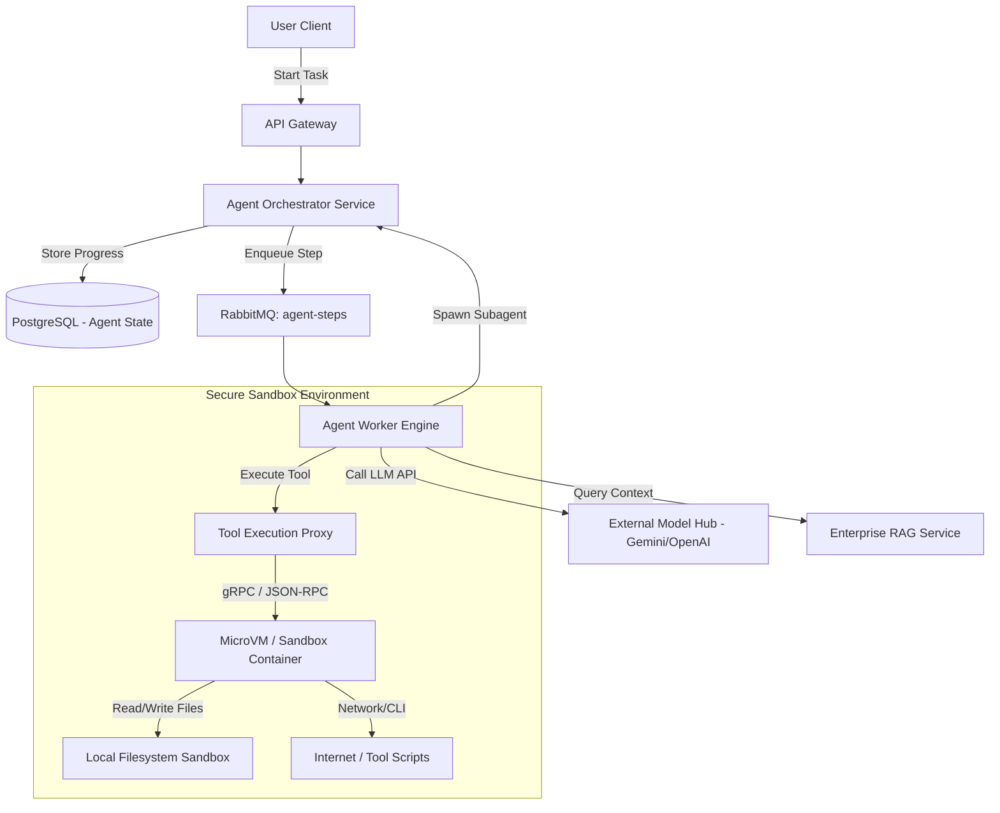
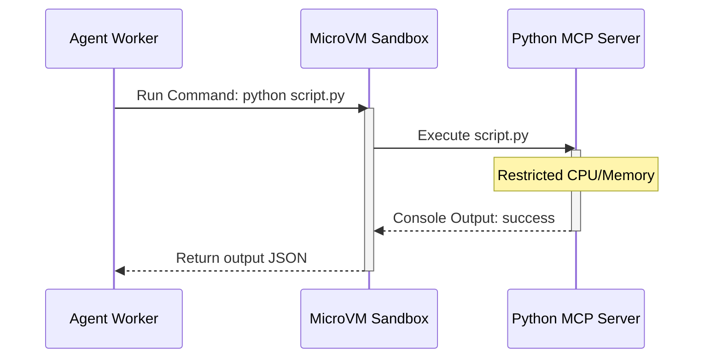

# System Design: AI Agent Platform

> Design an enterprise-grade AI Agent Execution and Orchestration platform
> **Key Concepts**: Agent runtime execution, state persistence, tool coordination (MCP), multi-agent communication, async task queues
> **Cross-references**: [Framework](./framework.md) · [Enterprise RAG](./enterprise-rag.md) · [Distributed Systems Deep Dive](../05-distributed-systems/deep-dive.md)

---

## 1. Requirements

### Functional
- Execute AI agents executing multi-step tasks (e.g. searching code, writing tests)
- Persist agent conversation histories, decision traces, and execution contexts
- Integrate Model Context Protocol (MCP) to allow agents to execute external tools (APIs, file writes, terminal runs)
- Support multi-agent systems where agents spawn and send messages to specialized subagents
- Enable long-running agent workflows that can run in the background (async task handling)

### Non-Functional
- **Sandbox Isolation**: Run agent tool executions (e.g., executing Python scripts, terminal commands) in isolated, secure sandboxes (Docker / Firecracker gVisor containers)
- **State Reliability**: Agent execution progress must survive server restarts (durable execution checkpoints)
- **Scalability**: Support thousands of concurrent agent steps and execution runs
- **Latency**: Minimal platform overhead for token passing and tool routing

## 2. High-Level Architecture



## 3. Database Schema

For tracking agent conversation history, tool calls, and state transitions:

```sql
-- Agent Session Definition
CREATE TABLE agent_sessions (
    id UUID PRIMARY KEY DEFAULT gen_random_uuid(),
    user_id UUID NOT NULL,
    status VARCHAR(20) NOT NULL, -- RUNNING, IDLE, COMPLETED, FAILED, WAITING_APPROVAL
    current_agent_type VARCHAR(50) NOT NULL,
    created_at TIMESTAMP NOT NULL DEFAULT NOW(),
    updated_at TIMESTAMP NOT NULL DEFAULT NOW()
);

-- Sequence of events/steps executed by the agent
CREATE TABLE agent_execution_trace (
    id BIGSERIAL PRIMARY KEY,
    session_id UUID NOT NULL REFERENCES agent_sessions(id),
    step_number INT NOT NULL,
    actor VARCHAR(20) NOT NULL, -- USER, LLM, TOOL, SYSTEM
    content TEXT NOT NULL,       -- Message, tool inputs/outputs, thought process
    tokens_used INT,
    latency_ms INT,
    created_at TIMESTAMP NOT NULL DEFAULT NOW()
);

CREATE INDEX idx_trace_session ON agent_execution_trace(session_id, step_number);
```

## 4. Key Design Decisions

### Secure Sandbox Tool Execution (gVisor/Firecracker)
Allowing an LLM to generate and run code directly on platform host servers is a critical security vulnerability:
- **Sandbox Strategy**: Every agent session gets assigned an isolated MicroVM (using **Firecracker** or **gVisor** container environments) with strict CPU/memory quotas and zero access to host server file systems.
- **Model Context Protocol (MCP)**: Downstream tools (like databases, code interpreters, compilers) expose tools via the JSON-RPC Model Context Protocol. The sandbox executor connects to these local MCP servers.



### State Checkpointing & Pause-and-Resume
AI agent operations can take minutes or hours to resolve.
- **Durable Executions**: We use a state coordinator pattern. After each step (e.g., waiting for model inference or waiting for human approval to run a command), the agent worker serializes the execution trace and parks the worker task.
- **Human-in-the-loop**: When an agent requests a critical action (like buying a ticket or modifying code), the session status changes to `WAITING_APPROVAL`, releasing the CPU resources. Once the user approves, a message is published back to RabbitMQ, triggering an agent worker to pick up the session trace and resume execution.

## 5. Failure Scenarios & Mitigations

| Scenario | Mitigation |
|----------|------------|
| Agent worker node dies mid-loop | Temporal or RabbitMQ queue redelivers the unacknowledged task. The worker retrieves the session history from SQL and continues. |
| Model API Rate Limits (429) | Automatic exponential backoff on model calls. Dynamic fallback to secondary models (e.g. OpenAI fallback if Gemini rate limits occur). |
| Out of control agent loop | Implement **Max Step Limits** (e.g., max 30 steps per task session). System automatically terminates agents exceeding limits. |
| Memory leaks in long sessions | Truncate agent context using sliding windows, summarizes older conversation blocks, and keeps only the latest 10 steps in raw format. |

## 6. Scaling Strategy

- **Worker Cluster Scaling**: Agent workers scale horizontally inside Kubernetes based on RabbitMQ queue depth.
- **Model Call Caching**: Cache semantic queries and tool calls (e.g. read file calls that don't change often) to bypass LLM calls and speed up repetitive tasks.
- **Distributed Tracing**: Export traces to OpenTelemetry and Jaeger to inspect where latency bottlenecks occur (e.g. during tool runs or model API calls).
