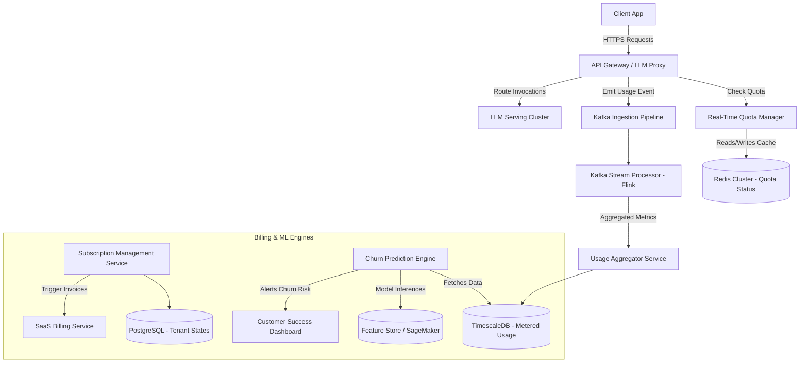

# System Design: AI Subscription Manager

> Design a scalable SaaS billing and subscription platform tailored for generative AI products
> **Key Concepts**: Usage-based billing (metering), tiered access, real-time quota enforcement, churn prediction, multi-tenant subscription states
> **Cross-references**: [Framework](./framework.md) · [SaaS Billing Platform](./saas-billing-platform.md) · [Enterprise RAG](./enterprise-rag.md)

---

## 1. Requirements

### Functional
- Support multiple pricing models: flat-rate, usage-based (per-token, per-query), and hybrid tier models
- Enforce real-time rate limiting and quota consumption (e.g., immediate API blocking on quota exhaustion)
- Track user subscriptions, billing cycles, trial periods, and payment statuses
- Log usage metrics at high resolution (millions of model invocations per minute)
- Predict subscription churn using ML pipeline based on user interaction and usage drops
- Provide customer-facing dashboard for real-time usage visualization and cost forecasting

### Non-Functional
- **Latency**: Sub-millisecond overhead (< 5ms) for query quota verification in the hot-path
- **Throughput**: Support up to 50,000 billing/usage event ingestion events per second
- **Consistency**: Eventual consistency for usage metrics aggregation, but strong consistency for subscription state transitions (active, suspended, expired)
- **Scalability**: Multi-tenant architecture isolating client usage tracking and billing histories

## 2. Scale Assumptions

| Metric | Value |
|--------|-------|
| Daily active subscription users | 10M |
| Monthly usage events (tokens/queries) | 100B |
| Peak usage ingestion rate | 50,000 events/sec |
| Average payload size for billing logs | 500 bytes |
| Storage required for raw events/year | ~600TB |
| Verification cache hit rate (Redis) | 99.5% |

## 3. High-Level Architecture



## 4. Database Design

```sql
-- Subscription & Account State (Transactional Metadata)
CREATE TABLE tenant_subscriptions (
    id UUID PRIMARY KEY DEFAULT gen_random_uuid(),
    tenant_id UUID NOT NULL,
    plan_id VARCHAR(50) NOT NULL,
    status VARCHAR(20) NOT NULL, -- ACTIVE, TRIALS, SUSPENDED, EXPIRED
    billing_cycle_start TIMESTAMP NOT NULL,
    billing_cycle_end TIMESTAMP NOT NULL,
    current_token_limit BIGINT NOT NULL,
    metadata JSONB,
    created_at TIMESTAMP NOT NULL DEFAULT NOW(),
    updated_at TIMESTAMP NOT NULL DEFAULT NOW()
);

CREATE INDEX idx_tenant_status ON tenant_subscriptions(tenant_id, status);

-- TimescaleDB Hypertable for usage metrics (metering data)
CREATE TABLE user_token_usage (
    time TIMESTAMP NOT NULL,
    tenant_id UUID NOT NULL,
    user_id UUID NOT NULL,
    model_id VARCHAR(50) NOT NULL,
    input_tokens INT NOT NULL,
    output_tokens INT NOT NULL,
    cost_estimation DECIMAL(12, 6) NOT NULL
);

-- Convert to hypertable for time-series optimization
SELECT create_hypertable('user_token_usage', 'time');

-- Indexes on time-series table
CREATE INDEX idx_usage_tenant_time ON user_token_usage (tenant_id, time DESC);
```

## 5. API Design

```
POST /v1/meter/events
Authorization: Bearer <service_token>
Body: {
  "tenant_id": "8f8b3d6a-54cd-4e89-bdc8-9d29df7ad54a",
  "user_id": "c30fa1db-e865-4f4d-ae0c-7b2ab10373ab",
  "model_id": "gpt-4o",
  "input_tokens": 1024,
  "output_tokens": 256,
  "timestamp": "2026-06-05T01:05:00Z"
}
Response 202: { "status": "ACCEPTED" }

GET /v1/usage/summary?tenant_id=xxx&start_time=2026-06-01T00:00:00Z&end_time=2026-06-05T23:59:59Z
Response 200: {
  "tenant_id": "8f8b3d6a-54cd-4e89-bdc8-9d29df7ad54a",
  "total_input_tokens": 58920102,
  "total_output_tokens": 19203912,
  "accrued_cost": 412.39,
  "billing_cycle_end": "2026-06-30T00:00:00Z"
}
```

## 6. Kafka Topics

| Topic | Key | Value | Consumers |
|-------|-----|-------|-----------|
| `usage.raw-events` | tenant_id | RawMeterEvent | Flink Engine, S3 Cold Storage Archiver |
| `usage.aggregated` | tenant_id | AggregatedUsageEvent | Usage Aggregator Service, Quota Cache Updater |
| `subscription.status-changed` | tenant_id | SubscriptionStatusEvent | LLM Proxy Quota Service, Marketing Webhook Service |
| `billing.invoice-generated` | tenant_id | InvoiceEvent | Payout Service, Customer Notification Service |

## 7. Key Design Decisions

### Real-Time Quota Verification (Hot-Path Proxy Bypass)
To prevent LLM Proxy routing from hitting database engines for checking usage caps:
1. When a query arrives, the LLM Proxy contacts the **Quota Manager**.
2. The Quota Manager checks a fast Redis cache (`quota:tenant_id`) indicating current consumed tokens vs plan caps.
3. If valid, the proxy routes the LLM query, increments usage tentatively in Redis, and asynchronously publishes a raw event to Kafka.
4. If Redis contains a "BLOCKED" flag, the proxy immediately rejects with `429 Too Many Requests (Quota Exhausted)`.

```java
public boolean isQuotaAllowed(String tenantId, int estimatedTokensNeeded) {
    String key = "quota:" + tenantId;
    List<String> values = redisTemplate.opsForHash().multiGet(key, Arrays.asList("limit", "consumed", "blocked"));
    
    if (values == null || values.get(0) == null) {
        // Hydrate from primary database on cache miss
        hydrateCache(tenantId);
        return true;
    }
    
    long limit = Long.parseLong(values.get(0));
    long consumed = Long.parseLong(values.get(1));
    boolean blocked = Boolean.parseBoolean(values.get(2));
    
    if (blocked || (consumed + estimatedTokensNeeded > limit)) {
        redisTemplate.opsForHash().put(key, "blocked", "true");
        return false;
    }
    
    // Optimistically update cache usage
    redisTemplate.opsForHash().increment(key, "consumed", estimatedTokensNeeded);
    return true;
}
```

### Churn Prediction Pipeline
A daily batch job processes time-series aggregates in TimescaleDB:
1. Features (declining login frequency, sudden drops in weekly token usage, API error rates) are generated.
2. Sent to a SageMaker endpoint executing a gradient-boosted tree model (XGBoost).
3. If probability of churn is > 75%, an event is published to `marketing.churn-risk`, triggering retention emails or customer success team review alerts.

## 8. Failure Scenarios

| Scenario | Mitigation |
|----------|------------|
| Redis Cluster crashes | Fallback to PostgreSQL read-replicas for quota status. Enforce short-term client-side token limits on the LLM proxies directly. |
| Kafka ingestion backpressure | Proxy buffering on EKS hosts (local disk fallback buffer). Scale Kafka partitions dynamically. |
| Duplicate billing events | Idempotent event deduplication in Flink based on `uuid_hash(tenant_id, user_id, timestamp, model_id)`. |
| LLM proxy crashes mid-request | Under-billing is acceptable. System prioritizes client availability over exact penny metering. |

## 9. Scaling Strategy

- **Ingestion**: Split `usage.raw-events` topic into 64 partitions, partitioning by `tenant_id` to guarantee ordering and high-throughput ingestion.
- **Cache Isolation**: Distribute Redis clusters along region lines or key hashing blocks. Use Redis Sentinel for high availability.
- **Aggregation Layer**: Apache Flink computes tumbling windows of 1-minute intervals to update the primary TimescaleDB instances in batches, eliminating lock contention.
