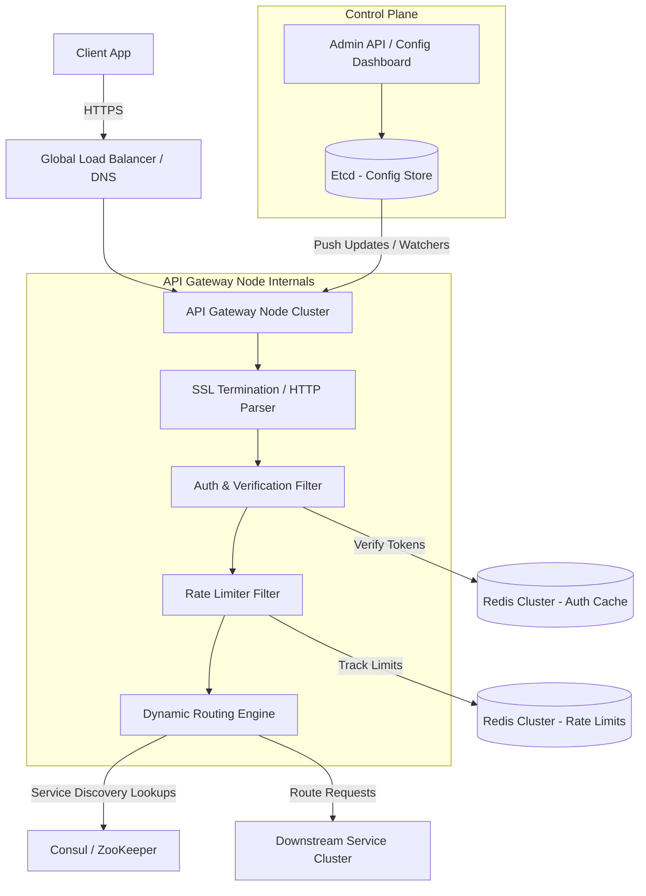

# System Design: API Gateway

> Design a high-performance API Gateway like Kong, Zuul, or AWS API Gateway
> **Key Concepts**: Reverse proxy, rate limiting, authentication offloading, service discovery, dynamic routing, SSL termination
> **Cross-references**: [Framework](./framework.md) · [Auth Platform](./auth-platform.md) · [Security](../06-security/security-deep-dive.md)

---

## 1. Requirements

### Functional
- Route client requests to downstream microservices dynamically
- Authenticate and authorize requests at the edge (token validation, API keys)
- Implement rate limiting (per IP, per tenant, per user)
- Collect and export telemetry data (request/response metrics, distributed tracing)
- Support protocol translation (e.g., HTTP/JSON to gRPC)

### Non-Functional
- **Latency**: Minimal proxy overhead (P99 < 15ms)
- **Throughput**: 100,000+ RPS under peak load
- **Availability**: 99.999% uptime (downtime < 5 minutes per year)
- **Extensibility**: Support custom plugins (Lua, WebAssembly, JS)

## 2. Scale Assumptions

| Metric | Value |
|--------|-------|
| Daily active requests | 2B |
| Peak concurrent requests | 100K RPS |
| Config updates per minute | ~50 |
| Log generation rate | ~50GB/hour |

## 3. High-Level Architecture



## 4. Key Design Decisions

### Rate Limiting Implementation (Token Bucket via Redis Lua script)
To guarantee high performance and accuracy across nodes, rate limiting is executed via atomic Lua scripts in Redis to prevent race conditions (Read-Modify-Write issues).

```lua
-- Key: rate_limit:tenant_id:api
-- ARGV[1]: Max tokens (bucket capacity)
-- ARGV[2]: Fill rate (tokens per second)
-- ARGV[3]: Request cost (default 1)
-- ARGV[4]: Current timestamp (epoch seconds)

local key = KEYS[1]
local capacity = tonumber(ARGV[1])
local fill_rate = tonumber(ARGV[2])
local cost = tonumber(ARGV[3])
local now = tonumber(ARGV[4])

local state = redis.call('HMGET', key, 'tokens', 'last_updated')
local tokens = tonumber(state[1])
local last_updated = tonumber(state[2])

if not tokens then
    tokens = capacity
    last_updated = now
else
    -- Replenish tokens based on elapsed time
    local elapsed = math.max(0, now - last_updated)
    tokens = math.min(capacity, tokens + elapsed * fill_rate)
end

if tokens < cost then
    return {0, tokens} -- Rejected
else
    tokens = tokens - cost
    redis.call('HMSET', key, 'tokens', tokens, 'last_updated', now)
    redis.call('EXPIRE', key, 86400) -- Clean up after a day of inactivity
    return {1, tokens} -- Accepted
end
```

### Routing Config Distribution (Etcd Watchers)
API route rules can change dynamically. Rather than restarting gateway nodes:
1. The **Control Plane** publishes route changes to **Etcd**.
2. Gateway nodes run an internal watcher loop observing changes in Etcd keys.
3. Upon change detection, gateway nodes update their internal routing tree (using Radix tree representation) in memory immediately without service interruption.

## 5. Security & Edge Offloading

- **TLS Termination**: Offload SSL decryption at the gateway node to leverage hardware-accelerated decryption cards.
- **Token Translation**: Client supplies JWT access tokens. Gateway validates the signature, extracts user metadata (e.g., `user_id`, `roles`), and injects them as custom HTTP headers (e.g., `X-User-Id`, `X-User-Roles`) before passing them down. Downstream microservices can assume incoming headers are pre-validated.
- **IP Whitelisting & WAF integration**: Intercept malicious request bodies, SQL injection signatures, and flag abnormal rate trends.

## 6. Failure Scenarios

| Scenario | Mitigation |
|----------|------------|
| Redis rate limiter unavailable | Fail-open strategy. Allow requests through, fallback to local node-level token bucket limits, and trigger alerts. |
| Configuration store (Etcd) down | Gateways keep running on cached in-memory configs. Operations continue but config changes are temporarily blocked. |
| Downstream service latency spike | Implement **Circuit Breaker** (using Resilient4j pattern). Break circuit if error rate or latency > 50% over a 10s window. Serve fallback error code `503`. |
| Out of Memory (OOM) under spike | Enforce connection limits and maximum payload validation limits on the HTTP parsing layer. |

## 7. Scaling Strategy

- **Anycast Routing**: Use BGP Anycast to direct users to the geographically closest data center.
- **Horizontal Scaling**: API Gateway instances run inside Kubernetes, using HPA (Horizontal Pod Autoscaler) bound to CPU and network bandwidth thresholds.
- **Zero-Copy Optimization**: Optimize packet reading on network sockets via Linux epoll and socket recycling mechanisms.
