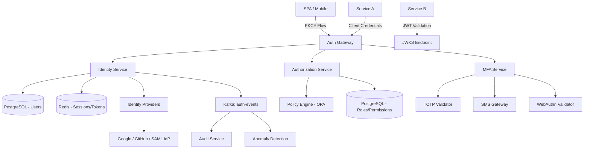

# System Design: Authentication & Authorization Platform

> Design a centralized auth platform like Auth0/Keycloak
> **Key Concepts**: OAuth2/OIDC, SSO, MFA, RBAC/ABAC, token lifecycle, federated identity

---

## 1. Requirements

### Functional
- OAuth2 Authorization Code + PKCE flow for SPAs/mobile
- Client Credentials flow for service-to-service
- Single Sign-On (SSO) across multiple applications
- Multi-Factor Authentication (MFA): TOTP, SMS, WebAuthn
- Social login (Google, GitHub, Microsoft)
- RBAC + ABAC authorization with policy management
- User management: registration, password reset, account linking
- Audit logging of all authentication events

### Non-Functional
- **Availability**: 99.99% (auth is critical path)
- **Latency**: P99 < 100ms for token validation
- **Throughput**: 50,000 auth requests/second
- **Security**: Zero Trust, token rotation, brute-force protection

## 2. Architecture



## 3. Database Design

```sql
CREATE TABLE users (
    id UUID PRIMARY KEY,
    email VARCHAR(255) UNIQUE NOT NULL,
    password_hash VARCHAR(255),  -- bcrypt/argon2
    email_verified BOOLEAN DEFAULT FALSE,
    mfa_enabled BOOLEAN DEFAULT FALSE,
    mfa_secret VARCHAR(255),     -- TOTP encrypted secret
    status VARCHAR(20) DEFAULT 'ACTIVE', -- ACTIVE, LOCKED, SUSPENDED
    failed_login_attempts INT DEFAULT 0,
    locked_until TIMESTAMP,
    created_at TIMESTAMP DEFAULT NOW()
);

CREATE TABLE oauth_clients (
    client_id VARCHAR(100) PRIMARY KEY,
    client_secret_hash VARCHAR(255),
    client_name VARCHAR(255) NOT NULL,
    grant_types VARCHAR[] NOT NULL, -- {authorization_code, client_credentials}
    redirect_uris TEXT[] NOT NULL,
    scopes VARCHAR[] NOT NULL,
    access_token_ttl INT DEFAULT 900,    -- 15 minutes
    refresh_token_ttl INT DEFAULT 2592000 -- 30 days
);

CREATE TABLE roles (
    id UUID PRIMARY KEY,
    tenant_id UUID NOT NULL,
    name VARCHAR(100) NOT NULL,
    permissions JSONB NOT NULL,  -- ["orders:read", "orders:write", "users:read"]
    UNIQUE(tenant_id, name)
);

CREATE TABLE user_roles (
    user_id UUID REFERENCES users(id),
    role_id UUID REFERENCES roles(id),
    tenant_id UUID NOT NULL,
    PRIMARY KEY (user_id, role_id, tenant_id)
);

CREATE TABLE refresh_tokens (
    id UUID PRIMARY KEY,
    user_id UUID NOT NULL,
    token_hash VARCHAR(255) UNIQUE NOT NULL,
    family_id UUID NOT NULL,    -- For rotation detection
    used BOOLEAN DEFAULT FALSE,
    expires_at TIMESTAMP NOT NULL,
    created_at TIMESTAMP DEFAULT NOW()
);
```

## 4. Key Design Decisions

### Token Architecture
- **Access Token**: JWT, RS256 signed, 15-minute TTL, contains user_id + roles + tenant
- **Refresh Token**: Opaque, stored in Redis, 30-day TTL, rotated on every use
- **ID Token**: OIDC standard, contains user profile claims
- **JWKS endpoint**: Public keys for JWT validation (cached by services for 24h)

### Token Refresh with Rotation
```java
public TokenPair refreshTokens(String refreshToken) {
    RefreshTokenEntity entity = tokenRepo.findByHash(hash(refreshToken))
        .orElseThrow(() -> new InvalidTokenException("Unknown token"));

    if (entity.isUsed()) {
        // REUSE DETECTED — compromise! Invalidate entire family
        tokenRepo.deleteByFamilyId(entity.getFamilyId());
        auditService.logSecurityEvent("TOKEN_REUSE_DETECTED", entity.getUserId());
        throw new TokenReuseException("Token compromised");
    }

    entity.setUsed(true);
    tokenRepo.save(entity);

    // Issue new pair
    String newRefreshToken = generateSecureRandom();
    RefreshTokenEntity newEntity = new RefreshTokenEntity(
        entity.getUserId(), hash(newRefreshToken), entity.getFamilyId());
    tokenRepo.save(newEntity);

    String accessToken = jwtService.generateAccessToken(entity.getUserId());
    return new TokenPair(accessToken, newRefreshToken);
}
```

## 5. Security & Failure Scenarios

| Scenario | Mitigation |
|----------|------------|
| Brute force login | Rate limit: 5 failed attempts → 15-minute lockout. CAPTCHA after 3 failures |
| Token theft | Refresh token rotation with reuse detection. Short access token TTL (15 min) |
| Session hijacking | Bind tokens to fingerprint (IP + user-agent hash). Anomaly detection |
| IdP outage | Graceful degradation: cached user data, local password fallback |
| Redis failure | Fallback to database for token validation. Circuit breaker on Redis |

## 6. Scaling Strategy
- Stateless JWT validation (services validate locally with JWKS)
- Redis Cluster for session/token storage
- PostgreSQL read replicas for user lookup
- Separate scaling for login spikes (morning login surge)
- CDN caching for JWKS endpoint
