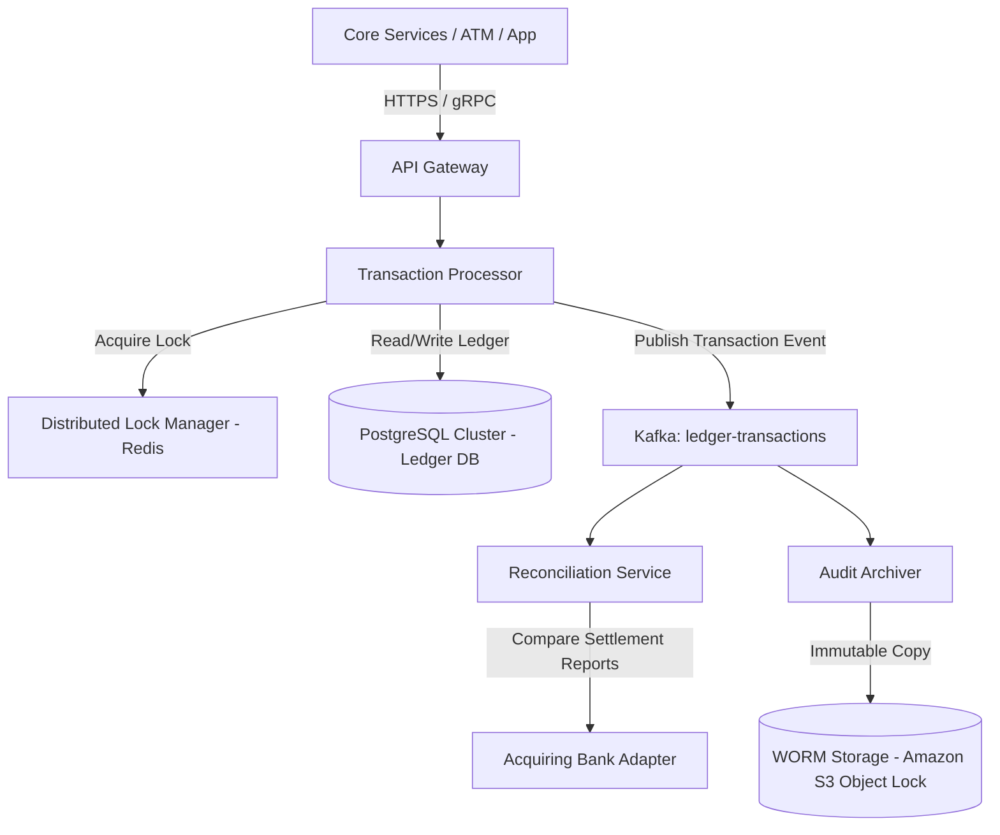

# System Design: Core Banking Platform

> Design a high-reliability core banking ledger system
> **Key Concepts**: Double-entry bookkeeping, transaction isolation, ACID databases, reconciliation engines, audit trails, regulatory reporting
> **Cross-references**: [Framework](./framework.md) · [Payment Gateway](./payment-gateway.md) · [SaaS Billing](./saas-billing-platform.md)

---

## 1. Requirements

### Functional
- Keep accurate track of customer accounts, balances, and transaction history
- Support money transfers between accounts (deposit, withdraw, transfer)
- Ensure double-entry bookkeeping rules (sum of all debits equals sum of all credits across the bank ledger)
- Generate audit trails of every database modification
- Produce daily reconciliation reports matching ledger transactions with external settlement gateways

### Non-Functional
- **Strict Consistency**: No balance over-drafts or ghost transactions. Transaction isolation level set to SERIALIZABLE
- **Availability**: 99.999% uptime. Write pathways must degrade gracefully rather than corrupting balances
- **Auditable**: Immutable ledger entries (records cannot be modified or deleted, only countered)
- **Scalability**: Support up to 5,000 transaction requests per second (TPS) with low tail latency

## 2. Scale Assumptions

| Metric | Value |
|--------|-------|
| Total bank accounts | 50M |
| Daily ledger writes | 40M transactions |
| Average transaction size | $120 |
| Ledger entry storage size | ~300 bytes |
| Yearly database growth | ~4.3TB |
| Target transactional TPS | 5,000 peak |

## 3. High-Level Architecture



## 4. Key Design Decisions

### Double-Entry Ledger Bookkeeping Database Schema
In double-entry systems, money does not simply vanish or appear. It is moved between accounts. Every transaction consists of at least two entries: a **debit** (reducing value from a source) and a **credit** (increasing value in a destination).

```sql
-- Accounts definitions
CREATE TABLE accounts (
    id UUID PRIMARY KEY DEFAULT gen_random_uuid(),
    customer_id UUID NOT NULL,
    type VARCHAR(20) NOT NULL,    -- ASSET, LIABILITY, EQUITY, REVENUE, EXPENSE
    balance BIGINT NOT NULL DEFAULT 0,  -- In cents, to avoid float issues
    currency VARCHAR(3) NOT NULL DEFAULT 'USD',
    version INT NOT NULL DEFAULT 0,     -- Optimistic concurrency token
    status VARCHAR(20) NOT NULL DEFAULT 'ACTIVE', -- ACTIVE, FROZEN, CLOSED
    created_at TIMESTAMP NOT NULL DEFAULT NOW()
);

-- Core immutable ledger transaction record
CREATE TABLE transactions (
    id UUID PRIMARY KEY DEFAULT gen_random_uuid(),
    description VARCHAR(255),
    correlation_id VARCHAR(64) UNIQUE, -- Prevent double execution
    timestamp TIMESTAMP NOT NULL DEFAULT NOW()
);

-- Individual double-entry entries
CREATE TABLE entries (
    id BIGSERIAL PRIMARY KEY,
    transaction_id UUID NOT NULL REFERENCES transactions(id),
    account_id UUID NOT NULL REFERENCES accounts(id),
    type VARCHAR(10) NOT NULL, -- DEBIT or CREDIT
    amount BIGINT NOT NULL CHECK (amount > 0),
    currency VARCHAR(3) NOT NULL,
    created_at TIMESTAMP NOT NULL DEFAULT NOW()
);

-- Ensure debits and credits equal zero validation rule (checked inside database)
CREATE UNIQUE INDEX idx_entries_accounting ON entries(transaction_id, account_id);
```

### Serialized Execution & Deadlock Avoidance
When executing a transfer between Account A and Account B:
1. We must lock both rows to perform the balance updates.
2. If Transaction 1 tries to transfer A -> B, and Transaction 2 tries to transfer B -> A concurrently, a **deadlock** can occur if they acquire locks in opposing orders.
3. **Solution**: Always sort account locking orders in application memory by their primary key IDs before performing database operations:
```java
public void executeTransfer(UUID sourceId, UUID destId, long amount) {
    UUID firstLock = sourceId.compareTo(destId) < 0 ? sourceId : destId;
    UUID secondLock = sourceId.compareTo(destId) < 0 ? destId : sourceId;
    
    transactionTemplate.execute(status -> {
        // Lock accounts in strict primary key order
        Account first = accountRepository.findByIdForUpdate(firstLock);
        Account second = accountRepository.findByIdForUpdate(secondLock);
        
        // Execute debit / credit calculations
        Account source = first.getId().equals(sourceId) ? first : second;
        Account dest = first.getId().equals(destId) ? first : second;
        
        if (source.getBalance() < amount) {
            throw new InsufficientFundsException();
        }
        
        source.decrementBalance(amount);
        dest.incrementBalance(amount);
        
        accountRepository.save(source);
        accountRepository.save(dest);
        
        // Write double-entry entries
        writeLedgerRecords(sourceId, destId, amount);
        return null;
    });
}
```

## 5. Failure Scenarios

| Scenario | Mitigation |
|----------|------------|
| Multi-node primary db crash | Utilize **CockroachDB** or highly-configured PostgreSQL with **Raft** / **Patroni** replication to guarantee Zero Data Loss (RPO=0) even if a node collapses. |
| Message Queue (Kafka) drops events | Operational database transaction writes must be transactional with the Outbox table. Outbox polling worker pushes transactions to Kafka reliably. |
| Inconsistent internal ledger vs external bank reports | Daily automatic reconciliation loops compare internal settlement records with clearing house statements. Unreconciled accounts freeze automatically. |

## 6. Scaling Strategy

- **Account Sharding**: Shard account databases by ranges or hash values of `customer_id`.
- **Read-Write Separation**: Balance checks and audit histories (90% of requests) are routed to read replicas or Elasticsearch audit index caches. Core balance modifications are dedicated to CockroachDB/PostgreSQL primaries.
- **Cache Balancing**: Cache account states (e.g. frozen status) in Redis with short TTLs to bypass SQL checks for incoming transaction runs.
