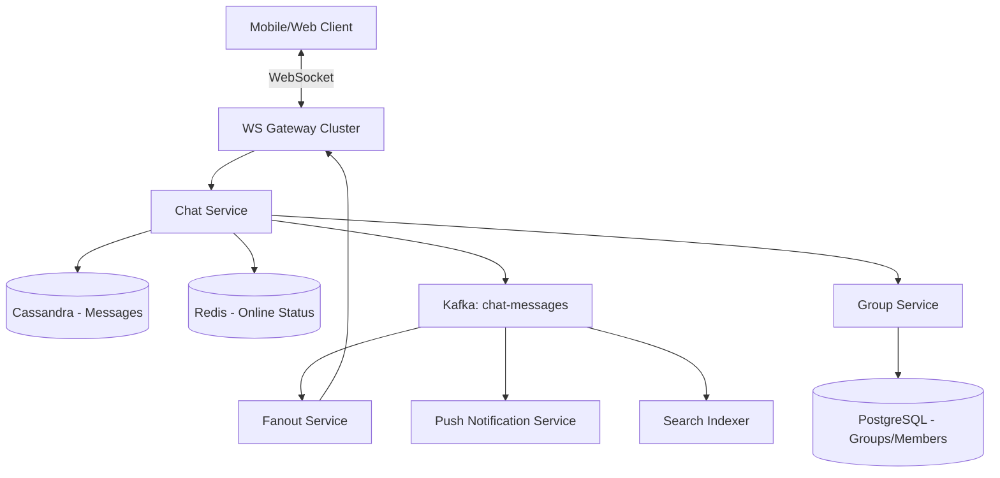
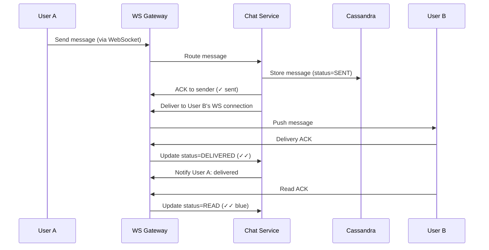

# System Design: Chat System

> Design a real-time chat system like WhatsApp/Slack
> **Key Concepts**: WebSocket, message ordering, delivery receipts, E2E encryption, presence

---

## Scale: 50M DAU, 1B messages/day, ~12K messages/sec avg, 50K peak

## Architecture


## Message Flow (1:1)


## Message Storage (Cassandra — write-optimized, time-series)
```sql
CREATE TABLE messages (
    conversation_id UUID,
    message_id TIMEUUID,
    sender_id UUID,
    content TEXT,          -- Encrypted payload
    content_type VARCHAR,  -- text, image, video, file
    status VARCHAR,        -- SENT, DELIVERED, READ
    created_at TIMESTAMP,
    PRIMARY KEY (conversation_id, message_id)
) WITH CLUSTERING ORDER BY (message_id DESC);
-- Partition by conversation_id → all messages for a chat on same node
-- Clustering by message_id (TIMEUUID) → ordered by time
```

## Group Chat Fanout
- Small groups (<100): Fan-out on write — message written to each member's inbox
- Large channels (100+): Fan-out on read — message stored once, members query on open
- Typing indicators: UDP-like fire-and-forget via Redis Pub/Sub (no persistence)

## Presence System: Heartbeat every 30s to Redis. TTL 60s. If no heartbeat → offline. Subscribe to presence changes via Redis Pub/Sub.

## E2E Encryption: Signal Protocol. Key exchange on first message. Server stores only encrypted blobs. Server cannot read messages.

## Offline Messages: Stored in Cassandra. On reconnect, client requests messages since last_seen_message_id. Push notification triggers for offline users.
