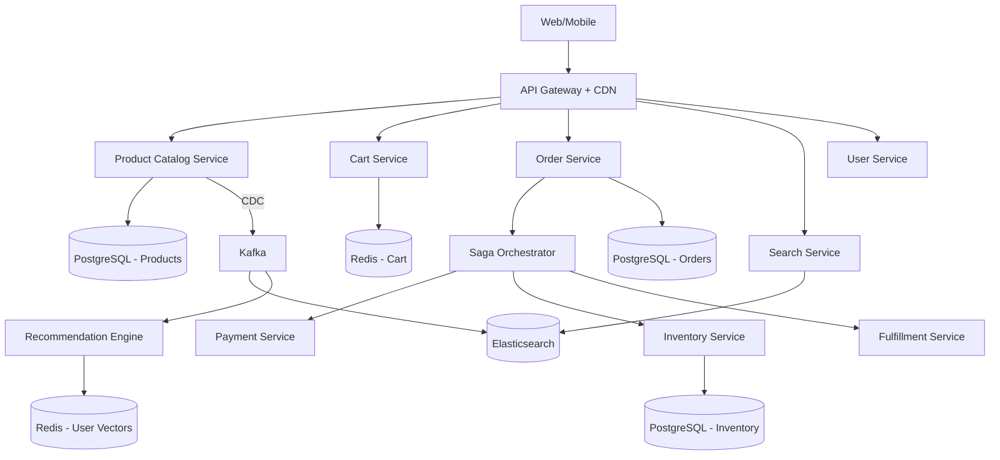
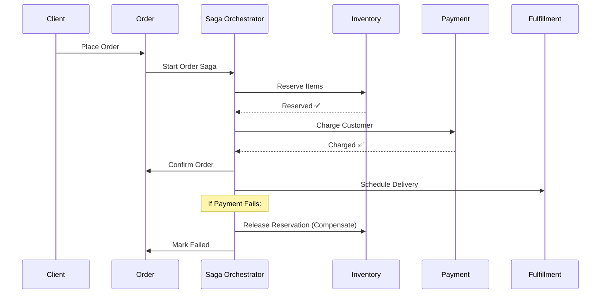

# System Design: E-Commerce Platform

> Design a scalable e-commerce platform like Amazon
> **Key Concepts**: Saga pattern, inventory locking, search, recommendations, cart management

---

## Architecture



## Order Saga (Orchestration)



## Inventory Locking Strategy
```java
// Pessimistic lock — prevents overselling during flash sales
@Transactional
public boolean reserveInventory(UUID productId, int quantity) {
    // SELECT ... FOR UPDATE SKIP LOCKED
    InventoryItem item = inventoryRepo.findByIdWithLock(productId);
    if (item.getAvailable() < quantity) {
        throw new InsufficientStockException(productId);
    }
    item.setAvailable(item.getAvailable() - quantity);
    item.setReserved(item.getReserved() + quantity);
    inventoryRepo.save(item);

    // Schedule reservation expiry (15 min TTL)
    reservationScheduler.scheduleRelease(productId, quantity, Duration.ofMinutes(15));
    return true;
}
```

## Key Tables
```sql
CREATE TABLE orders (
    id UUID PRIMARY KEY,
    user_id UUID NOT NULL,
    status VARCHAR(20) NOT NULL, -- CREATED, CONFIRMED, SHIPPED, DELIVERED, CANCELLED
    total_amount BIGINT NOT NULL,
    currency VARCHAR(3) DEFAULT 'USD',
    shipping_address JSONB NOT NULL,
    saga_state VARCHAR(30),
    created_at TIMESTAMP DEFAULT NOW()
);

CREATE TABLE order_items (
    id UUID PRIMARY KEY,
    order_id UUID REFERENCES orders(id),
    product_id UUID NOT NULL,
    quantity INT NOT NULL,
    unit_price BIGINT NOT NULL
);

CREATE TABLE inventory (
    product_id UUID PRIMARY KEY,
    available INT NOT NULL CHECK (available >= 0),
    reserved INT NOT NULL DEFAULT 0,
    version INT NOT NULL DEFAULT 0  -- Optimistic locking
);
```

## Scaling: Product catalog cached in Redis (TTL 5 min). Elasticsearch for search with autocomplete. Cart in Redis (fast, ephemeral). Orders partitioned by date. CDN for product images (S3 + CloudFront). Read replicas for product queries.
