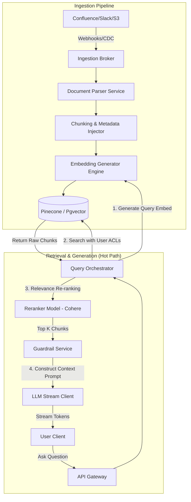
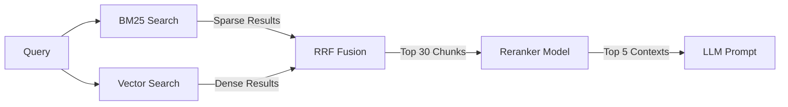

# System Design: Enterprise RAG Platform

> Design a high-security, scalable Retrieval-Augmented Generation (RAG) platform
> **Key Concepts**: Hybrid search (sparse + dense), vector databases (pgvector/Pinecone), document chunking pipelines, document-level Access Control Lists (ACLs), rerankers, guardrails
> **Cross-references**: [Framework](./framework.md) · [AI Agent Platform](./ai-agent-platform.md) · [Distributed Systems Deep Dive](../05-distributed-systems/deep-dive.md)

---

## 1. Requirements

### Functional
- Ingest enterprise document spaces (PDFs, Word docs, Confluence, Slack logs)
- Retrieve relevant document fragments matching a user query
- Generate highly contextual answers based *only* on retrieved context (prevent hallucinations)
- Respect document Access Control Lists (ACLs) - users must never see information they don't have access to in the original source system

### Non-Functional
- **Latency**: Under 1.5 seconds for final generated token stream (start streaming tokens in < 200ms)
- **High Ingestion Throughput**: Parse and index 100K pages per hour
- **Accuracy (Relevance)**: High retrieval precision (NDCG@K) and generation accuracy
- **Security**: Strict encryption of vector space and access logs

## 2. Scale Assumptions

| Metric | Value |
|--------|-------|
| Total ingested documents | 10M documents |
| Average document length | 5 pages (~2500 words) |
| Total text chunks (500 tokens/chunk) | 50M chunks |
| Vector dimensions (e.g. text-embedding-3-small) | 1536 float32 |
| Vector storage required | ~300GB in-memory indexes |
| Peak Query Rate | 500 QPS |

## 3. High-Level Architecture



## 4. Key Design Decisions

### Ingestion & Chunking Strategy
- **Chunk Size & Overlap**: 512-token chunks with 10% overlap (51 tokens). Keeps chunk context coherent.
- **Hierarchical Chunking**: Parent-Child relationships. Small chunks (e.g. 128 tokens) are indexed for semantic matching, but when a match occurs, the larger parent chunk (e.g., 512 tokens) is sent to the LLM to provide richer context.
- **Metadata Injection**: Prepend metadata (e.g., source name, creation date, parent directory) directly to the chunk text before generating embeddings.

### Security: Vector ACL Filtering (Security Leak Prevention)
A critical security leak in RAG systems is returning information the user shouldn't see. We solve this by adding access controls on the database query level:
- In Pinecone/Pgvector, every vector is tagged with metadata fields containing allowed roles/user IDs.
- During query execution, we extract the user's active session roles and pass them as meta-filters.

```sql
-- Pgvector query schema with ACL constraints
SELECT id, document_id, chunk_content, 
       1 - (embedding <=> :query_vector) AS similarity
FROM document_chunks
WHERE 
  -- Strict ACL matching check
  (allowed_users && ARRAY[:user_id]::uuid[] OR allowed_roles && :user_roles::varchar[])
  AND status = 'ACTIVE'
ORDER BY embedding <=> :query_vector
LIMIT 20;
```

### Hybrid Search & Reranking Pipeline
1. **Keyword Match (BM25)**: Essential for catching exact matches, serial numbers, codes, and acronyms.
2. **Dense Vector Match (Cosine/L2)**: Catches semantic meanings, synonyms, and intent.
3. **Reciprocal Rank Fusion (RRF)**: Merges scores from BM25 and vector searches.
4. **Cross-Encoder Reranker**: BM25 and Vector Search are fast but make approximations. We feed the top 30 merged results into a heavy Reranker model (e.g., Cohere/BGE-Reranker) to evaluate exact semantic similarity. We select only the top 5 reranked chunks.



## 5. Failure Scenarios & Mitigations

| Scenario | Mitigation |
|----------|------------|
| Vector DB Latency Spike | Implement cache queries using a Redis Semantic Cache. If user query has 95% similarity to a recent query, return the cached LLM answer. |
| Ingestion pipeline backlog | Scale PDF parsing workers. Use OCR only when PDF has no text layer, routing text-heavy files directly to fast parser libraries. |
| Hallucinations in generated text | Enforce strict instructions in the system prompt: "Answer the question ONLY based on the context. If the answer is not in the context, say 'I don't know'." Run a post-generation check evaluating citation overlaps. |

## 6. Scaling Strategy

- **Index Partitioning**: Partition PGvector tables by `tenant_id` or `workspace_id`. Keeps indexes small, ensuring high HNSW search performance inside database memory.
- **Embedding Inferences**: Batch embedding requests before sending to the model server. Run embedding extraction on local GPU pods to avoid external network hops.
- **Streaming Tokens**: Utilize HTTP Server-Sent Events (SSE) to stream tokens as they are generated by the model, minimizing P99 time-to-first-token.
