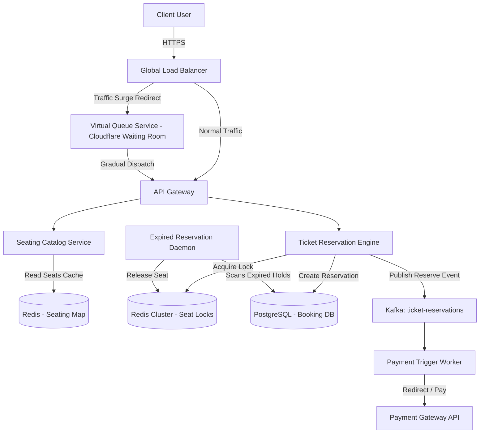
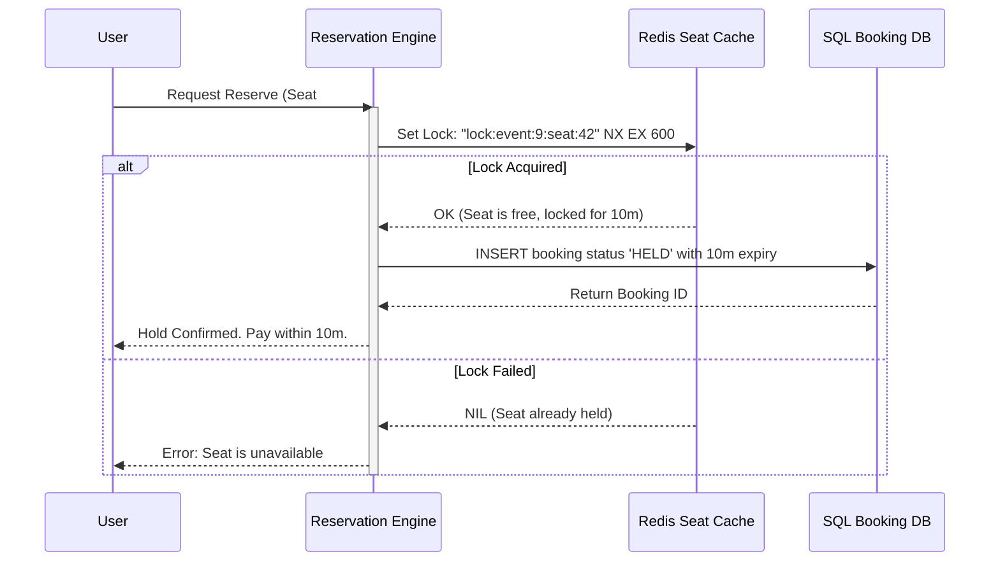

# System Design: High-Concurrency Event Ticketing Platform

> Design a high-concurrency ticket sales system like Ticketmaster
> **Key Concepts**: Flash-sale locking, distributed locking (Redlock), transactional seating isolation, virtual waiting queues, eventual consistency payment reconciliation
> **Cross-references**: [Framework](./framework.md) · [Payment Gateway](./payment-gateway.md) · [Distributed Systems Deep Dive](../05-distributed-systems/deep-dive.md)

---

## 1. Requirements

### Functional
- Users can view upcoming events and choose specific seats
- Users can hold seats for 10 minutes while completing the payment
- Process high-demand ticket sales (e.g. Coldplay stadium concert) where 100K+ users hit the system simultaneously
- Issue digital tickets (with secure QR codes) to users after payment confirmation

### Non-Functional
- **Strict Isolation**: No double-booking of seats (a seat must be locked to a maximum of one user)
- **High Read Capacity**: Support massive traffic viewing seating maps during flash sales
- **Scalability**: Handle sudden spikes in ticket requests without crashing (e.g., peak load 50,000 requests/sec)
- **Reliability**: Expire pending holds automatically if payment fails or holds timeout (10 mins)

## 2. Scale Assumptions

| Metric | Value |
|--------|-------|
| Stadium seat capacity | 80,000 seats |
| Total users at sale start | 500,000 users |
| Peak TPS request rate | 50,000 requests/sec |
| Ticket reservation payload | ~200 bytes |
| Booking time window | 10 minutes |

## 3. High-Level Architecture



## 4. Seating Inventory Reservation Pattern



## 5. Key Design Decisions

### Virtual Waiting Queue (Surge Shield)
To prevent the application servers and databases from crashing under a 50K TPS load:
1. When a popular concert goes on sale, all incoming users are routed to a **Virtual Queue** (using a queue token engine at the CDN/Cloudflare level).
2. Users receive a cookie token and wait in a virtual room.
3. The queue service admits users to the application gateway at a controlled rate (e.g., 500 users/second) matching the processing capability of the database.

### Seat Reservation Mechanics (Atomic Locking)
Using SQL transactions directly for holding seats in a hot flash sale causes table locking and deadlocks:
- **Solution**: Reserve seats inside a fast, single-threaded Redis key using `SET seat:event_id:seat_id user_id NX EX 600`.
- Once Redis confirms the lock, write the reservation to PostgreSQL asynchronously or via a lightweight transaction.
- If the user pays, the lock status becomes permanent in the database, and the Redis key is deleted. If they fail to pay in 10 minutes, the Redis key expires naturally, and a background daemon marks the PostgreSQL reservation as `EXPIRED`.

```sql
-- PostgreSQL booking table (optimized for updates)
CREATE TABLE ticket_reservations (
    id UUID PRIMARY KEY DEFAULT gen_random_uuid(),
    event_id UUID NOT NULL,
    seat_identifier VARCHAR(20) NOT NULL,
    user_id UUID NOT NULL,
    status VARCHAR(20) NOT NULL, -- HELD, RESERVED, CANCELED
    expires_at TIMESTAMP NOT NULL,
    created_at TIMESTAMP NOT NULL DEFAULT NOW(),
    updated_at TIMESTAMP NOT NULL DEFAULT NOW()
);

-- Constraint preventing duplicate active bookings for the same seat
CREATE UNIQUE INDEX idx_unique_active_seat ON ticket_reservations(event_id, seat_identifier)
WHERE status IN ('HELD', 'RESERVED');
```

## 6. Failure Scenarios & Mitigations

| Scenario | Mitigation |
|----------|------------|
| Redis node crashes, losing locks | Redis Sentinel with master-replica sync. Set up AOF persistence to disk every second to recover keys on node boot. |
| User closes tab mid-payment | The booking status remains `HELD` in the DB. A cron job checks for expired holds every 10 seconds, releases the seat in Redis, and changes the DB status to `CANCELED`. |
| Stripe webhooks delayed | If Stripe confirms payment after the 10-minute hold expires, trigger automated refund logic and notify the customer. |

## 7. Scaling Strategy

- **Seating Map CDN Caching**: Seating maps and availability matrices (which seats are taken) are cached at CDN Edge locations. Availability data can be slightly stale; when a user clicks a seat, the live validation occurs on the Redis lock layer.
- **SQL Partitioning**: Shard the PostgreSQL database by `event_id`. This distributes booking operations for different concerts across distinct database shards.
- **WebSocket Status Feeds**: Use WebSockets to stream seat availability updates (sold, held) to active clients, preventing constant polling requests from client browsers.
