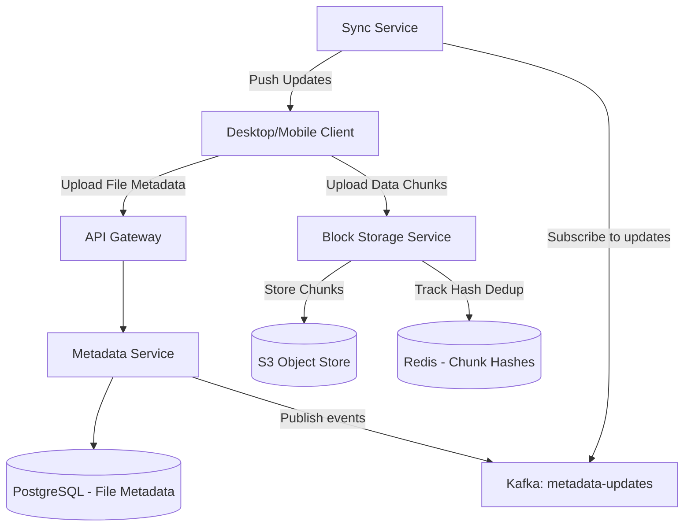

# System Design: File Storage Service

> Design a cloud file storage and synchronization service like Dropbox or Google Drive
> **Key Concepts**: File chunking, data deduplication, metadata synchronization, conflict resolution, block-level storage, WebSockets for sync notification
> **Cross-references**: [Framework](./framework.md) · [Video Streaming](./video-streaming.md) · [Distributed Systems Deep Dive](../05-distributed-systems/deep-dive.md)

---

## 1. Requirements

### Functional
- Users can upload, download, and delete files from any device (web, mobile, desktop client)
- File synchronization across multiple devices owned by the same user
- Revision history and file versioning (revert to previous states)
- Share files/folders with other users (read/write permissions)
- Support offline file modification with automatic sync upon reconnection

### Non-Functional
- **Durability**: 99.999999999% (11 9s) durability of files (prevent data loss)
- **Consistency**: Strong consistency for file metadata (users shouldn't see old files after update)
- **Bandwidth Optimization**: Minimize upload bandwidth (delta sync: only upload modified chunks)
- **Concurrency**: Handle multiple devices editing the same file simultaneously (conflict resolution)

## 2. Scale Assumptions

| Metric | Value |
|--------|-------|
| Daily active users | 50M |
| Average files stored per user | 2000 |
| Total files stored | 100B |
| Average file size | 5MB |
| Total storage space | 500PB |
| Write/Upload requests daily | 100M |

## 3. High-Level Architecture



## 4. Key Design Concepts

### File Chunking & Delta Sync
To minimize bandwidth and optimize transfer rates:
- Large files are divided into small, fixed or variable-size **chunks** (e.g., 4MB).
- **Variable-size Chunking (Rabin Fingerprints)**: Better than fixed-size chunking. If a user inserts one byte at the start of a file, fixed chunking shifts all boundary offsets, altering every chunk hash. Rabin chunking detects logical boundaries based on content hash windows, meaning only the modified chunk hash changes.
- **Delta Sync**: When a file is updated, the client computes chunk hashes, compares them with server hashes, and uploads *only* the chunks whose hashes are missing.

### Data Deduplication
To reduce storage costs significantly:
- Chunks are stored in the block storage by their SHA-256 hash value.
- If two users upload the same photo or file, their chunks will produce the identical SHA-256 hashes.
- The block storage keeps only *one* copy of the chunk in S3, and links both metadata records to it.

## 5. Database Design (Metadata)

We require strong consistency for directory trees and versioning, mapping naturally to SQL with ACID features.

```sql
-- Files & Folders tree
CREATE TABLE file_nodes (
    id UUID PRIMARY KEY DEFAULT gen_random_uuid(),
    parent_id UUID REFERENCES file_nodes(id),
    owner_id UUID NOT NULL,
    name VARCHAR(255) NOT NULL,
    is_directory BOOLEAN NOT NULL DEFAULT FALSE,
    version INT NOT NULL DEFAULT 1,
    checksum VARCHAR(64), -- SHA-256 hash of the complete file
    size BIGINT NOT NULL DEFAULT 0,
    created_at TIMESTAMP NOT NULL DEFAULT NOW(),
    updated_at TIMESTAMP NOT NULL DEFAULT NOW()
);

CREATE INDEX idx_file_parent ON file_nodes(parent_id);
CREATE INDEX idx_file_owner ON file_nodes(owner_id);

-- Mapping file versions to individual block chunks
CREATE TABLE file_chunks (
    id UUID PRIMARY KEY DEFAULT gen_random_uuid(),
    chunk_hash VARCHAR(64) UNIQUE NOT NULL, -- SHA-256 of block data
    chunk_size INT NOT NULL,
    storage_path VARCHAR(255) NOT NULL       -- S3 URL or object key
);

CREATE TABLE file_node_chunks (
    file_node_id UUID REFERENCES file_nodes(id),
    chunk_id UUID REFERENCES file_chunks(id),
    chunk_order INT NOT NULL,
    PRIMARY KEY (file_node_id, chunk_order)
);
```

## 6. Sync and Conflict Resolution Protocol

When offline editing occurs on two client devices:
1. Device A and Device B both modify a file locally at version `N`.
2. Device A connects first, pushes chunk updates, updates the metadata version to `N+1`.
3. Device B connects, tries to push changes referencing version `N`.
4. The server rejects Device B's request (optimistic locking check fail).
5. Device B is prompted to pull version `N+1` changes, and a local duplicate copy is created (e.g. `document_conflict_DeviceB.txt`) for the user to resolve manually.

## 7. Failure Scenarios

| Scenario | Mitigation |
|----------|------------|
| File chunk upload interrupted | Client resumes upload of remaining chunks starting from the last verified block offset. Already uploaded blocks are not re-sent. |
| Object store (S3) degradation | Multi-region replication enabled on S3. Write requests fail-over to alternate region bucket. |
| Metadata database crash | PostgreSQL primary replica failover utilizing Patroni. Write updates held in memory queue on client side until database writes recover. |

## 8. Scaling Strategy

- **Shard Metadata**: Shard the SQL databases by `owner_id` (user workspace partition). This ensures that files owned by a user live in a single database partition, keeping directory tree traversals fast and transactional.
- **Cache Block Hashes**: Keep a large Redis cluster storing all known chunk hashes. Before a client uploads any chunk, it queries Redis. If the hash exists, the client marks it as uploaded instantly (instant upload capability).
- **Edge Metadata Caching**: Use regional Redis caches to store active directory tree queries to limit direct hits on PostgreSQL.
