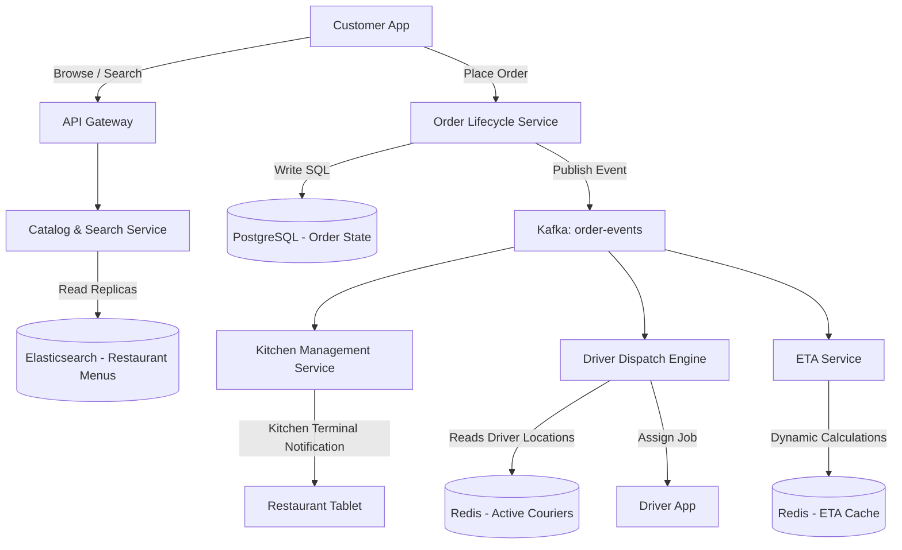

# System Design: Food Delivery Platform

> Design a scalable food delivery platform like DoorDash, UberEats, or Grubhub
> **Key Concepts**: Order lifecycle orchestration, driver dispatch, restaurant geofencing, dynamic ETA estimation, push notifications
> **Cross-references**: [Framework](./framework.md) · [Ride-Sharing](./ride-sharing.md) · [Payment Gateway](./payment-gateway.md)

---

## 1. Requirements

### Functional
- Browse restaurants, view menus, and place orders
- Real-time order state tracking (Placed, Accepted by Kitchen, Preparing, Out for Delivery, Completed)
- Dynamic ETA estimation based on kitchen prep time, driver availability, and route traffic
- Geofenced delivery ranges for restaurants
- Driver dispatch algorithm matching order pickup locations with nearby active couriers

### Non-Functional
- **Availability**: 99.99% for search and order placement paths
- **Consistency**: Strong consistency on payments and order balance transactions; eventual consistency on courier location updates
- **Latency**: Menu search P99 < 150ms. Order tracking updates pushed in near-real-time (< 2 seconds)
- **Scalability**: Handle huge traffic spikes during lunch and dinner peaks (e.g., Sunday 6 PM)

## 2. Scale Assumptions

| Metric | Value |
|--------|-------|
| Daily active customers | 15M |
| Daily orders processed | 3M |
| Active restaurants | 300K |
| Active drivers | 500K |
| Peak order rate | 1,500 orders/sec |
| Delivery coordinates tracking payload | ~150 bytes |

## 3. High-Level Architecture



## 4. Database Schema

```sql
-- Restaurant Profile & Geofence
CREATE TABLE restaurants (
    id UUID PRIMARY KEY DEFAULT gen_random_uuid(),
    name VARCHAR(100) NOT NULL,
    delivery_boundary GEOMETRY(Polygon, 4326), -- Geofenced operating range
    status VARCHAR(20) NOT NULL,                -- OPEN, CLOSED, BUSY
    average_prep_time_mins INT DEFAULT 25,
    created_at TIMESTAMP NOT NULL DEFAULT NOW()
);

CREATE INDEX idx_restaurant_boundary ON restaurants USING GIST (delivery_boundary);

-- Order Transactional Database
CREATE TABLE orders (
    id UUID PRIMARY KEY DEFAULT gen_random_uuid(),
    customer_id UUID NOT NULL,
    restaurant_id UUID REFERENCES restaurants(id),
    courier_id UUID,
    status VARCHAR(30) NOT NULL, -- PLACED, ACCEPTED, PREPARING, PICKED_UP, DELIVERED, CANCELED
    delivery_address GEOMETRY(Point, 4326) NOT NULL,
    items_json JSONB NOT NULL,
    subtotal BIGINT NOT NULL,     -- In cents
    delivery_fee BIGINT NOT NULL,
    tip_amount BIGINT NOT NULL,
    estimated_eta TIMESTAMP,
    created_at TIMESTAMP NOT NULL DEFAULT NOW(),
    updated_at TIMESTAMP NOT NULL DEFAULT NOW()
);

CREATE INDEX idx_orders_customer ON orders(customer_id, created_at DESC);
CREATE INDEX idx_orders_restaurant ON orders(restaurant_id, status);
```

## 5. Dynamic ETA System

The ETA is computed dynamically using a three-stage formula:
$$\text{ETA} = \text{Kitchen Preparation Time} + \text{Courier Travel to Restaurant Time} + \text{Courier Travel to Customer Time}$$

- **Kitchen Prep Time**: Predicted via ML models utilizing historical prep times for specific restaurants, item counts, and current kitchen backlog.
- **Courier Travel**: Estimated using routing engines (e.g., OSRM) factoring in real-time traffic grids and distance.
- **Kafka stream update**: As the courier moves, updates are published to Kafka, feeding the ETA recalculation worker which updates Redis. If the deviation is > 5 minutes, a push notification is sent to the customer.

## 6. Courier Dispatch & Geofencing

### Geofencing Lookup (Restaurant Boundary Validation)
When a customer searches for restaurants, the database filters records where the customer's coordinate lies inside the restaurant's polygon.
```sql
SELECT id, name FROM restaurants
WHERE status = 'OPEN' 
  AND ST_Contains(delivery_boundary, ST_SetSRID(ST_Point(-122.4194, 37.7749), 4326));
```

### Dispatch Protocol (Two-Sided Matching)
1. Order goes into `ACCEPTED` status by the restaurant.
2. The **Dispatch Engine** creates a matching area in Redis based on the restaurant's geographic coordinate.
3. Candidate drivers within a 3km radius are filtered.
4. An offer is pushed via WebSocket to the highest-scoring driver. If declined or timed out (15s), the system moves to the next closest driver.

## 7. Failure Scenarios

| Scenario | Mitigation |
|----------|------------|
| Courier accepts order, then vehicle breaks down | Driver reports issue in app -> Dispatch Engine immediately puts order back in queue -> marks courier offline -> triggers new matching flow. |
| Restaurant tablets lose internet connection | Fallback SMS or automated phone call placed to the restaurant. If unacknowledged within 5 minutes, customer is notified and order is canceled. |
| Massive spike in orders (e.g. Super Bowl) | Throttle checkout rates using a virtual waiting queue. Restaurants can temporarily set status to `BUSY` to decrease intake. |

## 8. Scaling Strategy

- **Elasticsearch Catalog Cache**: Read traffic (browsing menus/searches) is 90% of requests. We cache menu items in Elasticsearch clusters, sharded by `zip_code` categories.
- **Order DB Partitioning**: Partition `orders` table monthly to keep indexes compact and query execution fast.
- **WebSocket Gateway Splitting**: Separate WebSocket connection nodes handling driver coordinate updates from those pushing notification statuses to customer frontends to avoid resource starvation.
