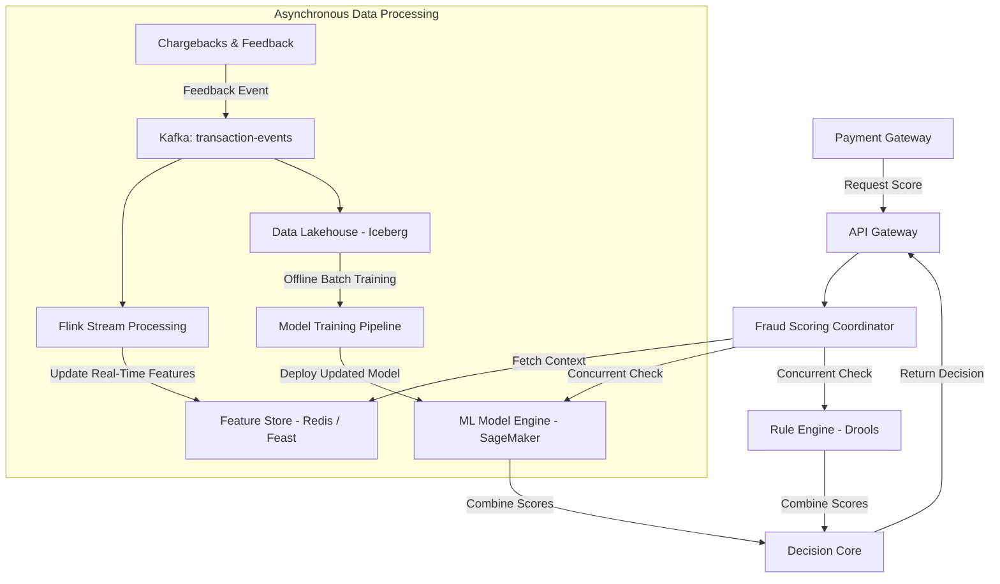
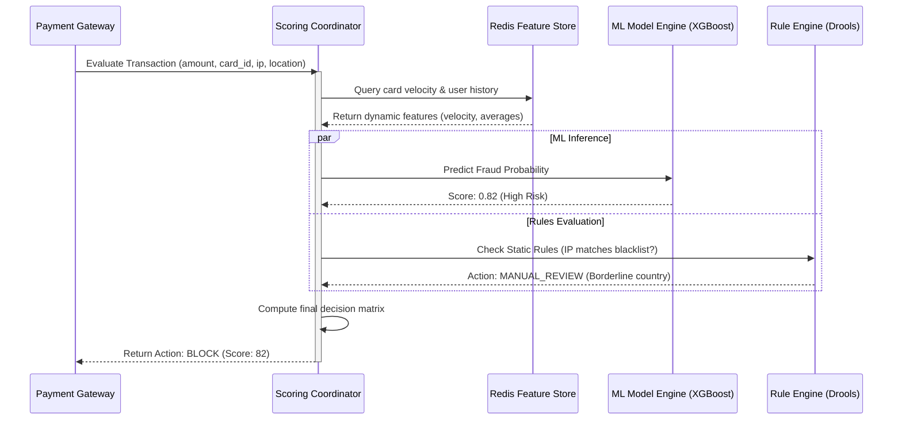

# System Design: Fraud Detection Engine

> Design a real-time transaction fraud detection and risk scoring engine
> **Key Concepts**: Feature store, rule engine (Drools), ML models (XGBoost), sliding window metrics, real-time blocking, feedback loops
> **Cross-references**: [Framework](./framework.md) · [Payment Gateway](./payment-gateway.md) · [Core Banking](./banking-platform.md)

---

## 1. Requirements

### Functional
- Analyze transactions in real-time and compute a risk score (0 to 100)
- Allow low-risk transactions, block high-risk transactions, and route borderline transactions to a manual review queue
- Compute aggregate features on sliding time windows (e.g., "number of transactions from this card in the last 10 minutes")
- Accept fraud feedback tags (chargebacks, merchant alerts) to retrain models and update feature lists

### Non-Functional
- **Latency**: Inline decision pathway must run in P99 < 50ms (cannot slow down payment auth path)
- **Throughput**: Process up to 20,000 requests per second at peak
- **Accuracy**: Minimize false positives (blocking legitimate users) while catching maximum fraudulent charges (high recall)
- **High Availability**: Fallback mechanisms when ML servers degrade

## 2. Scale Assumptions

| Metric | Value |
|--------|-------|
| Peak TPS | 20,000 transactions/sec |
| Average latency SLA | 30ms |
| Sliding window history | 30 days of active feature cache |
| Daily transaction count | 50M |
| Database storage size | ~10TB (for telemetry and audit trails) |

## 3. High-Level Architecture



## 4. Feature Store Design

For real-time scoring, static user information isn't enough. We must check dynamic behavior (e.g. velocities):
- `user_velocity_10m`: Count of transactions in the last 10 minutes.
- `user_amt_sum_24h`: Sum of transaction amounts in the last 24 hours.
- `country_mismatch`: Current transaction country does not match user's registration country.

### Redis Sliding Window Metric Storage
We use Redis **Sorted Sets (ZSET)** to calculate sliding window velocities:
- **Key**: `txn:velocity:user:<user_id>`
- **Value**: `txn_id`
- **Score**: Epoch timestamp

When a transaction occurs:
1. Prune entries older than the window threshold (e.g., 10 mins).
2. Query the current count of elements.
3. Add the current transaction.

```lua
-- Lua script for atomic sliding window evaluation
local key = KEYS[1]
local now = tonumber(ARGV[1])
local window = tonumber(ARGV[2])
local txn_id = ARGV[3]

-- Clear expired entries
redis.call('ZREMRANGEBYSCORE', key, '-inf', now - window)

-- Count transactions remaining in window
local count = redis.call('ZCARD', key)

-- Log current transaction
redis.call('ZADD', key, now, txn_id)
redis.call('EXPIRE', key, window * 2)

return count
```

## 5. Inline Scoring Evaluation Flow



## 6. Key Design Decisions

### Rule Engine vs. ML Model Hybrid Structure
1. **Rule Engine**: Fast execution of hard constraints (e.g., "If card is from country X and amount > $10,000, block"). Simple to update by compliance teams.
2. **ML Model**: Handles complex, high-dimension non-linear signals.
3. **Decision Core Combination**:
   - Rules always take precedence. If a blacklist rule triggers, the transaction is rejected instantly without querying the ML model (saves latency/cost).
   - If no strict rules trigger, the ML model score decides.

## 7. Failure Scenarios & Mitigations

| Scenario | Mitigation |
|----------|------------|
| ML Model Engine timeout (> 30ms) | Fail-open. Bypass model score and proceed using only static rules and local velocity thresholds. Better to risk fraud than to stall all payments. |
| Redis Feature Store cluster down | Fallback to PostgreSQL read replicas. Limit calculations to 1-day metrics, dropping 10-minute sliding window checks temporarily. |
| Poisoning of feedback loop | Sanitize chargeback events. Validate event signatures and ensure only verified financial claims update the model features. |

## 8. Scaling Strategy

- **Flink Cluster Scaling**: Apache Flink runs multiple worker slots sharded by `card_id` to compute sliding window statistics concurrently.
- **Model Quantization**: Deploy models using optimized runtimes (ONNX Runtime, TensorRT) to guarantee sub-10ms inference latencies on CPU-only endpoints, minimizing hardware costs.
- **Feature Sharding**: Partition the Redis Feature Store using Consistent Hashing on user/card hashes to distribute memory evenly across clusters.
