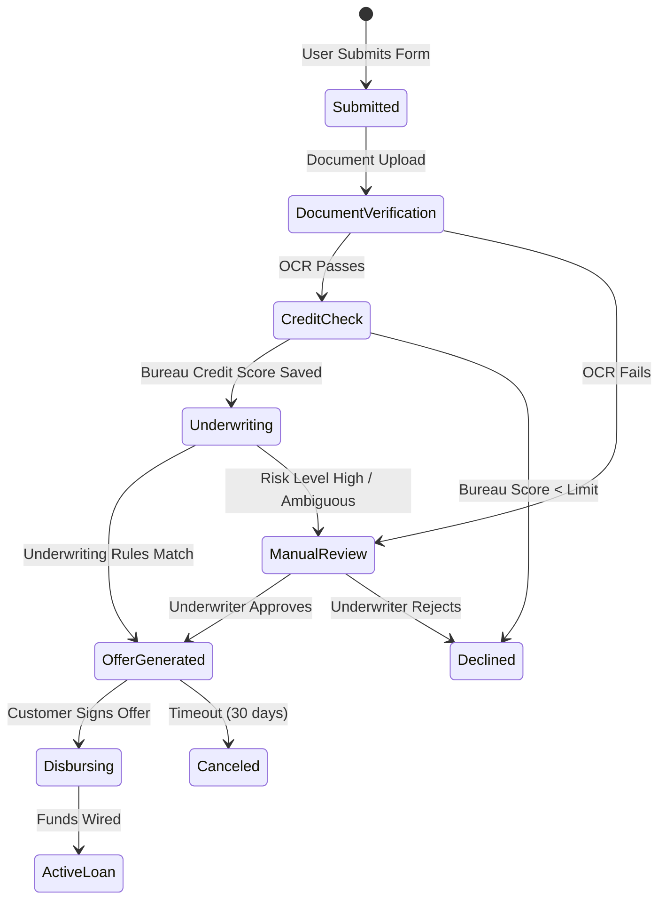
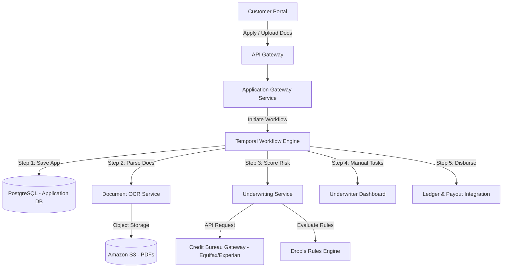

# System Design: Loan Processing Engine

> Design an automated loan processing and underwriting workflow system
> **Key Concepts**: Saga Orchestration, workflow engines (Temporal / Camunda), credit underwriting integrations, risk scoring pipelines, document parsing
> **Cross-references**: [Framework](./framework.md) · [Banking Platform](./banking-platform.md) · [Fraud Detection](./fraud-detection.md)

---

## 1. Requirements

### Functional
- Users can apply for a loan (personal, business, mortgage) with financial data and documents
- Collect credit scores and financial histories via third-party bureaus (Equifax, Experian)
- Calculate risk metrics and approve/decline applications dynamically through underwriting rules
- Manage multi-step application lifecycles (Submitted, Credit Check, Underwriting, Offer, Approved, Disbursed)
- Provide document upload, verification, and optical character recognition (OCR) processing

### Non-Functional
- **Durability**: Workflow state must survive long execution cycles (loans can take days or weeks for manual checks)
- **Traceability**: Audit log of all rules, credit bureau inputs, and user approval points
- **Integrability**: Reliable interface with external API dependencies (often slow, fragile bureau systems)
- **Compliance**: GDPR, CCPA, and Fair Credit Reporting Act (FCRA) audit compliance

## 2. System Workflow State Machine



## 3. High-Level Architecture



## 4. Key Design Decisions

### Using Temporal for Long-Running Workflows
Traditional databases with cron schedulers are fragile and hard to audit when steps fail or stall.
- **Why Temporal?**: Temporal coordinates distributed tasks (Activities) while maintaining state across process failures.
- **Workflow Isolation**: If the credit bureau API times out, Temporal retries the activity automatically based on customizable backoff rules, persisting the workflow state safely without database locks.

```java
// Temporal Workflow definition
public class LoanApplicationWorkflowImpl implements LoanApplicationWorkflow {
    private final UnderwritingActivities activities = 
        Workflow.newActivityStub(UnderwritingActivities.class,
            ActivityOptions.newBuilder()
                .setStartToCloseTimeout(Duration.ofMinutes(5))
                .setRetryOptions(RetryOptions.newBuilder()
                    .setInitialInterval(Duration.ofSeconds(10))
                    .setMaximumAttempts(5)
                    .build())
                .build());

    @Override
    public void processApplication(LoanApplication app) {
        // 1. Verify Documents via OCR
        activities.verifyDocuments(app.getId());
        
        // 2. Fetch Credit Bureau Report
        CreditReport report = activities.fetchCreditReport(app.getTaxId());
        
        if (report.getScore() < 600) {
            activities.updateStatus(app.getId(), "DECLINED");
            return;
        }
        
        // 3. Risk Engine Rules Evaluation
        UnderwritingResult result = activities.runUnderwritingRules(app.getId(), report);
        
        if (result.isManualReviewRequired()) {
            activities.updateStatus(app.getId(), "MANUAL_REVIEW");
            // Wait for human input signal
            Workflow.await(() -> activities.isReviewed(app.getId()));
        }
        
        // 4. Final Disbursement
        activities.disburseFunds(app.getId());
        activities.updateStatus(app.getId(), "COMPLETED");
    }
}
```

## 5. Underwriting Rules Integration
The underwriting system uses rule files (e.g. Drools or custom rule files) to separate changing business requirements from code:
- **Debt-to-Income (DTI)** check
- **Loan-to-Value (LTV)** verification for mortgages
- **Bureau Blacklists** cross-referencing

## 6. Failure Scenarios & Mitigations

| Scenario | Mitigation |
|----------|------------|
| Credit Bureau service down | Implement retry with circuit breaker. If the bureau remains offline for 1 hour, Temporal parks the workflow, alerts operators, and resumes automatically when healthy. |
| Double disbursement error | Payout API requires a unique idempotency key consisting of `loan_id` + `disbursement_attempt_number`. Core ledger blocks duplicate keys. |
| Document OCR parsing error | Fallback directly to the manual review queue. Underwriter staff verify files manually. |

## 7. Scaling Strategy

- **Temporal Sharding**: Set up Temporal clusters with multiple task queues sharded by geographic region or loan product type (e.g., mortgage vs personal loans).
- **OCR Server Autoscale**: The OCR service runs on Kubernetes pods equipped with GPU access, auto-scaling horizontally based on CPU/GPU utilization limits.
- **Audit Database Archiving**: Store full application payloads, including PDF document states and rule footprints, into Amazon S3, recording only metadata pointer links in PostgreSQL.
