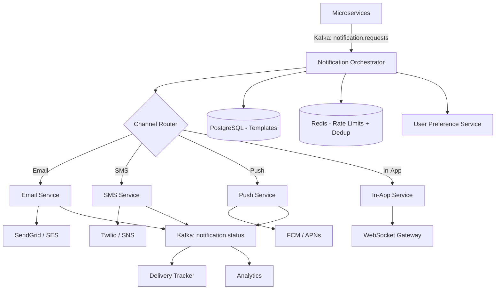

# System Design: Notification System

> Design a multi-channel notification platform (email, SMS, push, in-app)
> **Key Concepts**: Multi-channel delivery, templates, rate limiting, retry, user preferences

---

## Architecture



## Key Design Decisions

### Template Engine
```json
{
  "template_id": "order_confirmation",
  "channels": ["email", "push", "in_app"],
  "email": {
    "subject": "Order {{order_id}} confirmed",
    "body_html": "<h1>Thanks {{user_name}}!</h1><p>Your order of {{amount}} is confirmed.</p>"
  },
  "push": { "title": "Order Confirmed", "body": "Your order #{{order_id}} is on its way!" },
  "priority": "HIGH",
  "rate_limit": { "max": 3, "window": "1h", "key": "user_id" }
}
```

### Rate Limiting & Deduplication
- Per-user rate limit: Max 10 notifications/hour (configurable per channel)
- Deduplication: Redis SET with TTL — `dedup:{user_id}:{template_id}:{hash}` prevents duplicate sends
- Priority queues: CRITICAL (OTP/security) bypasses rate limits, HIGH (transactional), LOW (marketing)

### Retry Strategy
| Channel | Retry | Backoff | DLQ After |
|---------|-------|---------|-----------|
| Email | 5 attempts | 1m, 5m, 30m, 2h, 24h | 5 failures |
| SMS | 3 attempts | 30s, 2m, 10m | 3 failures |
| Push | 3 attempts | 10s, 1m, 5m | 3 failures |
| In-App | 1 attempt | N/A (stored for pull) | N/A |

### Database Schema
```sql
CREATE TABLE notifications (
    id UUID PRIMARY KEY,
    user_id UUID NOT NULL,
    template_id VARCHAR(100) NOT NULL,
    channel VARCHAR(20) NOT NULL,
    status VARCHAR(20) DEFAULT 'PENDING', -- PENDING, SENT, DELIVERED, FAILED, BOUNCED
    priority VARCHAR(10) DEFAULT 'NORMAL',
    payload JSONB NOT NULL,
    attempts INT DEFAULT 0,
    sent_at TIMESTAMP,
    delivered_at TIMESTAMP,
    created_at TIMESTAMP DEFAULT NOW()
) PARTITION BY RANGE (created_at);

CREATE TABLE user_preferences (
    user_id UUID NOT NULL,
    channel VARCHAR(20) NOT NULL,
    enabled BOOLEAN DEFAULT TRUE,
    quiet_hours_start TIME,
    quiet_hours_end TIME,
    PRIMARY KEY (user_id, channel)
);
```

### Failure Scenarios
- **Email bounce**: Update user record, suppress future emails, alert support
- **Push token expired**: Remove token, request re-registration on next app open
- **SMS delivery failure**: Fallback to email if SMS fails
- **Kafka consumer lag**: Auto-scale consumers, alert on lag > 5 minutes

### Scaling: Partition Kafka topics by user_id for ordering. Separate consumer groups per channel. Batch email sends (SES supports 50/sec per call). Cache templates and user preferences in Redis.
