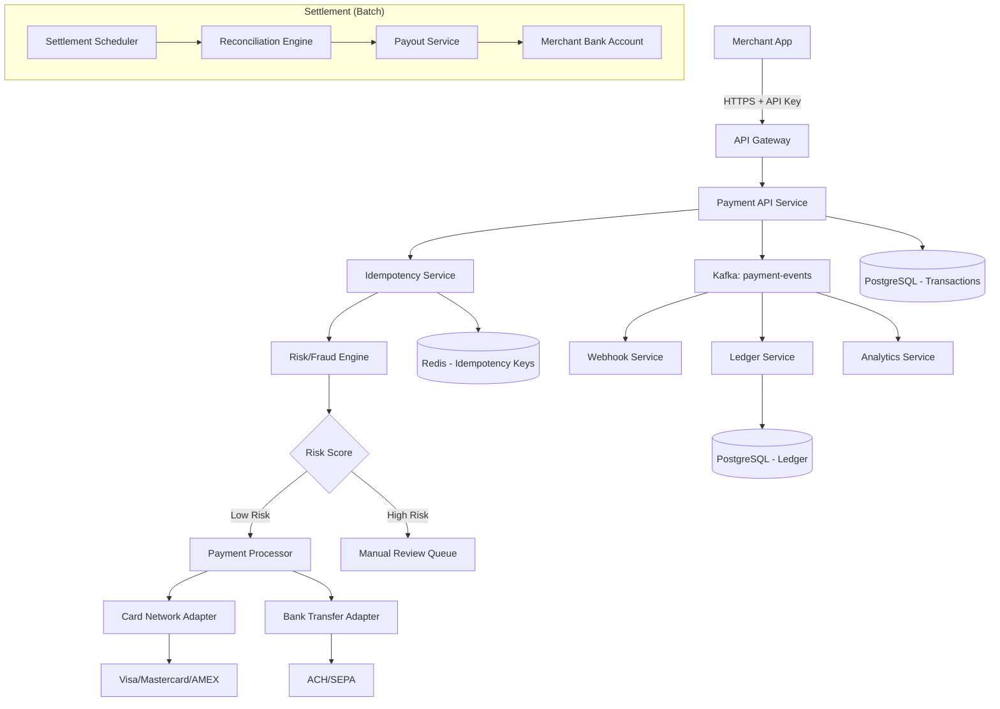

# System Design: Payment Gateway

> Design a payment processing system like Stripe or PayPal
> **Key Concepts**: Idempotency, PCI-DSS, settlement, reconciliation, fraud scoring
> **Cross-references**: [Framework](./framework.md) · [Banking Platform](./banking-platform.md) · [Security](../06-security/security-deep-dive.md)

---

## 1. Requirements

### Functional
- Process credit card, debit card, and bank transfer payments
- Support multiple currencies with real-time conversion
- Provide idempotent payment API (prevent double charges)
- Generate and deliver webhook notifications for payment events
- Handle refunds (full and partial)
- Settlement and reconciliation with acquiring banks
- Merchant dashboard with transaction history

### Non-Functional
- **Availability**: 99.99% (52 min downtime/year)
- **Latency**: P99 < 500ms for payment processing
- **Throughput**: 10,000 TPS peak
- **Security**: PCI-DSS Level 1 compliance
- **Consistency**: Strong consistency for financial transactions
- **Auditability**: Complete audit trail for every transaction

## 2. Scale Assumptions

| Metric | Value |
|--------|-------|
| Daily transactions | 50M |
| Peak TPS | 10,000 |
| Average transaction size | $45 |
| Daily volume | $2.25B |
| Transaction record size | ~2KB |
| Storage per year | ~36TB |
| Active merchants | 500K |
| Supported currencies | 135 |

## 3. High-Level Architecture



## 4. Database Design

```sql
-- Core transaction table (partitioned by date)
CREATE TABLE transactions (
    id UUID PRIMARY KEY DEFAULT gen_random_uuid(),
    idempotency_key VARCHAR(64) UNIQUE NOT NULL,
    merchant_id UUID NOT NULL REFERENCES merchants(id),
    amount BIGINT NOT NULL,  -- Stored in smallest unit (cents)
    currency VARCHAR(3) NOT NULL,
    status VARCHAR(20) NOT NULL DEFAULT 'PENDING',
    -- PENDING → AUTHORIZED → CAPTURED → SETTLED | DECLINED | REFUNDED
    payment_method_type VARCHAR(20) NOT NULL,
    card_last_four VARCHAR(4),
    card_brand VARCHAR(20),
    processor_response_code VARCHAR(10),
    processor_transaction_id VARCHAR(100),
    risk_score DECIMAL(5,2),
    metadata JSONB,
    created_at TIMESTAMP NOT NULL DEFAULT NOW(),
    updated_at TIMESTAMP NOT NULL DEFAULT NOW(),
    settled_at TIMESTAMP
) PARTITION BY RANGE (created_at);

-- Monthly partitions
CREATE TABLE transactions_2025_01 PARTITION OF transactions
    FOR VALUES FROM ('2025-01-01') TO ('2025-02-01');

-- Indexes
CREATE INDEX idx_txn_merchant_created ON transactions(merchant_id, created_at DESC);
CREATE INDEX idx_txn_status ON transactions(status) WHERE status IN ('PENDING', 'AUTHORIZED');
CREATE INDEX idx_txn_idempotency ON transactions(idempotency_key);

-- Double-entry ledger
CREATE TABLE ledger_entries (
    id BIGSERIAL PRIMARY KEY,
    transaction_id UUID NOT NULL REFERENCES transactions(id),
    account_id UUID NOT NULL,
    entry_type VARCHAR(10) NOT NULL, -- DEBIT or CREDIT
    amount BIGINT NOT NULL,
    currency VARCHAR(3) NOT NULL,
    balance_after BIGINT NOT NULL,
    created_at TIMESTAMP NOT NULL DEFAULT NOW()
);
```

## 5. API Design

```
POST /v1/payments
Headers: Idempotency-Key: <uuid>, Authorization: Bearer <api_key>
Body: {
  "amount": 5000,           // $50.00 in cents
  "currency": "USD",
  "payment_method": {
    "type": "card",
    "card": { "number": "tok_xxxx", "exp_month": 12, "exp_year": 2026, "cvc": "123" }
  },
  "description": "Order #1234",
  "metadata": { "order_id": "ord_abc123" }
}
Response 201: {
  "id": "pay_xxxxx",
  "status": "CAPTURED",
  "amount": 5000,
  "currency": "USD",
  "created_at": "2025-01-15T10:30:00Z"
}

POST /v1/payments/{id}/refund
Body: { "amount": 2500 }  // Partial refund $25.00

GET /v1/payments/{id}
GET /v1/payments?merchant_id=xxx&from=2025-01-01&to=2025-01-31
```

## 6. Kafka Topics

| Topic | Key | Value | Consumers |
|-------|-----|-------|-----------|
| `payment.created` | payment_id | PaymentEvent | Webhook, Ledger, Analytics |
| `payment.captured` | payment_id | PaymentEvent | Webhook, Ledger, Settlement |
| `payment.refunded` | payment_id | RefundEvent | Webhook, Ledger |
| `payment.failed` | payment_id | FailureEvent | Webhook, Alerting |
| `webhook.delivery` | merchant_id | WebhookPayload | Webhook Delivery Service |
| `settlement.batch` | merchant_id | SettlementBatch | Payout Service |

## 7. Key Design Decisions

### Idempotency Implementation
```java
@Transactional
public PaymentResult processPayment(String idempotencyKey, PaymentRequest request) {
    // 1. Check Redis for existing result
    Optional<PaymentResult> cached = redis.get("idem:" + idempotencyKey);
    if (cached.isPresent()) return cached.get();

    // 2. Check DB (Redis might have evicted)
    Optional<Transaction> existing = txnRepo.findByIdempotencyKey(idempotencyKey);
    if (existing.isPresent()) return toResult(existing.get());

    // 3. Process payment
    Transaction txn = Transaction.create(idempotencyKey, request);
    txn = txnRepo.save(txn);

    PaymentResult result = processorAdapter.charge(txn);
    txn.updateWithResult(result);
    txnRepo.save(txn);

    // 4. Cache result
    redis.set("idem:" + idempotencyKey, result, Duration.ofHours(24));

    // 5. Publish event
    kafkaTemplate.send("payment.captured", txn.getId().toString(), toEvent(txn));

    return result;
}
```

### PCI-DSS Compliance
- Card numbers **never** stored — tokenized at edge via Stripe.js / client-side SDK
- All cardholder data in isolated PCI network segment
- Encryption at rest (AES-256) and in transit (TLS 1.3)
- Access logging for all PCI components
- Quarterly vulnerability scans, annual penetration test

## 8. Failure Scenarios

| Scenario | Mitigation |
|----------|------------|
| Payment processor timeout | Retry with exponential backoff (3 attempts). Check idempotency to prevent double charge. |
| Database failure mid-transaction | Transaction rolls back. Idempotency key allows safe retry. |
| Kafka unavailable | Transactional outbox pattern — write to outbox table, CDC publishes to Kafka. |
| Webhook delivery failure | Exponential retry (1min, 5min, 30min, 2hr, 24hr). DLQ after 5 attempts. |
| Fraud false positive | Manual review queue. SLA: review within 15 minutes. |
| Settlement mismatch | Reconciliation engine detects discrepancies. Alert finance team. |

## 9. Scaling Strategy

- **API layer**: Horizontal scaling behind ALB. Stateless services in K8s.
- **Database**: Partitioned by date. Read replicas for merchant dashboard queries. Archival to S3 after 2 years.
- **Redis**: Cluster mode for idempotency keys. Separate cluster for rate limiting.
- **Kafka**: Scale partitions per topic. Payment events: 32 partitions for parallel processing.
- **Settlement**: Batch processing during off-peak hours. Parallel per-merchant settlement.
