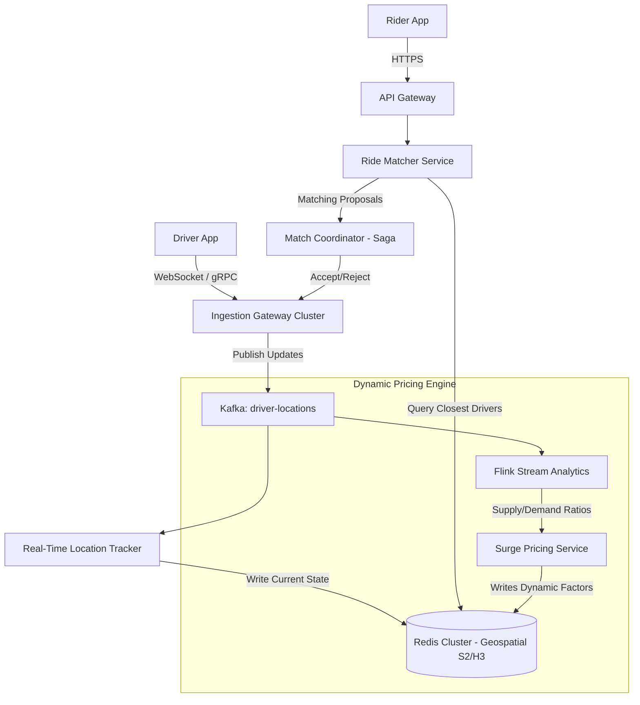
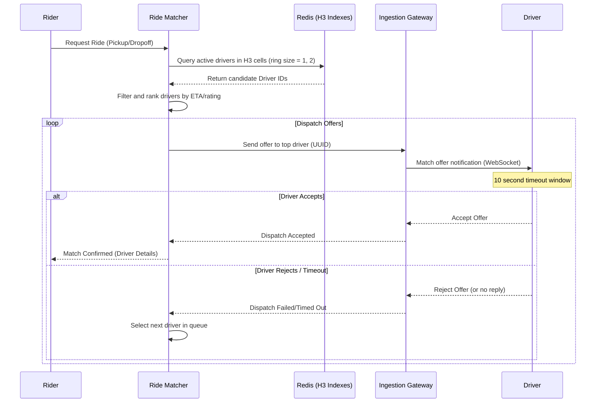

# System Design: Ride-Sharing Platform

> Design a real-time ride-matching and dispatch system like Uber or Lyft
> **Key Concepts**: Geospatial indexing (H3 / S2), real-time location tracking, matching algorithm, dynamic pricing, WebSocket connections
> **Cross-references**: [Framework](./framework.md) · [Food Delivery](./food-delivery.md) · [Distributed Systems Deep Dive](../05-distributed-systems/deep-dive.md)

---

## 1. Requirements

### Functional
- Track driver locations in real-time (updates every 4 seconds)
- Support rider requests with pickup and drop-off coordinates
- Match riders with the closest available drivers based on ETA
- Implement dynamic pricing (surge pricing) based on demand and driver supply in a region
- Enable real-time ride status updates (requested, accepted, arriving, in-ride)

### Non-Functional
- **Latency**: Matching/dispatch must resolve in < 5 seconds. P99 location update ingestion < 100ms
- **Consistency**: High availability for location updates, but strong consistency for driver-rider matching (no double booking)
- **Scalability**: Support millions of active rides simultaneously
- **Precision**: Highly accurate ETAs and pricing models

## 2. Scale Assumptions

| Metric | Value |
|--------|-------|
| Daily active riders | 20M |
| Daily active drivers | 2M |
| Simultaneous active rides | 1M |
| Location updates per second | 500,000 |
| Location data point size | ~100 bytes |
| Bandwidth ingestion | ~50MB/sec |

## 3. High-Level Architecture



## 4. Database & Geospatial Schema Design

### Geospatial Index Strategy (S2 vs H3)
- **Google S2**: Uses rectangular/square projections. Great for hierarchical grid aggregation and range queries.
- **Uber H3**: Uses hexagonal shapes. Better for calculating uniform geographic distances between cells (adjacent hexagons have identical distance ratios, unlike squares). We use H3 index (resolution 8/9, ~100m cell size) for mapping drivers and surge zones.

```sql
-- Driver location history table for audit and route analysis
CREATE TABLE driver_routes (
    id BIGSERIAL,
    driver_id UUID NOT NULL,
    ride_id UUID,
    location GEOMETRY(Point, 4326), -- PostGIS coordinate
    h3_index VARCHAR(15),           -- Uber H3 cell representation
    speed_mps DECIMAL(4,2),
    bearing DECIMAL(5,2),
    timestamp TIMESTAMP NOT NULL DEFAULT NOW()
) PARTITION BY RANGE (timestamp);

-- Ride state transactional record
CREATE TABLE rides (
    id UUID PRIMARY KEY DEFAULT gen_random_uuid(),
    rider_id UUID NOT NULL,
    driver_id UUID,
    status VARCHAR(20) NOT NULL, -- REQUESTED, MATCHED, ARRIVING, IN_ROUTE, COMPLETED
    pickup_location GEOMETRY(Point, 4326) NOT NULL,
    dropoff_location GEOMETRY(Point, 4326) NOT NULL,
    fare_amount BIGINT NOT NULL,  -- In cents
    surge_multiplier DECIMAL(3,2) DEFAULT 1.0,
    created_at TIMESTAMP NOT NULL DEFAULT NOW(),
    updated_at TIMESTAMP NOT NULL DEFAULT NOW()
);
```

## 5. Dynamic Matching Sequence



## 6. Key Design Decisions

### Real-Time Location Ingestion Optimization
Instead of hitting relational databases for every 4s update:
1. Driver app emits location via WebSocket containing `{driver_id, lat, lon, bearing, status}`.
2. Ingestion gateway writes directly to Kafka (`driver-locations`).
3. A lightweight consumer updates **Redis Geospatial Index** (`GEOADD drivers_geo <lon> <lat> <driver_id>`).
4. Current driver metadata (bearing, status) is stored in standard Redis Hashes (`driver:metadata:<driver_id>`).

### Matching Locking Logic
To prevent matching the same driver to multiple riders (double booking):
- We utilize Redis distributed lock (`SET matching:driver:<id> "lock" NX PX 5000`) before sending the dispatch offer.
- Once the driver accepts, the lock is transformed into a database reservation write under a single transaction.

## 7. Failure Scenarios

| Scenario | Mitigation |
|----------|------------|
| Driver disconnects during offer | WebSocket session closure triggers immediate offer expiration. The matcher dispatches to the next driver. |
| Rider cancels match mid-transit | The Saga coordinator cancels the dispatch transaction, informs the driver via WebSocket, and bills a cancellation fee. |
| Surge price engine delay | Fail-back to static default pricing matrices based on distance/time estimations. |
| PostGIS database lag | Read replicas for analytics/reporting. The hot transactional matching relies purely on Redis and Kafka. |

## 8. Scaling Strategy

- **Geographical Sharding**: Shard the WebSocket gateway, Redis instances, and matching engines based on physical cities/regions (e.g., separate clusters for New York, San Francisco, London). Since drivers rarely drive across oceans, city boundaries provide clean isolation.
- **Kafka Partition Keying**: Partition `driver-locations` by `driver_id` to guarantee that updates for any single driver are processed sequentially by the location tracking consumers.
