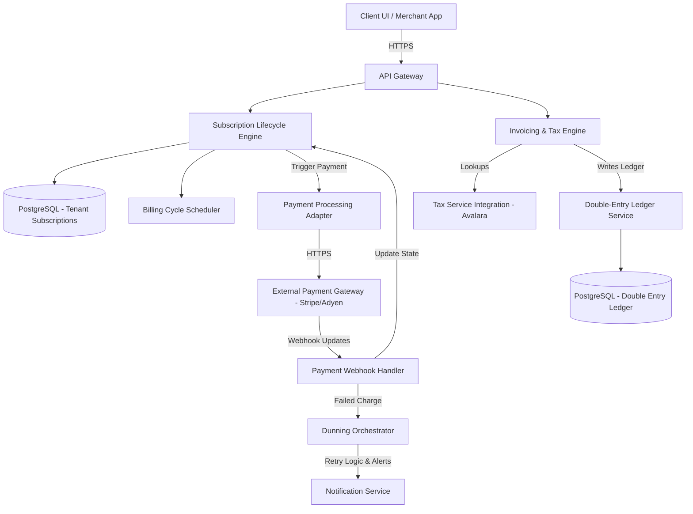
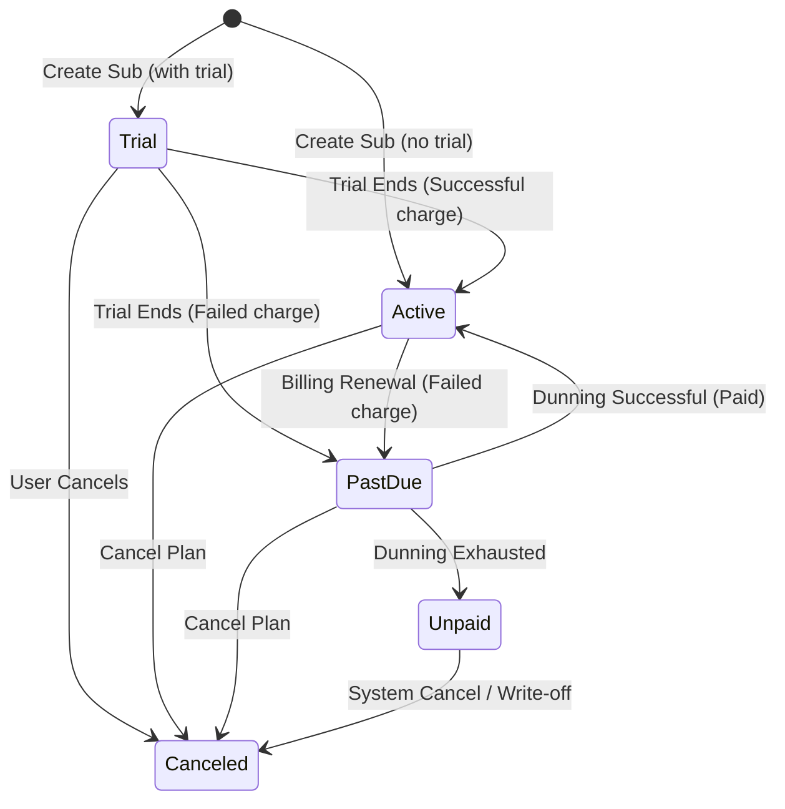

# System Design: SaaS Billing Platform

> Design a scalable, multi-tenant billing engine for enterprise SaaS platforms (like Stripe Billing or Chargebee)
> **Key Concepts**: Multi-tenancy, subscription life cycle state machine, invoicing, dunning management, tax engines, financial ledger
> **Cross-references**: [Payment Gateway](./payment-gateway.md) · [AI Subscription Manager](./ai-subscription-manager.md)

---

## 1. Requirements

### Functional
- Support multi-tenancy with strict partition isolation
- Flexible subscription plans (flat rate, per-seat, tiered pricing, discounts, coupons)
- Manage subscription transitions (trial, upgrade, downgrade, cancellation, suspension)
- Generate automated invoices with tax calculations and discounts
- Implement automated dunning processes for failed payments (retries, notifications, card updates)
- Maintain a double-entry financial ledger for all billing operations

### Non-Functional
- **Accuracy**: Double-entry ledger guarantee. Zero floating-point arithmetic errors (use exact integers or decimals)
- **High Availability**: 99.999% uptime for billing status queries (read path)
- **Consistency**: Strong ACID properties for state changes (write path)
- **Compliance**: Audit logging and SOC 2 Type II compliance readiness

## 2. Scale Assumptions

| Metric | Value |
|--------|-------|
| Active merchants/tenants | 100K |
| Subscriptions tracked | 10M |
| Monthly invoices generated | 12M |
| Concurrent webhook updates | 5,000 requests/sec |
| Financial database size | ~5TB (optimized for transactional durability) |

## 3. High-Level Architecture



## 4. Database Design

```sql
-- Subscription status engine (Transactional)
CREATE TABLE customer_subscriptions (
    id UUID PRIMARY KEY DEFAULT gen_random_uuid(),
    tenant_id UUID NOT NULL,
    customer_id UUID NOT NULL,
    plan_id VARCHAR(50) NOT NULL,
    status VARCHAR(30) NOT NULL, -- TRIAL, ACTIVE, PAST_DUE, CANCELED, UNPAID
    trial_start TIMESTAMP,
    trial_end TIMESTAMP,
    current_period_start TIMESTAMP NOT NULL,
    current_period_end TIMESTAMP NOT NULL,
    cancel_at_period_end BOOLEAN NOT NULL DEFAULT FALSE,
    created_at TIMESTAMP NOT NULL DEFAULT NOW(),
    updated_at TIMESTAMP NOT NULL DEFAULT NOW()
);

CREATE INDEX idx_sub_tenant_customer ON customer_subscriptions(tenant_id, customer_id);
CREATE INDEX idx_sub_status ON customer_subscriptions(status);

-- Invoicing record
CREATE TABLE invoices (
    id UUID PRIMARY KEY DEFAULT gen_random_uuid(),
    tenant_id UUID NOT NULL,
    customer_id UUID NOT NULL,
    subscription_id UUID REFERENCES customer_subscriptions(id),
    amount_due BIGINT NOT NULL,       -- Stored in smallest unit (e.g. cents)
    amount_paid BIGINT NOT NULL DEFAULT 0,
    currency VARCHAR(3) NOT NULL,
    tax_amount BIGINT NOT NULL DEFAULT 0,
    status VARCHAR(20) NOT NULL,      -- DRAFT, OPEN, PAID, UNCOLLECTIBLE, VOID
    due_date TIMESTAMP NOT NULL,
    created_at TIMESTAMP NOT NULL DEFAULT NOW()
);

-- Invoice line items
CREATE TABLE invoice_items (
    id UUID PRIMARY KEY DEFAULT gen_random_uuid(),
    invoice_id UUID NOT NULL REFERENCES invoices(id),
    description VARCHAR(255) NOT NULL,
    quantity INT NOT NULL,
    unit_amount BIGINT NOT NULL,
    total_amount BIGINT NOT NULL
);
```

## 5. Subscription Lifecycle State Machine



## 6. Key Design Decisions

### Double-Entry Ledger Implementation
To prevent billing mismatches and guarantee consistency, all transactions are registered using double-entry bookkeeping logic where total debits equal total credits.

```java
@Transactional
public void recordInvoicePayment(Invoice invoice, long amountPaid) {
    // 1. Mark Invoice as PAID
    invoice.setStatus(InvoiceStatus.PAID);
    invoice.setAmountPaid(amountPaid);
    invoiceRepository.save(invoice);
    
    // 2. Perform Double-Entry Booking
    UUID accountReceivable = getAccountUUID(invoice.getTenantId(), AccountType.RECEIVABLE);
    UUID cashAccount = getAccountUUID(invoice.getTenantId(), AccountType.CASH);
    
    LedgerEntry debitCash = new LedgerEntry(
        invoice.getId(), 
        cashAccount, 
        EntryType.DEBIT, 
        amountPaid, 
        invoice.getCurrency()
    );
    LedgerEntry creditReceivables = new LedgerEntry(
        invoice.getId(), 
        accountReceivable, 
        EntryType.CREDIT, 
        amountPaid, 
        invoice.getCurrency()
    );
    
    ledgerRepository.save(debitCash);
    ledgerRepository.save(creditReceivables);
}
```

### Invoicing and Tax Engine
Tax laws differ based on customer geolocation (VAT, sales tax). 
- Use external services (like Avalara or TaxJar) with fallback logic to local caching lookup databases.
- Address verification must occur before invoicing calculation to determine accurate taxation rates.

## 7. Failure Scenarios & Dunning Logic

| Scenario | Mitigation |
|----------|------------|
| Payment Charge Failures | Trigger **Dunning Workflow**: retry charging the card on day 1, 3, 5, 8. Concurrently email customer with secure payment update link. |
| External Tax Service Down | Fallback to country-level default static tax rate table and flag invoice for manual reconciliation if tax delta occurs. |
| Multi-tenant cross-tenant access | Enforce tenant isolation at the row level using PostgreSQL Row Level Security (RLS). |
| Race condition in billing cycle trigger | Distributed locking using Redis-Redlock on `billing-cycle:tenant:customer` during invoice runs. |

## 8. Scaling Strategy

- **Distributed Scheduler**: Run a worker tier that scans for expiring subscriptions in parallel using bucketed cursor execution. Use Kafka partition keys (`customer_id`) to process invoice generation concurrently.
- **Ledger Storage**: Keep the operational ledger database relatively lean. Move invoices and ledger history older than 7 years to cheap cold storage (AWS S3 Glacier) with database indexes referencing the S3 URIs.
