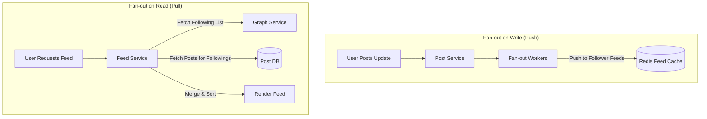
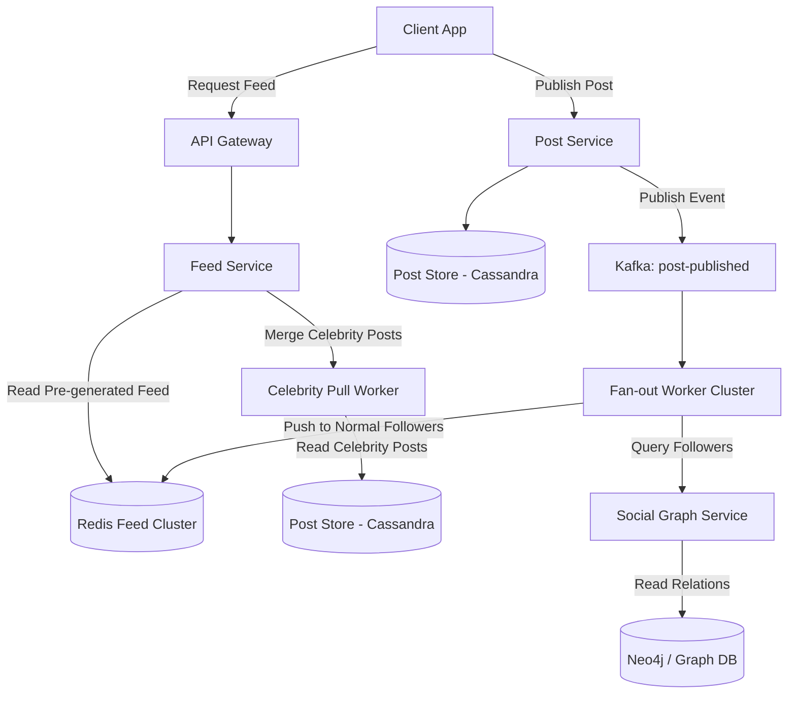

# System Design: Social Media Feed

> Design a scalable social media news feed like Facebook, Instagram, or Twitter
> **Key Concepts**: Fan-out on write (push model), fan-out on read (pull model), hybrid feed generation, Redis timeline storage, content ranking algorithms
> **Cross-references**: [Framework](./framework.md) · [Distributed Systems Deep Dive](../05-distributed-systems/deep-dive.md) · [Messaging Deep Dive](../08-kafka-rabbitmq/messaging-deep-dive.md)

---

## 1. Requirements

### Functional
- Users can post updates (text, images, links)
- Users can follow other users
- Users can view a chronological list of posts from followed users (News Feed)
- Support celebrity/popular users (millions of followers) without system bottlenecks
- Provide like/comment features on feed items

### Non-Functional
- **Latency**: Feed generation P99 < 200ms
- **High Read-to-Write Ratio**: 100:1 read to write ratio
- **Availability**: High availability on read path (users should always see a feed, even if slightly stale)
- **Consistency**: Eventual consistency is acceptable (new posts appearing within seconds is fine)

## 2. Scale Assumptions

| Metric | Value |
|--------|-------|
| Daily Active Users (DAU) | 300M |
| Average follow count | 200 users |
| Celebrity follow count | 50M+ users |
| New posts created daily | 100M |
| Feed requests daily | 10B |
| Storage per post | ~500 bytes (text + metadata refs) |

## 3. Feed Generation Strategies



### 1. Fan-out on Write (Push Model)
- **Mechanism**: When a user publishes a post, it is immediately inserted into the feed caches of all their followers.
- **Pros**: Fast reads (feed is pre-generated in a Redis list).
- **Cons**: High write amplification. If a user has 50M followers, a single post requires 50M writes to Redis.

### 2. Fan-out on Read (Pull Model)
- **Mechanism**: Feeds are generated on-demand when a user logs in. The system queries all followed users, retrieves their latest posts, and merges them.
- **Pros**: Low write footprint. No pre-calculation.
- **Cons**: Slow reads (complex database queries and sorting on the hot path).

### 3. The Hybrid Solution (Celebrity Handler)
- **Normal Users**: Use **Fan-out on Write**. Since average follow counts are low (< 1000), writes are fast.
- **Celebrities/Influencers (Followers > 20K)**: Do **NOT** push their posts to followers' lists. Instead, when a user requests their feed, the system pulls the celebrity posts and merges them dynamically with the pre-generated feed of normal users.

## 4. High-Level Architecture



## 5. Database & Cache Schema

```sql
-- Cassandra Schema for High-Write Posts Store
CREATE KEYSPACE post_keyspace WITH replication = {
    'class': 'SimpleStrategy', 
    'replication_factor': 3
};

CREATE TABLE post_keyspace.posts (
    post_id UUID,
    author_id UUID,
    content text,
    media_urls list<text>,
    created_at timestamp,
    PRIMARY KEY (author_id, created_at)
) WITH CLUSTERING ORDER BY (created_at DESC);
```

### Redis Cache Representation
Pre-generated timelines are stored as Redis **Sorted Sets (ZSET)** where the key is the `user_id` and the score is the post `created_at` timestamp.
- **ZSET Key**: `feed:user:<user_id>`
- **Value**: `post_id` (UUID)
- **Score**: Unix timestamp
- **Limit**: Keep the feed size limited to the latest 500 items. Older items can be pulled from Cassandra if the user scrolls indefinitely.

## 6. Key Design Decisions

### Feed Aggregation Sequence
```java
public List<Post> getFeed(UUID userId, int limit, Long maxTimestamp) {
    String feedKey = "feed:user:" + userId.toString();
    
    // 1. Fetch normal follower posts from Redis pre-generated feed
    Set<String> postIds = redis.zrevrangeByScore(feedKey, maxTimestamp, 0, 0, limit);
    
    // 2. Fetch list of followed celebrities
    List<UUID> celebrities = graphService.getFollowedCelebrities(userId);
    
    // 3. Query latest celebrity posts from Cassandra
    List<Post> celebPosts = postRepository.getLatestPosts(celebrities, maxTimestamp, limit);
    
    // 4. Load full post structures for Redis IDs
    List<Post> followerPosts = postRepository.getPostsByIds(postIds);
    
    // 5. Merge, sort, and paginate the lists
    return mergeAndSortFeeds(followerPosts, celebPosts, limit);
}
```

## 7. Failure Scenarios

| Scenario | Mitigation |
|----------|------------|
| Redis cache eviction | If a user's feed is evicted, fall back to generating the feed via Cassandra reads (re-populate Redis asynchronously). |
| Sudden celebrity post flood | Fan-out worker queue backup. Use rate-limiting on celebrity ingest and drop down to pure pull mode if queues build up. |
| Inconsistent follow count | Eventual consistency in graph operations. Use message queues to guarantee follow/unfollow events are retried if failure occurs. |

## 8. Scaling Strategy

- **Redis Partitioning**: Partition Redis timeline caches using Consistent Hashing on the `user_id` key.
- **CDN Caching**: Static media assets (images, videos) must be served via CDNs (e.g., Cloudflare) to minimize bandwidth costs on host servers.
- **Hot-spot Mitigation**: Query-heavy celebrity posts are cached in local JVM memory caches with short TTLs (e.g., 5 seconds) to prevent read amplification on Cassandra nodes.
