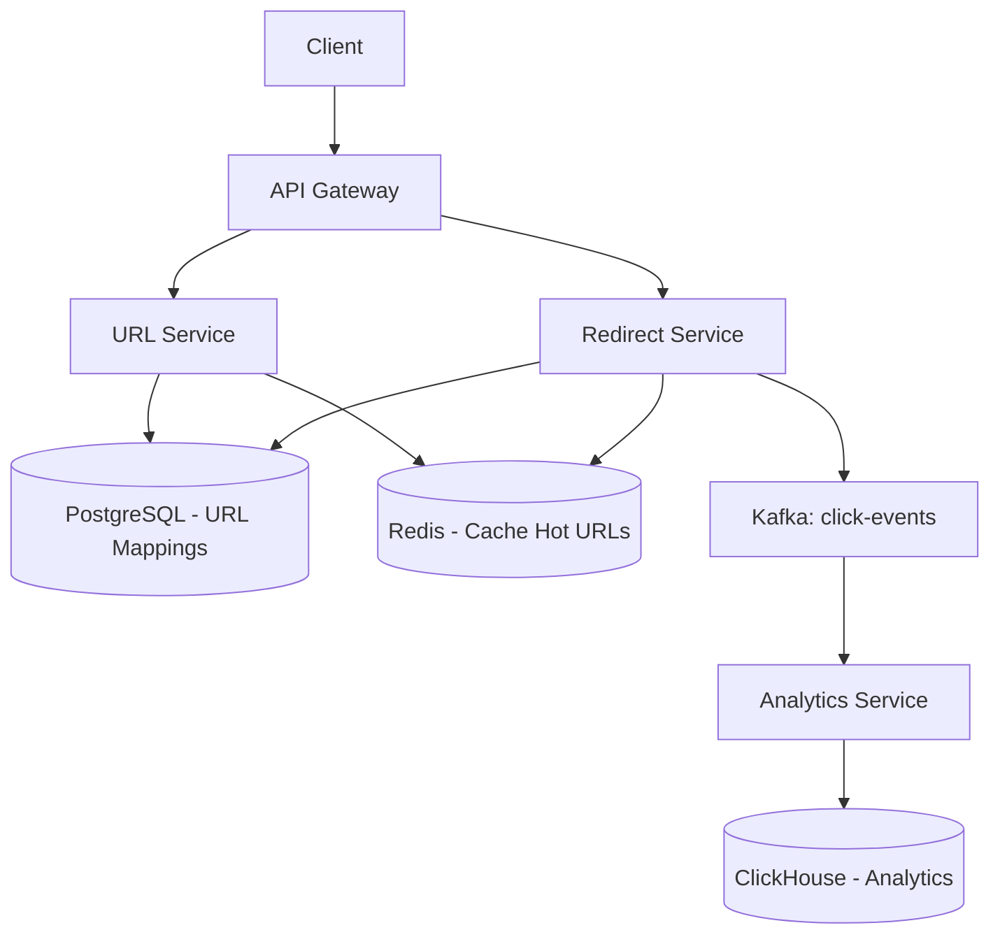

# System Design: URL Shortener

> Design a URL shortener like bit.ly — **Key Concepts**: Base62 encoding, read-heavy (100:1), consistent hashing

---

## Scale: 100M URLs/month created, 10B redirects/month, 100K read QPS peak

## Architecture


## Key Design: Short Code Generation
```java
// Approach 1: Counter-based with Base62 (preferred)
// Distributed counter via Redis INCR or Snowflake ID
public String generateShortCode(long id) {
    String chars = "0123456789abcdefghijklmnopqrstuvwxyzABCDEFGHIJKLMNOPQRSTUVWXYZ";
    StringBuilder sb = new StringBuilder();
    while (id > 0) { sb.append(chars.charAt((int)(id % 62))); id /= 62; }
    return sb.reverse().toString(); // 7 chars = 62^7 = 3.5 trillion unique URLs
}
```

## Database
```sql
CREATE TABLE urls (
    id BIGSERIAL PRIMARY KEY,
    short_code VARCHAR(10) UNIQUE NOT NULL,
    original_url TEXT NOT NULL,
    user_id UUID,
    expires_at TIMESTAMP,
    created_at TIMESTAMP DEFAULT NOW()
);
CREATE INDEX idx_short_code ON urls(short_code); -- Primary lookup
```

## Redirect Flow: 301 (permanent, cached by browser — less analytics) vs 302 (temporary — every click tracked). **Choose 302** for analytics.

## Caching: Redis caches top 20% URLs (Pareto). Cache-aside pattern. TTL 24h. Bloom filter to quickly reject non-existent codes.

## Sharding: Consistent hashing on short_code. Range-based won't work (hot partitions from sequential IDs).
