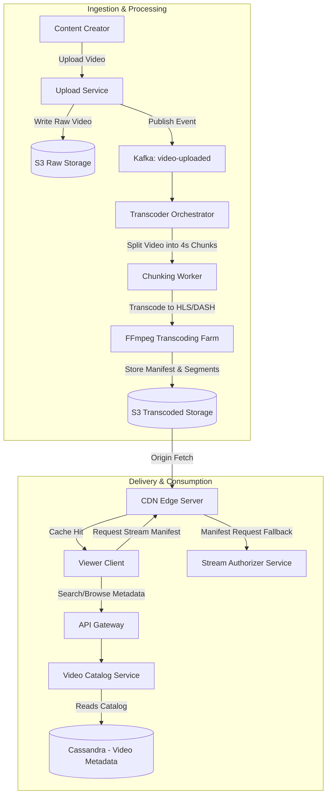
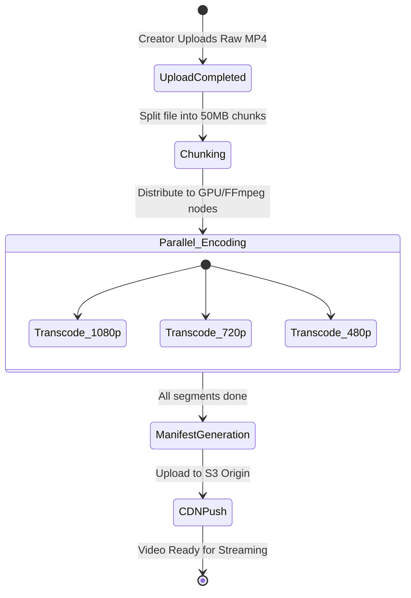

# System Design: Video Streaming Platform

> Design a large-scale video streaming service like YouTube or Netflix
> **Key Concepts**: Adaptive Bitrate Streaming (HLS / DASH), video transcoding pipelines, CDN distribution, edge caching, digital rights management (DRM)
> **Cross-references**: [Framework](./framework.md) · [File Storage](./file-storage.md) · [Distributed Systems Deep Dive](../05-distributed-systems/deep-dive.md)

---

## 1. Requirements

### Functional
- Users can upload video files (ranging from 10MB to 50GB)
- Users can stream videos smoothly without buffering on various network speeds
- Support multiple resolutions (360p, 480p, 720p, 1080p, 4k)
- Track video views, likes, and watch history
- Enable real-time search for video titles and tags

### Non-Functional
- **Availability**: 99.99% for video catalog browsing and playing paths
- **Low Latency**: Startup buffering time under 1 second (fast time-to-first-frame)
- **Scalability**: Support concurrent streams to millions of clients globally
- **Cost Efficiency**: Minimize egress traffic costs using intelligent CDN routing

## 2. Scale Assumptions

| Metric | Value |
|--------|-------|
| Daily active viewers | 100M |
| Concurrent active video streams | 5M |
| Average bandwidth per stream | 3 Mbps |
| Total egress bandwidth required | 15 Tbps |
| Daily new video uploads | 500,000 videos |
| Storage needed per minute of 1080p video | ~50MB (raw + transcoded formats) |

## 3. High-Level Architecture



## 4. Key Tech Concepts

### Adaptive Bitrate Streaming (HLS & MPEG-DASH)
Instead of streaming a single continuous file, videos are processed as follows:
- **Chunking**: The video file is chopped into small, equal-duration chunks (typically 2 to 6 seconds long).
- **Transcoding**: Each chunk is encoded into multiple resolution options and bitrates.
- **Manifest File (`.m3u8` or `.mpd`)**: An index file listing the URIs of all transcoded chunks for all bitrates.
- **Dynamic Selection**: The client media player fetches the manifest first, continuously tests network speed, and automatically requests the best matched resolution chunk for the next segment.

```
                  ┌──> 1080p Manifest ──> segment_1_1080.ts, segment_2_1080.ts
Master Manifest ──┼──> 720p Manifest  ──> segment_1_720.ts,  segment_2_720.ts
                  └──> 480p Manifest  ──> segment_1_480.ts,  segment_2_480.ts
```

## 5. Transcoding Pipeline Orchestration



## 6. Database Schema (Cassandra)

Using NoSQL Cassandra to handle high-volume write/read ratios of video metadata and telemetry:

```sql
-- Video Metadata Table
CREATE TABLE video_catalog (
    video_id UUID PRIMARY KEY,
    title text,
    description text,
    author_id UUID,
    manifest_url text,
    thumbnail_url text,
    duration_seconds int,
    view_count counter, -- Distributed counter for views
    tags set<text>,
    created_at timestamp
);

-- User Watch Progress (for resume playback)
CREATE TABLE user_playback_progress (
    user_id UUID,
    video_id UUID,
    last_watched_seconds int,
    updated_at timestamp,
    PRIMARY KEY (user_id, video_id)
);
```

## 7. Failure Scenarios

| Scenario | Mitigation |
|----------|------------|
| Transcoding node crashes mid-job | The orchestrator uses a message queue retry strategy. Tasks are not removed from the queue until an output segment validation hash is submitted. |
| CDN edge cache miss storm | Implement **request collapsing/coalescing** on the CDN shield level; only one node fetches from the S3 origin, other duplicate requests wait. |
| DRM protection bypass | Apply Widevine/FairPlay encryption keys inside the transcoding flow. Manifests are only served with signed short-lived cookies/tokens. |

## 8. Scaling Strategy

- **CDN Geo-distribution**: 95% of video chunks are delivered directly via third-party CDNs (Akamai, Cloudflare) stationed close to ISP networks, minimizing origin server burden.
- **Pre-warming Popular Content**: When a popular creator uploads, automatically push the 1080p and 720p chunks to regional CDNs before any client requests them.
- **Cold vs Hot Storage**: Keep popular, newly-released videos in SSD-backed caches. Migrate older, unwatched videos to cheaper S3 Glacier standard options. When someone requests an old video, compile it with a slight start delay.
