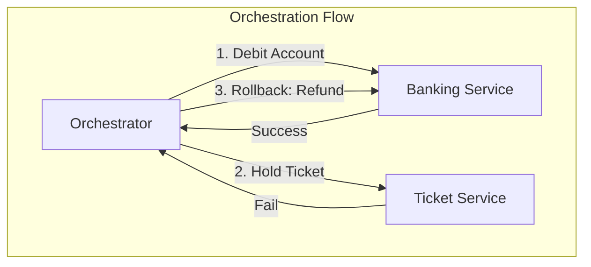
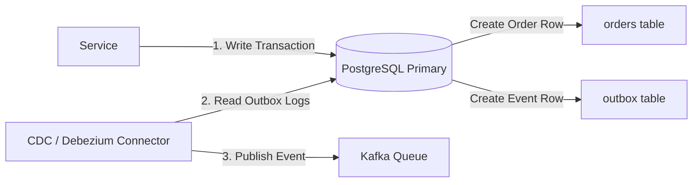

# Distributed Systems Masterclass

> Advanced reference guide for architectural patterns, consistency models, and reliability strategies in distributed systems
> **Key Concepts**: CAP/PACELC, Saga Orchestration vs Choreography, Transactional Outbox, CQRS, Distributed Locks, Consensus

---

## 1. Core Theorems & Trade-offs

### CAP vs PACELC Theorem
The CAP theorem states that a system can guarantee at most two of: Consistency, Availability, Partition Tolerance. In reality, network partitions cannot be ignored, leaving us to choose between **Consistency (CP)** or **Availability (AP)** during a partition.

The **PACELC** theorem extends CAP to describe trade-offs under normal operation (when no partition is active):
- **If there is a Partition (P)**, trade off **Availability (A)** or **Consistency (C)**.
- **Else (E)**, trade off **Latency (L)** or **Consistency (C)**.

| System | CAP Class | PACELC Class | Core Behavior |
|--------|-----------|--------------|---------------|
| **MongoDB** | CP | PC/EC | Prioritizes consistency. Normal writes wait for replicas (adds latency). |
| **Cassandra** | AP | PA/EL | High availability and low latency. Writes return fast with eventual consistency. |
| **CockroachDB** | CP | PC/EC | Strong consistency using Raft consensus. Latency is higher due to network round-trips. |

---

## 2. Distributed Transactions & Consistency Patterns

### Saga Pattern (Orchestration vs Choreography)
Used to maintain consistency across multiple microservices without locking database resources (avoiding 2-Phase Commit bottlenecks).

#### 1. Choreography (Event-Driven)
- **Mechanism**: Every service listens to events, performs its action, and publishes a new event. If a step fails, compensation events are published.
- **Pros**: Simple, highly decoupled.
- **Cons**: Difficult to trace the workflow logic as it is scattered across services.

#### 2. Orchestration (Centralized)
- **Mechanism**: An Orchestrator service commands participants what steps to run, tracks the current state, and handles compensation steps if any step fails.
- **Pros**: Highly visible workflow state, clean monitoring.
- **Cons**: Orchestrator can become a single point of failure or bottleneck.



---

## 3. High-Reliability Design Patterns

### Transactional Outbox Pattern
Ensures that a database state change and its corresponding message queue event are executed atomically.
- **Problem**: Publishing to Kafka directly inside a DB transaction can cause inconsistency if the DB commit fails but the message is already sent, or vice versa.
- **Solution**: Inside the DB transaction, write the event payload to a local database `outbox` table. A background reader/polling thread reads this table and publishes the event to Kafka, ensuring at-least-once delivery.



### Command Query Responsibility Segregation (CQRS)
Separates the write model (Command) from the read model (Query) to optimize performance, scalability, and security.

- **Write Path**: Optimizes for fast writes, validations, and normalized structures (PostgreSQL).
- **Read Path**: Optimizes for fast searches, aggregations, and denormalized views (Elasticsearch/Redis).
- **Synchronization**: Asynchronous event streams (Kafka) synchronize changes from the write store to the read store, accepting eventual consistency.

---

## 4. Distributed Coordination & Locking

### Distributed Locking Strategy (Redis Redlock vs ZooKeeper/Etcd)
To prevent concurrent workers from running the same job or corrupting shared resources:

#### 1. Redis Redlock
- **Mechanism**: Acquired by locking multiple independent Redis master nodes using `SET resource_name my_random_value NX PX 30000`.
- **Pros**: Extremely fast, low setup complexity.
- **Cons**: Vulnerable to clock drift, JVM garbage collection pauses, and network partitions. If a worker goes into a 20s GC pause, the lock expires, another worker acquires the lock, and both edit the resource concurrently.

#### 2. Etcd / ZooKeeper Consensus Locks
- **Mechanism**: Leverages Raft/Paxos consensus algorithms. A client creates a ephemeral node. If the client disconnects, the node disappears.
- **Pros**: Highly robust. Incorporates a **Fencing Token** (sequential ID incremented with every lock lease). Downstream storage systems reject requests presenting an outdated fencing token.
- **Cons**: Higher latency and configuration overhead.

```java
// Fencing Token logic usage in Java
public void writeDataSafely(String resourceId, LockLease lease) {
    long currentToken = lease.getFencingToken();
    
    // DB validates fencing token is greater than the last recorded token
    boolean success = database.updateResource(resourceId, data, currentToken);
    if (!success) {
        throw new OutdatedLockException("Lock lease expired or overridden by newer worker");
    }
}
```

---

## 5. Summary Architectural Matrix

| Pattern | Primary Benefit | Trade-off / Cost | Best Used For |
|---------|-----------------|------------------|---------------|
| **Saga** | Cross-service consistency | Complex compensations | Order checkout workflows |
| **Outbox** | Reliable message delivery | Extra database writes | Syncing DB to Kafka |
| **CQRS** | High read performance | Data synchronization latency | E-commerce catalog & dashboards |
| **Raft** | Strong consensus & consistency | Network write latency | Distributed state configs (Etcd) |
