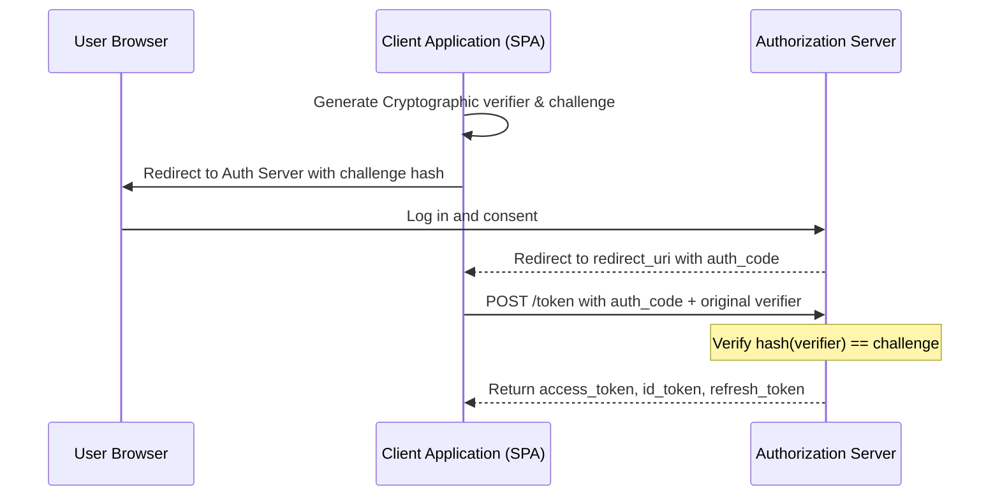
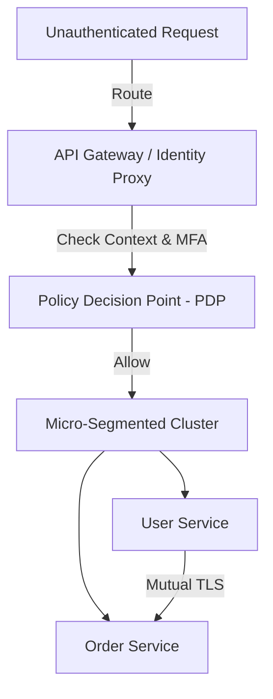

# Security Masterclass

> Advanced architectural guide covering authentication, web security, cryptographic protocols, and Zero Trust networks
> **Key Concepts**: OAuth2/OIDC, JWT lifecycle, Cross-Site Scripting (XSS/CSRF), Transport Security, Zero Trust Architecture

---

## 1. Authentication & Authorization Frameworks

### OAuth 2.0 & OpenID Connect (OIDC)
OAuth 2.0 is an authorization framework allowing applications to obtain limited access to user accounts. OIDC is an identity layer built on top of OAuth 2.0 to provide user authentication.

#### Authorization Code Flow with PKCE (Proof Key for Code Exchange)
The most secure flow for both single-page apps (SPAs) and native apps, preventing authorization code interception attacks.

### JWT Token Lifecycle & Rotation
JSON Web Tokens (JWT) allow stateless authorization.
- **Access Tokens**: Short-lived (e.g. 15 minutes) used to access APIs.
- **Refresh Tokens**: Long-lived (e.g. 7 days) stored securely to request new access tokens.
- **Token Rotation**: Each time a refresh token is used, a *new* refresh token is issued, and the old one is invalidated. If a used refresh token is reused, it indicates theft, and the auth server invalidates the entire token family, forcing the user to log in again.

---

## 2. Web Security Mitigations

### Cross-Site Scripting (XSS)
Attackers inject malicious client-side scripts into web pages viewed by other users.
- **Mitigation**:
  1. HTML escaping and context-aware sanitization of user inputs.
  2. Implement strict **Content Security Policy (CSP)** headers (e.g., block execution of inline scripts: `Content-Security-Policy: default-src 'self'`).
  3. Store authentication tokens in cookies with `HttpOnly` and `Secure` attributes, preventing JavaScript access.

### Cross-Site Request Forgery (CSRF)
Forces a logged-in user to execute unwanted actions on a trusted web application.
- **Mitigation**:
  1. Use **Anti-CSRF Tokens** (Double Submit Cookie pattern). The client includes a unique token in HTTP headers that matches a token in a cookie.
  2. Apply the `SameSite=Strict` or `SameSite=Lax` cookie attribute to prevent cookies from being sent on cross-origin requests.

---

## 3. Cryptographic Standards

### Data Encryption
- **Encryption at Rest**: AES-256 (Advanced Encryption Standard) in GCM (Galois/Counter Mode) to ensure both encryption and integrity validation.
- **Encryption in Transit**: TLS 1.3, which eliminates outdated cipher suites and speeds up the handshake to one round-trip.

### Password Hashing
Never use MD5 or SHA-256 for password storage (vulnerable to fast GPU cracking). Use memory-hard, adjustable hashing algorithms:
- **Argon2id**: Current industry-standard, resistant to GPU/ASIC attacks.
- **BCrypt**: Solid alternative with adjustable work factor.

---

## 4. Zero Trust Architecture

Zero Trust operates under the motto: **"Never trust, always verify."**

1. **Micro-segmentation**: Microservices reside in distinct network partitions. Inter-service communication requires mutual TLS (mTLS) with SPIFFE/SPIRE identity validation.
2. **Context-aware access**: Policies evaluate request origin, device posture, time of day, and risk vectors before granting resources.
3. **Least Privilege**: Services have strict, minimal IAM policies scoped to read/write specific tables or topics.
