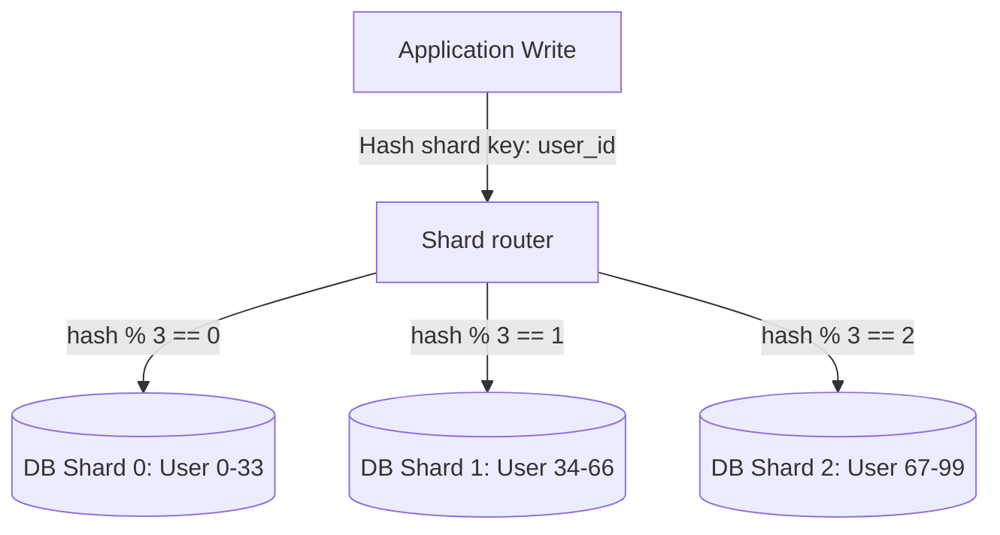

# Database Masterclass

> Deep dive into database internals, index optimizations, transaction isolation models, sharding strategies, and NoSQL engines
> **Key Concepts**: MVCC, B-Tree vs LSM Trees, Query Profiling, Horizontal Sharding, Replication Lag

---

## 1. Relational Database Internals & MVCC

### Multi-Version Concurrency Control (MVCC)
MVCC is used by modern databases (PostgreSQL, MySQL InnoDB) to execute concurrent reads and writes without blocking each other.
- **Mechanism**: Instead of locking a row during an update, the database keeps multiple versions of the row. Every transaction sees a "snapshot" of the database at a specific point in time.
- **Implementation in PostgreSQL**: Each row header contains metadata:
  - `xmin`: Transaction ID that created the row.
  - `xmax`: Transaction ID that deleted or replaced the row.
- **Vacuuming**: Because old rows ("dead tuples") accumulate, a background daemon (`VACUUM`) scans tables to clean up unneeded row versions. High write rates can cause "table bloat" if the autovacuum daemon cannot keep up.

---

## 2. Index Structures & Query Performance

### B-Tree Indexes
- **Structure**: Balanced tree maintaining sorted data, allowing log-time searches, insertions, and range queries.
- **Best Use**: High cardinality columns (e.g. `user_id`, `email`), equality, and range searches (`created_at > '2026-01-01'`).

### Log-Structured Merge (LSM) Trees
- **Structure**: Used in write-heavy NoSQL databases (Cassandra, RocksDB). Writes are buffered in memory (`MemTable`) and flushed to immutable sequential disk files (`SSTables`). A background compaction process merges sorted files.
- **Best Use**: Extremely fast write ingestion; reads are slower as they require checking multiple SSTables.

### Index Optimization & Query Tuning
When analyzing slow queries, use `EXPLAIN ANALYZE` to inspect execution plans.

```sql
-- Analyze query execution plan
EXPLAIN ANALYZE
SELECT id, status FROM orders 
WHERE customer_id = '8a8b2c6a-54cd-4e89-bdc8-9d29df7ad54a' 
  AND status = 'PENDING';
```

- **Scan Types to Watch For**:
  - `Seq Scan` (Sequential scan / Table scan): Bad. Database reads the entire table on disk. Needs an index.
  - `Index Scan`: Good. Directly reads the index to pinpoint rows.
  - `Index Only Scan`: Best. All selected columns exist in the index itself, avoiding reading the primary table data blocks.

---

## 3. Scale-Out Strategies

### Replication (Sync vs Async & Replication Lag)
- **Synchronous**: Primary writes data, waits for acknowledgment from replica before returning success. Zero data loss guarantee, but adds write latency.
- **Asynchronous**: Primary writes and returns success immediately. Data replication occurs in the background. Risk of data loss if primary crashes before replica updates, and readers can experience **Replication Lag** (seeing outdated states on replicas).

### Horizontal Sharding
Partitioning a single database table across multiple database nodes.
- **Sharding Key Selection**: Crucial decision. Must distribute data evenly to prevent **Hot Shards** (hotspots).
  - *Good*: `tenant_id` (for SaaS where queries are naturally scoped to tenants), `user_id` (for consumer apps).
  - *Bad*: `created_at` (all writes for the current day hit the same shard).
- **Cross-Shard Queries**: Highly expensive. Try to avoid joins across different shards.



---

## 4. Database Comparison Matrix

| Database Type | Technology | Write Strength | Read Strength | Consistency Model | Best Used For |
|---|---|---|---|---|---|
| **RDBMS (SQL)** | PostgreSQL | Moderate (WAL) | High (B-Tree index) | Strong ACID | Core transactions, accounts |
| **NoSQL Wide-Column** | Cassandra | High (LSM Tree) | Moderate (Disk merges) | Tunable (Eventual) | Log ingestion, timelines |
| **NoSQL Document** | MongoDB | High | High (Index search) | Strong / Eventual | Flexible schemas, catalogs |
| **In-Memory Cache** | Redis | Extremely High | Extremely High | Eventual (Async replica) | Session stores, rate limits |
