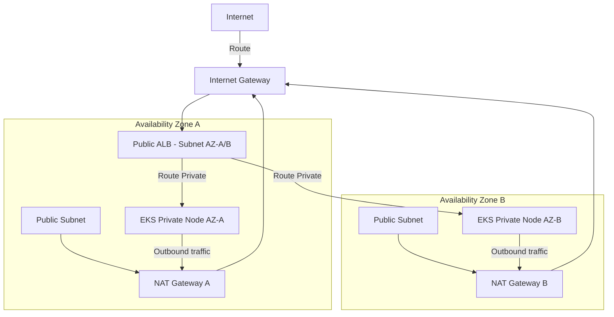

# Cloud Infrastructure: AWS & Kubernetes Playbook

> Production-ready reference for building highly available, secure, and observable infrastructure using AWS and Kubernetes (EKS)
> **Key Concepts**: Multi-AZ VPC, EKS Pod Networking, IAM Roles for Service Accounts (IRSA), Ingress Routing, HPA Auto-scaling

---

## 1. AWS VPC Network Architecture

A secure enterprise cloud deployment begins with a multi-Availability Zone (Multi-AZ) VPC configuration to prevent single points of failure.



- **Public Subnets**: Contain Load Balancers and NAT Gateways. Directly route inbound traffic from the internet.
- **Private Subnets**: Contain EKS worker nodes, databases, and application code. Egress traffic passes through NAT Gateways in the public subnets. No direct inbound access from the public internet is allowed.
- **Security Groups**: Stateful host-level firewalls. Rule of Least Privilege: EKS nodes only accept incoming traffic from the Application Load Balancer (ALB) security group.

---

## 2. Kubernetes (EKS) Topology & Core Concepts

### IAM Roles for Service Accounts (IRSA)
- **Problem**: Giving EKS worker nodes full IAM roles violates security rules; any pod on that node inherits those permissions.
- **Solution (IRSA)**: Link a Kubernetes Service Account to an AWS IAM Role using an OpenID Connect (OIDC) identity provider. Individual pods declare this Service Account, obtaining narrow, scoped IAM tokens.

### Ingress & Controller Routing
Traffic flows into the cluster as follows:
1. An **Ingress Resource** defines routing rules (e.g. `/v1/payments` routes to `payment-service`).
2. The **AWS Load Balancer Controller** reads the ingress resource and provisions an AWS ALB dynamically.
3. The ALB routes traffic directly to Pod IPs inside the private subnets using the **Amazon VPC CNI plugin** (which assigns native VPC IP addresses to Kubernetes pods).

---

## 3. High-Availability & Autoscale Configuration

To survive major traffic spikes, EKS uses two scaling layers:
1. **Horizontal Pod Autoscaler (HPA)**: Monitors metrics (CPU, Memory, custom Prometheus metrics like RPS) and increases the number of application pods.
2. **Karpenter / Cluster Autoscaler**: If the pods cannot run because EKS worker nodes are full, Karpenter boots new EC2 VM nodes in the private subnets, joining them to the cluster in seconds.

```yaml
# HPA YAML definition example
apiVersion: autoscaling/v2
kind: HorizontalPodAutoscaler
metadata:
  name: payment-service-hpa
  namespace: production
spec:
  scaleTargetRef:
    apiVersion: apps/v1
    kind: Deployment
    name: payment-service
  minReplicas: 3
  maxReplicas: 30
  metrics:
  - type: Resource
    resource:
      name: cpu
      target:
        type: Utilization
        averageUtilization: 70
```

---

## 4. Disaster Recovery (DR) & Business Continuity

- **RTO (Recovery Time Objective)**: Target time to restore service after failure.
- **RPO (Recovery Point Objective)**: Maximum acceptable age of data that can be lost.

| DR Strategy | Active Nodes | RTO | RPO | Cost |
|---|---|---|---|---|
| **Backup & Restore** | None (Deploy on crash) | Hours | 24 Hours | Low |
| **Pilot Light** | Minimal core systems active | < 30 min | 1 Hour | Medium |
| **Warm Standby** | Scaled-down replica in second region | < 10 min | < 15 min | High |
| **Active-Active** | Full dual-region load-sharing | Real-time | Near 0 | Very High |
