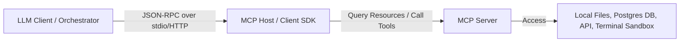
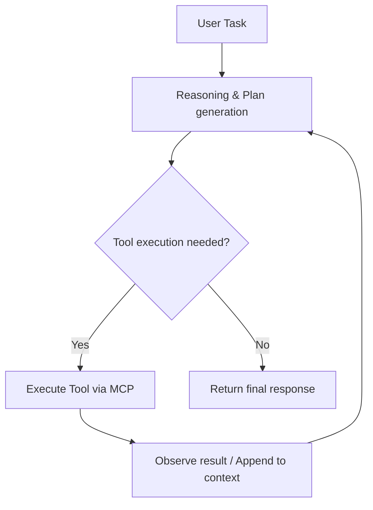

# AI Engineering Guide

> Deep dive into AI application patterns, Model Context Protocol (MCP), agent frameworks, semantic search optimization, and production LLM engineering
> **Key Concepts**: Model Context Protocol (MCP), Semantic Caching, Hybrid RAG, Prompt Engineering, Evaluation Frameworks

---

## 1. Model Context Protocol (MCP)

### Overview
The Model Context Protocol (MCP) is an open standard designed by Anthropic that enables secure, bi-directional communication between LLM clients (like AI assistants or orchestration platforms) and external tools, files, and data resources.



### Architectural Principles
1. **Separation of Concerns**: The LLM doesn't need to know *how* to access a database or query a search engine. It only knows what tool descriptions exist. The MCP server wraps the access logic.
2. **Standardized Protocol**: Uses JSON-RPC 2.0 payloads for tool list negotiation, resource retrieval, and tool executions.
3. **Security Boundaries**: Host applications control access. They can intercept tool requests, prompt users for authorization (e.g. write file, run command), and execute them in sandbox terminals.

---

## 2. Agentic Architectures

Enterprise AI applications are moving from basic chat to **Agentic Systems** that execute loops of reasoning, planning, and actions:



### Key Framework Integration (LangChain4j / Java Spring AI)
For Java-based Enterprise environments, **LangChain4j** provides standard wrappers for tools, system contexts, and chat memory models:

```java
// LangChain4j AI Service with Tools
public interface Assistant {
    @SystemMessage("You are an autonomous billing agent. Answer questions using only the available tools.")
    TokenStream chat(String message);
}

// Registering a tool for billing history lookups
public class BillingTools {
    @Tool("Query customer payment and invoice history using customer UUID")
    public List<Invoice> getBillingHistory(String customerId) {
        return billingService.getHistory(UUID.fromString(customerId));
    }
}
```

---

## 3. Production RAG Optimization

### Semantic Caching
To minimize LLM API token costs and speed up response latency:
1. When a user asks a question, generate its embedding vector.
2. Query a semantic caching database (Redis) using a similarity threshold (e.g. Cosine distance < 0.05).
3. If a cached query matches, return the pre-recorded answer directly without calling the LLM.

### Hybrid RAG and Sparse/Dense Retrieval
- **Sparse Retrieval (BM25)**: Matches exact keywords, codes (e.g. `ERR_503`), or specific names.
- **Dense Retrieval (Cosine Similarity)**: Captures semantic intents and conceptual meanings.
- **Reciprocal Rank Fusion (RRF)**: Merges sparse and dense search scores to find the most accurate matches.

---

## 4. Evaluation & Observability (LLM-in-production)

### Core Metrics to Track
1. **Faithfulness**: Is the answer derived *only* from the retrieved context documents? (Hallucination detection).
2. **Answer Relevance**: Does the generated answer address the user's question directly?
3. **Context Recall**: Did the retrieval step gather all necessary information blocks to answer the question?

### Guardrails
Implement guardrail layers (LlamaGuard, NeMo Guardrails) at the input/output boundaries to scan for:
- Prompt Injection attempts.
- Personally Identifiable Information (PII) leakage.
- Off-topic or toxic generation responses.
