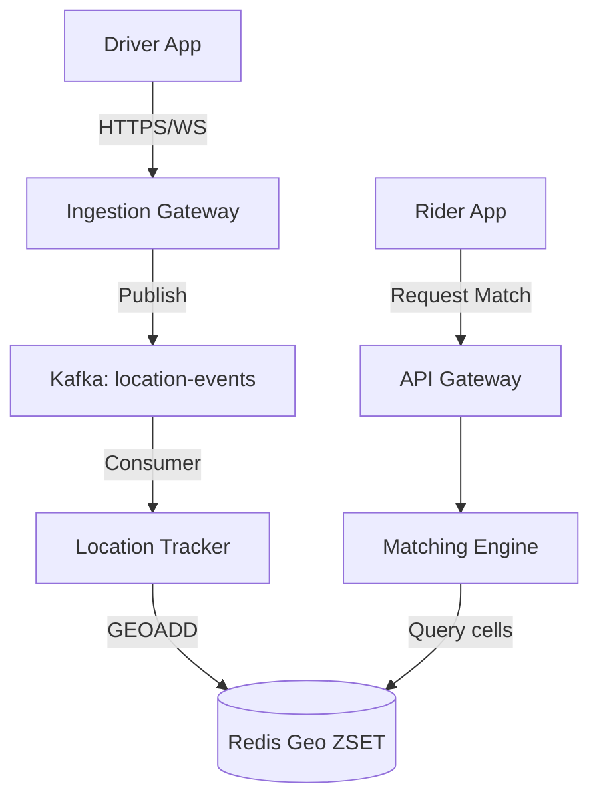

# Software Architect Mock Interviews

> Comprehensive transcript-style mock interviews for Software Architect roles, detailing dialogue, system diagrams, and evaluation rubrics
> **Mocks Included**: 1. Design a Ride-Sharing Matcher · 2. Design a High-Throughput Notification Engine

---

## Mock 1: Real-Time Ride-Sharing Matching Engine

### Interview Setting
- **Interviewer**: Staff Engineer / Architect
- **Candidate**: Software Architect candidate
- **Goal**: Evaluate candidate's ability to design a high-throughput, low-latency matching system (S2/H3 geofencing, Redis, distributed transactions, lock handling).

### Transcript Excerpt

**Interviewer**: Let's start the design session. I want you to design the backend system responsible for matching riders with drivers in real-time. How would you approach this?

**Candidate**: I will use the **RESHADED** framework. First, let's establish the requirements.
- **Functional**:
  1. Drivers send real-time coordinates every 4 seconds.
  2. Riders request a ride, specifying pickup and dropoff points.
  3. The system queries nearby available drivers and dispatches offers.
- **Non-Functional**:
  1. Low latency: Driver matching must occur in < 5 seconds.
  2. Consistent matching: A driver must not receive multiple concurrent offers (avoid double booking).
  3. City-level scale: Needs to scale for peak cities (e.g., 50K active drivers in NYC).

**Interviewer**: The requirements look good. Let's do a quick scale estimation. If we have 100K active drivers updating their location every 4 seconds, what is the write QPS?

**Candidate**:
- $100,000 \text{ drivers} / 4 \text{ seconds} = 25,000 \text{ write requests/sec (QPS)}$.
- At 100 bytes per coordinate update, network bandwidth is:
  $25,000 \text{ QPS} \times 100 \text{ bytes} \approx 2.5 \text{ MB/sec}$.
- This network bandwidth is low, but 25K database writes/sec is too high for a standard SQL relational database. I will buffer coordinates using a fast cache.

**Interviewer**: How would you represent and store the locations for real-time querying?

**Candidate**: I'll use **Uber H3** hexagonal indexes.
- We map latitude/longitude coordinates to a resolution 8 H3 index (approx. 700m wide hexagon).
- We store active driver locations in **Redis Geospatial Indexes (ZSET)**.
- When a ride is requested, the system maps the rider's pickup coordinate to an H3 cell and queries Redis for active drivers in the same or adjacent cells.

**Interviewer**: If multiple riders request a ride near the same driver, how do you prevent double booking?

**Candidate**:
1. When the Matcher selects the top candidate driver, it attempts to acquire a short-term lock in Redis:
   `SET lock:driver:<id> <match_id> NX EX 15`
2. If successful, the driver is offered the ride.
3. If they accept within 10 seconds, the database transaction converts the hold into an active ride state.
4. If they reject or time out, the lock is released, and the Matcher proceeds to the next driver.

---

## Evaluation Rubric

- **Architecture Choice (Pass/Fail)**: Candidate must avoid writing every coordinate update directly to a relational database. Redis/in-memory cache is expected.
- **Concurrency (Critical)**: Must address duplicate booking risks. Look for Redis distributed locks or atomic DB isolation levels.
- **Geospatial Knowledge**: Understanding of spatial indices (S2/H3 grid systems) and geohashes is highly regarded.
